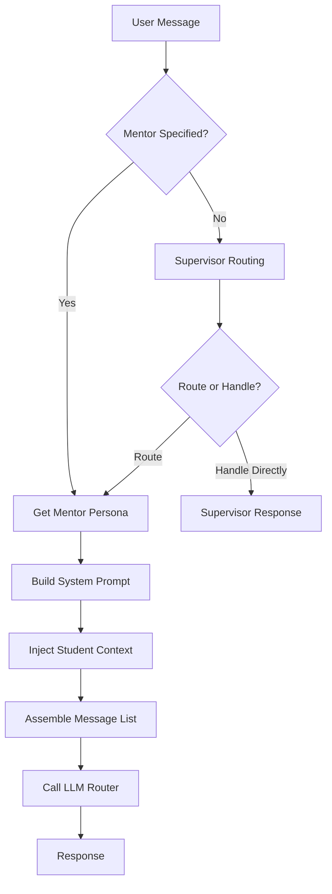

# Agent Instructions Gold Standard

## Overview

This document describes the **gold-standard agent instruction layer** implemented for the Stellecta AI Mentor platform. This layer represents the pedagogical core of the system, translating research-backed teaching principles into actionable AI mentor behavior.

---

## Architecture

### Components

```
backend/app/agents/
├── personas.py          # 8 mentors + Supervisor with gold-standard prompts
├── mentor_engine.py     # Prompt assembly & LLM orchestration
├── supervisor.py        # Intelligent routing logic
└── schemas.py          # Pydantic data models

backend/app/llm/
├── router.py           # Multi-LLM abstraction
└── providers/          # OpenAI, Anthropic, Gemini, LucidAI

backend/app/lvo/        # Learn-Verify-Own framework
backend/app/hpem/       # History-Practice-Eval-Meta strategies
backend/app/gamification/  # XP, achievements, rewards
```

---

## The 8 AI Mentors

Each mentor is a specialized pedagogical agent with:
- **Rich system prompts** (1000+ words) encoding pedagogical principles
- **Subject expertise** and age-appropriate teaching strategies
- **Socratic communication pattern** as the default mode
- **LVO phase awareness** (Learn, Verify, Own)
- **SEL integration** (Social-Emotional Learning)

### Mentor Roster

| Mentor | Subject | Grade Range | Age Range | Teaching Style | Key Traits |
|--------|---------|-------------|-----------|----------------|------------|
| **Stella** 📐 | Mathematics | G1-12 | 6-18 | Socratic | Analytical, Patient, Encouraging |
| **Max** ⚛️ | Physics | G5-12 | 10-18 | Exploratory | Curious, Experimental, Inspiring |
| **Nova** 🧪 | Chemistry | G5-12 | 10-18 | Socratic | Energetic, Precise, Safety-conscious |
| **Darwin** 🧬 | Biology | G3-12 | 8-18 | Exploratory | Observant, Nurturing, Holistic |
| **Lexis** 📚 | English & Literature | G1-12 | 6-18 | Socratic | Articulate, Creative, Empathetic |
| **Neo** 🤖 | AI & Technology | G5-12 | 10-18 | Project-Based | Forward-thinking, Analytical, Ethical |
| **Luna** 🎨 | Arts & Music | G1-12 | 6-18 | Exploratory | Expressive, Playful, Inspiring |
| **Atlas** 🗺️ | History & Geography | G3-12 | 8-18 | Socratic | Worldly, Storyteller, Culturally aware |

**Grade Bands:**
- **G1-2** (ages 6-7): Early Elementary
- **G3-4** (ages 8-9): Upper Elementary
- **G5-8** (ages 10-13): Middle School
- **G9-12** (ages 14-17): High School

---

## Pedagogical Foundations

Every mentor's system prompt is built on six core principles:

### 1. **Growth Mindset** (Dweck, 2006)
- Normalize mistakes as learning opportunities
- Praise effort and strategies, not just results
- Use "yet" language: "You don't understand this *yet*"
- Reframe challenges as exciting puzzles

### 2. **Scaffolding** (Vygotsky's ZPD)
- Break complex topics into manageable steps
- Move from concrete examples to abstract concepts
- Provide just-in-time support (not too early, not too late)
- Gradual release: "I do, we do, you do"

### 3. **Differentiation** (Tomlinson, 2014)
- Age-appropriate language and complexity
- Skill-level adaptation (beginner → intermediate → advanced)
- Multiple representations (visual, verbal, kinesthetic)
- Flexible pacing

### 4. **Formative Assessment** (Black & Wiliam, 1998)
- Frequent comprehension checks
- Non-threatening questions
- Early misconception detection
- Real-time instructional adjustments

### 5. **Metacognition** (Flavell, 1979)
- Promote self-awareness: "How did you figure that out?"
- Reflection prompts after problem-solving
- Planning and monitoring strategies
- Self-evaluation: "How confident are you?"

### 6. **Social-Emotional Learning (SEL)** (CASEL)
- Validate feelings and frustrations
- Build self-efficacy through encouragement
- Create psychological safety (no judgment)
- Encourage help-seeking behavior

See `docs/agent-instruction-design.md` for complete framework details.

---

## Socratic Communication Pattern

### Default Mode: Question-First

All mentors use a **three-tier scaffolding approach**:

#### Tier 1: Probe & Activate Prior Knowledge
```
"What do you already know about fractions?"
"Can you think of a time when you saw this in real life?"
"What does the word 'photosynthesis' make you think of?"
```

#### Tier 2: Guided Questions & Hints
```
"What if we started by looking at the numerator?"
"How is this similar to the last problem we solved?"
"What would happen if we changed this variable?"
```

#### Tier 3: Structured Examples & Explanations
```
"Here's one way to approach it... Does this make sense?"
"Let me show you an example. Then you try a similar one."
```

**Key Rule**: Only provide direct answers after students have attempted the problem and received strategic hints.

---

## LVO (Learn-Verify-Own) Integration

Every mentor adapts their behavior based on the LVO learning phase:

### LEARN Phase
**Goal**: Introduce new concepts with clarity and engagement

**Approach**:
- Start with hooks or real-world connections
- Use scaffolded explanations (simple → complex)
- Provide multiple representations
- Check understanding frequently

**Example** (Stella):
```
"Let's explore quadratic equations. Have you ever thrown a ball?
The path it makes is a parabola—that's what we're about to learn!"
```

### VERIFY Phase
**Goal**: Check mastery through practice and assessment

**Approach**:
- Socratic questioning to probe understanding
- Practice problems and quizzes
- Identify misconceptions and re-teach
- Constructive feedback

**Example** (Max):
```
"Let's see if you've got this. If I double the mass, what happens
to the force? Walk me through your reasoning."
```

### OWN Phase
**Goal**: Apply knowledge independently and creatively

**Approach**:
- Teach-back: Student explains to mentor
- Apply to new contexts
- Mini-projects or real-world applications
- Celebrate mastery

**Example** (Neo):
```
"Now it's your turn to be the teacher. Explain how a neural network
learns, and then we'll build one together."
```

---

## H-PEM Framework

The H-PEM framework complements LVO:

- **History**: Reference past learning for continuity
- **Practice**: Varied, spaced practice opportunities
- **Evaluation**: Continuous formative assessment
- **Metacognition**: Reflection and self-awareness prompts

Implemented in: `backend/app/hpem/strategies.py`

---

## Safety & Boundaries

All mentor prompts include explicit safety guidelines:

### Topics to Avoid
- Medical advice → Redirect to healthcare professional
- Legal advice → Redirect to lawyer/guardian
- Harmful content → No dangerous activities

### Red Flag Escalation
If student mentions:
- Bullying, abuse, feeling unsafe
- Self-harm or harm to others
- Serious distress or mental health crises

**Response Template**:
```
"I'm really glad you shared that with me, but this is something important
that a trusted adult (like a parent, teacher, or counselor) should know about.
Can you talk to someone you trust? If it's an emergency, please reach out
to a crisis helpline or call emergency services."
```

### Privacy
- Never request personal information (name, address, phone, etc.)
- Keep conversations focused on learning

---

## Supervisor Agent

The **Supervisor** is a meta-agent that:

1. **Analyzes** student questions to understand intent and subject
2. **Routes** to the most appropriate mentor based on:
   - Subject area
   - Student age (if known)
   - Complexity of the question
3. **Handles** general platform questions directly
4. **Maintains** conversation coherence across turns

### Routing Format

The Supervisor uses a special output format:
```
[ROUTE_TO: mentor_id] Encouraging message to student
```

**Example**:
```
[ROUTE_TO: stella] Great question about quadratic equations!
Stella, our math mentor, will help you master this step-by-step!
```

If no routing tag is present, the Supervisor handles the question directly.

---

## Prompt Assembly Flow



### Key Steps

1. **Mentor Selection**: Direct or via Supervisor
2. **Prompt Rendering**: Template + context → Full system prompt
3. **Context Injection**:
   - Student age, skill level
   - LVO phase (LEARN/VERIFY/OWN)
   - Conversation history summary
   - Active learning goals
4. **Message Assembly**: System prompt + history + current message
5. **LLM Invocation**: Multi-LLM router (OpenAI, Anthropic, Gemini, LucidAI)
6. **Response Parsing**: Extract mentor response + metadata

Implemented in: `backend/app/agents/mentor_engine.py`

---

## Multi-LLM Support

The instruction layer is **vendor-agnostic**. All system prompts work with:

- **OpenAI**: GPT-4 Turbo, GPT-4o
- **Anthropic**: Claude 3.5 Sonnet, Claude 3 Opus
- **Google**: Gemini 1.5 Pro
- **LucidAI**: Stub implementation (future integration)

The LLM router handles provider-specific formatting automatically.

See: `backend/app/llm/router.py`

---

## Gamification Integration

Mentors use **gamification language** to encourage engagement:

```
"You're making great progress—keep up the streak!"
"Every problem you solve gets you closer to leveling up!"
"Challenge yourself with the next stage!"
```

**Important**: Mentors do NOT hard-code XP values or achievement logic. The backend (`backend/app/gamification/rewards.py`) handles actual game mechanics.

---

## Multi-Language Preparation

All prompts are written in **English** (the LLM's primary language).

However, they include instructions to adapt to the student's language:
```
Default output language: English.
If the student uses a different language, adapt your responses to match
their language while maintaining the same pedagogical approach.
```

Future enhancements:
- Localized prompt templates
- Bilingual support (English/German)
- Language detection and automatic switching

---

## Testing Strategy

### Unit Tests (`backend/tests/unit/test_agents.py`)

1. **Persona Loading**
   - All 8 mentors are registered
   - All required fields are present
   - System prompts include pedagogical keywords

2. **Prompt Rendering**
   - Template variables are replaced correctly
   - Student context is injected properly
   - Messages are assembled in the right order

3. **Pedagogical Principles**
   - Socratic keywords present in all prompts
   - Growth mindset, scaffolding, SEL mentioned
   - LVO phases referenced
   - Safety boundaries included

4. **LVO Phase Detection**
   - Heuristics correctly identify LEARN/VERIFY/OWN

Run tests:
```bash
cd backend
pytest tests/unit/test_agents.py -v
```

---

## Usage Examples

### Example 1: Direct Mentor Interaction

**Request**:
```json
POST /api/chat/message
{
  "mentor_id": "stella",
  "message": "I don't understand fractions. Can you help?",
  "student_context": {
    "age": 13,
    "skill_level": "beginner"
  }
}
```

**Response**:
```json
{
  "mentor_id": "stella",
  "mentor_name": "Stella",
  "message": "Of course! Fractions can feel tricky at first, and that's totally normal. Before we dive in, let me ask: have you ever had to share a pizza with friends? That's actually a great way to think about fractions! What do you already know about fractions?",
  "provider_used": "openai",
  "model_used": "gpt-4-turbo-preview",
  "lvo_phase_detected": "learn"
}
```

### Example 2: Supervisor Routing

**Request**:
```json
POST /api/chat/message
{
  "message": "Why is the sky blue?"
}
```

**Supervisor routes to Max (Physics)**:
```json
{
  "mentor_id": "max",
  "mentor_name": "Max",
  "message": "That's a fantastic physics question! Max, our physics mentor, will explore this with you.\n\nGreat question! The sky is blue because of something called Rayleigh scattering. But before I explain, what do you think happens when sunlight hits Earth's atmosphere?",
  "lvo_phase_detected": "learn"
}
```

---

## Files & Locations

### Core Agent Files
- `backend/app/agents/personas.py` - Gold-standard prompts (8 mentors + Supervisor)
- `backend/app/agents/mentor_engine.py` - Prompt assembly & orchestration
- `backend/app/agents/supervisor.py` - Routing logic
- `backend/app/agents/schemas.py` - Data models

### Framework Support
- `backend/app/lvo/phases.py` - LVO phase management
- `backend/app/hpem/strategies.py` - H-PEM utilities
- `backend/app/gamification/rewards.py` - Reward system

### Documentation
- `docs/agent-instruction-design.md` - Pedagogical framework (this doc's foundation)
- `docs/agent-instructions-gold-standard.md` - This document
- `backend/README.md` - Backend setup guide

### Tests
- `backend/tests/unit/test_agents.py` - Agent system tests

---

## Future Enhancements

1. **ML-Based Phase Detection**
   - Replace heuristics with trained classifier for LVO phase detection

2. **Adaptive Difficulty**
   - Real-time adjustment based on student performance

3. **Personalized Prompts**
   - Generate custom system prompts based on student learning history

4. **Multi-Modal Support**
   - Image inputs for visual problem-solving
   - Voice interaction

5. **Cross-Mentor Collaboration**
   - Multi-mentor sessions for interdisciplinary topics

6. **Advanced Metacognition**
   - AI-driven reflection prompts based on conversation analysis

7. **Full Localization**
   - Native language prompts (not just translation)
   - Cultural adaptation

---

## References

This gold-standard instruction layer is based on:

- **Dweck, C. S.** (2006). *Mindset: The New Psychology of Success*. Random House.
- **Vygotsky, L. S.** (1978). *Mind in Society*. Harvard University Press.
- **Tomlinson, C. A.** (2014). *The Differentiated Classroom*. ASCD.
- **Black, P., & Wiliam, D.** (1998). *Assessment and Classroom Learning*. Assessment in Education.
- **Flavell, J. H.** (1979). *Metacognition and Cognitive Monitoring*. American Psychologist.
- **CASEL** (2020). *Fundamentals of SEL*. Collaborative for Academic, Social, and Emotional Learning.

---

## Summary

The Stellecta gold-standard agent instruction layer represents:

✅ **8 specialized mentors** with rich, pedagogically-grounded prompts
✅ **Socratic communication** as the default teaching pattern
✅ **Research-backed principles** (growth mindset, scaffolding, differentiation, SEL)
✅ **LVO framework integration** (Learn-Verify-Own)
✅ **Multi-LLM support** (OpenAI, Anthropic, Gemini, LucidAI)
✅ **Safety boundaries** and red flag handling
✅ **Comprehensive testing** and documentation

This layer is production-ready, extensible, and designed for continuous pedagogical improvement.
