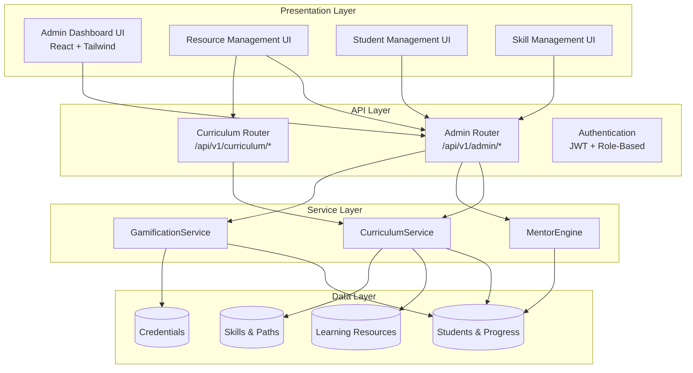
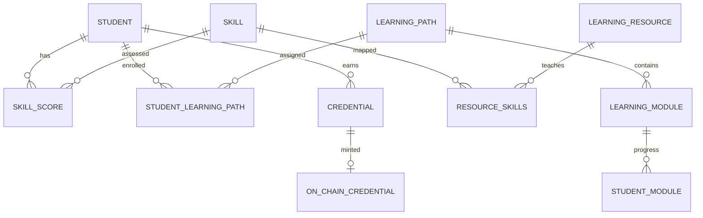

# Stellar AI - Admin Interface Documentation

**Version:** 1.0
**Last Updated:** November 14, 2025
**For:** Technical Teams, System Administrators, Product Managers

---

## Table of Contents

1. [Overview](#overview)
2. [Architecture](#architecture)
3. [Backend API Endpoints](#backend-api-endpoints)
4. [Data Models](#data-models)
5. [Frontend Components](#frontend-components)
6. [Permissions & Security](#permissions--security)
7. [Implementation Guide](#implementation-guide)
8. [Future Enhancements](#future-enhancements)

---

## Overview

The **Stellar AI Admin Interface** provides comprehensive management capabilities for school administrators and teachers. It serves as a **mini-CMS (Content Management System)** and **CRM (Customer Relationship Management)** layer on top of the core LVO learning platform.

### Key Capabilities

#### Content Management (CMS)
- Create, edit, and manage learning resources
- Link resources to skills and learning paths
- Multi-source content ingestion (school systems, teachers, public OER, AI-generated)
- Quality scoring and engagement metrics
- Subject and grade-level tagging

#### Student Management (CRM-Light)
- Comprehensive LVO profiles for every student
- Real-time skill scores and weak skill identification
- Learning path progress tracking
- Verification and credential history
- Personalized resource recommendations
- Parent communication insights

#### Curriculum Management
- Skill creation and categorization
- Learning path and module design
- Task assignment and sequencing
- Standards alignment (future)

#### Analytics & Reporting
- School-wide engagement metrics
- Content performance analytics
- Student progress dashboards
- Credential issuance tracking

---

## Architecture

### System Layers



### Component Architecture

```
/backend/app/
├── routers/
│   ├── admin.py          ← Main admin API router
│   ├── curriculum.py     ← Curriculum/resource endpoints
│   └── ...
├── services/
│   ├── curriculum.py     ← CurriculumService (recommendations)
│   ├── ai/
│   │   └── mentor_engine.py  ← MentorEngine
│   └── gamification.py   ← XP, levels, badges
├── models/
│   ├── curriculum.py     ← LearningResource, resource_skills
│   ├── skill.py          ← Skill, SkillScore
│   ├── learning_path.py  ← LearningPath, LearningModule
│   └── ...
└── demo/
    └── seed_demo_data.py ← Demo data seeding

/frontend/src/
├── pages/
│   └── admin/           ← Admin interface pages (to be created)
│       ├── AdminDashboard.tsx
│       ├── ResourceList.tsx
│       ├── StudentList.tsx
│       └── SkillManagement.tsx
└── components/
    └── admin/           ← Reusable admin components
```

---

## Backend API Endpoints

### Admin Dashboard

#### GET /api/v1/admin/stats
**Description:** Get overview statistics for admin dashboard

**Authentication:** Required (school_admin or teacher)

**Response:**
```json
{
  "total_students": 1,
  "total_teachers": 0,
  "total_classrooms": 0,
  "total_skills": 5,
  "total_learning_paths": 2,
  "total_resources": 4,
  "active_students_last_week": 1,
  "total_credentials_issued": 1,
  "total_xp_earned": 85
}
```

---

### Student Management

#### GET /api/v1/admin/students
**Description:** List all students with summary data

**Authentication:** Required (school_admin or teacher)

**Query Parameters:**
- `limit` (integer, default: 50, max: 200)
- `offset` (integer, default: 0)

**Response:**
```json
[
  {
    "student_id": "uuid",
    "name": "Amira Hassan",
    "email": "amira.student@stellar-demo.school",
    "grade_level": 3,
    "total_xp": 85,
    "current_level": 0,
    "weak_skills_count": 1,
    "credentials_count": 1,
    "last_active": null
  }
]
```

---

#### GET /api/v1/admin/students/{student_id}/lvo-profile
**Description:** Get comprehensive LVO profile for a student

**Authentication:** Required (school_admin or teacher)

**Path Parameters:**
- `student_id` (UUID)

**Response:**
```json
{
  "student_id": "uuid",
  "student_name": "Amira Hassan",
  "email": "amira.student@stellar-demo.school",
  "grade_level": 3,
  "total_xp": 85,
  "current_level": 0,

  "skill_scores": [
    {
      "skill_id": "uuid",
      "skill_name": "Reading A1 – Simple Sentences",
      "score": 72.0,
      "confidence": 0.85,
      "assessment_count": 3
    },
    {
      "skill_id": "uuid",
      "skill_name": "Reading A1 – Main Idea",
      "score": 45.0,
      "confidence": 0.60,
      "assessment_count": 1
    }
  ],

  "weak_skills": [
    {
      "skill_id": "uuid",
      "skill_name": "Reading A1 – Main Idea",
      "score": 45.0,
      "confidence": 0.60,
      "assessment_count": 1
    }
  ],

  "strong_skills": [],

  "learning_paths": [
    {
      "path_id": "uuid",
      "path_name": "English A1 – Starter Path",
      "status": "in_progress",
      "progress_percentage": 35
    }
  ],

  "active_modules": [
    {
      "module_id": "uuid",
      "module_name": "Short Stories",
      "status": "in_progress",
      "score": 45.0,
      "tasks_completed": 0,
      "tasks_total": 1
    }
  ],

  "verifications_count": 1,
  "recent_verifications": [
    {
      "verification_id": "uuid",
      "skill_name": "Reading A1 – Simple Sentences",
      "status": "verified",
      "score": 78.0,
      "verified_at": "2025-11-04T00:00:00"
    }
  ],

  "credentials_count": 1,
  "recent_credentials": [
    {
      "credential_id": "uuid",
      "title": "English A1 – Simple Sentences (Bronze)",
      "credential_type": "module_completion",
      "status": "issued",
      "issued_at": "2025-11-05T00:00:00"
    }
  ],

  "badges_earned": [
    {
      "badge_id": "uuid",
      "badge_name": "Reading Rookie",
      "earned_at": "2025-11-05T00:00:00"
    }
  ],

  "recommended_resources": [
    {
      "resource_id": "uuid",
      "title": "Finding the Main Idea - Animated Story",
      "resource_type": "video",
      "estimated_minutes": 8
    }
  ]
}
```

**Use Cases:**
- Teacher reviews student's complete learning profile
- Admin identifies struggling students across the school
- Automated reports for parents
- Data for personalized interventions

---

### Resource Management

#### GET /api/v1/admin/resources
**Description:** List all resources with admin metadata

**Authentication:** Required (school_admin or teacher)

**Query Parameters:**
- `limit` (integer, default: 50, max: 200)
- `offset` (integer, default: 0)
- `subject` (string, optional) - Filter by subject
- `resource_type` (string, optional) - Filter by type

**Response:**
```json
[
  {
    "id": "uuid",
    "title": "Finding the Main Idea - Animated Story",
    "resource_type": "video",
    "source_type": "public_open_content",
    "subject": "reading",
    "grade_min": 2,
    "grade_max": 4,
    "quality_score": 85,
    "view_count": 0,
    "completion_count": 0,
    "is_active": true,
    "skills_count": 1,
    "created_at": "2025-11-14T00:00:00"
  }
]
```

---

#### POST /api/v1/curriculum/resources
**Description:** Create a new learning resource

**Authentication:** Required (school_admin or teacher)

**Request Body:**
```json
{
  "title": "English A1 Story – The Lost Treasure",
  "description": "Interactive reading exercise about treasure hunting",
  "resource_type": "interactive_exercise",
  "url": "https://example.com/treasure-story",
  "language": "en",
  "subject": "reading",
  "grade_min": 3,
  "grade_max": 4,
  "age_min": 8,
  "age_max": 10,
  "estimated_minutes": 15,
  "source_type": "teacher_uploaded",
  "source_attribution": "Created by Sara Thompson",
  "difficulty_level": "intermediate"
}
```

**Response:** `201 Created` with resource object

---

#### POST /api/v1/curriculum/resources/{resource_id}/skills
**Description:** Link resource to skills

**Authentication:** Required (school_admin or teacher)

**Path Parameters:**
- `resource_id` (UUID)

**Request Body:**
```json
["skill-uuid-1", "skill-uuid-2"]
```

**Response:** `200 OK` with updated resource

---

#### DELETE /api/v1/admin/resources/{resource_id}
**Description:** Soft delete resource (sets is_active=False)

**Authentication:** Required (school_admin or teacher)

**Response:** `200 OK`
```json
{
  "message": "Resource deactivated successfully"
}
```

---

### Skill Management

#### GET /api/v1/admin/skills
**Description:** List all skills

**Authentication:** Required (school_admin or teacher)

**Query Parameters:**
- `limit` (integer, default: 100, max: 500)
- `offset` (integer, default: 0)
- `category` (string, optional) - Filter by category

**Response:**
```json
[
  {
    "id": "uuid",
    "name": "Reading A1 – Simple Sentences",
    "description": "Ability to read and understand simple sentences",
    "category": "language",
    "level": "A1 - Beginner",
    "age_group_min": 6,
    "age_group_max": 9,
    "created_at": "2025-11-14T00:00:00",
    "updated_at": "2025-11-14T00:00:00"
  }
]
```

---

#### POST /api/v1/admin/skills
**Description:** Create a new skill

**Authentication:** Required (school_admin or teacher)

**Request Body:**
```json
{
  "name": "Writing – Paragraph Structure",
  "description": "Ability to organize ideas into coherent paragraphs",
  "category": "language",
  "level": "Intermediate",
  "age_group_min": 9,
  "age_group_max": 12
}
```

**Response:** `201 Created` with skill object

---

### Learning Path Management

#### GET /api/v1/admin/learning-paths
**Description:** List all learning paths

**Authentication:** Required (school_admin or teacher)

**Query Parameters:**
- `limit` (integer, default: 50, max: 200)

**Response:**
```json
[
  {
    "id": "uuid",
    "name": "English A1 – Starter Path",
    "description": "Foundation English skills",
    "recommended_age_min": 6,
    "recommended_age_max": 9,
    "estimated_hours": 20,
    "difficulty": "beginner",
    "is_active": true,
    "created_at": "2025-11-14T00:00:00",
    "updated_at": "2025-11-14T00:00:00"
  }
]
```

---

## Data Models

### Key Relationships



### Core Models

#### LearningResource
```python
class LearningResource:
    id: UUID
    title: str (max 500)
    description: Text
    resource_type: Enum  # text, video, pdf, interactive, quiz, etc.
    url: str (max 1000)
    file_path: str (max 1000)
    language: str (max 10, default "en")
    subject: str (max 100)
    grade_min: int
    grade_max: int
    age_min: int
    age_max: int
    estimated_minutes: int
    source_type: Enum  # school_internal, teacher_uploaded, public, ai_generated
    source_attribution: Text
    license_type: str
    created_by_user_id: UUID (FK: users.id)
    school_id: UUID (FK: schools.id)
    is_active: bool
    is_public: bool
    difficulty_level: str
    quality_score: int (0-100)
    view_count: int
    completion_count: int
    resource_metadata: JSON
    created_at: DateTime
    updated_at: DateTime

    # Relationships
    skills: List[Skill]  # many-to-many via resource_skills
    created_by: User
    school: School
```

#### StudentLVOProfile (Composite View)
Not a database model, but a composite API response combining:
- Student
- SkillScores
- StudentLearningPaths
- StudentModules
- Verifications
- Credentials
- Badges
- XPEvents
- Recommended Resources (from CurriculumService)

---

## Permissions & Security

### Role-Based Access Control (RBAC)

| Endpoint | school_admin | teacher | student | parent |
|----------|-------------|---------|---------|--------|
| GET /admin/stats | ✅ | ✅ | ❌ | ❌ |
| GET /admin/students | ✅ | ✅ | ❌ | ❌ |
| GET /admin/students/{id}/lvo-profile | ✅ | ✅ | ❌ | ❌ |
| GET /admin/resources | ✅ | ✅ | ❌ | ❌ |
| POST /curriculum/resources | ✅ | ✅ | ❌ | ❌ |
| DELETE /admin/resources/{id} | ✅ | ✅ | ❌ | ❌ |
| POST /admin/skills | ✅ | ⚠️* | ❌ | ❌ |
| GET /admin/learning-paths | ✅ | ✅ | ❌ | ❌ |

*Teachers can create skills but may require admin approval (future enhancement)

### Authentication Flow

```python
from app.auth import require_role

@router.get("/admin/students")
async def list_students(
    current_user: User = Depends(require_role("school_admin", "teacher"))
):
    # Only accessible by school_admin or teacher roles
    ...
```

### Security Best Practices

1. **JWT Authentication:** All admin endpoints require valid JWT token
2. **Role Verification:** `require_role()` dependency enforces RBAC
3. **Input Validation:** Pydantic schemas validate all request bodies
4. **SQL Injection Prevention:** SQLAlchemy ORM prevents SQL injection
5. **Rate Limiting:** (Future) Implement rate limiting for admin endpoints
6. **Audit Logging:** (Future) Log all admin actions for compliance

---

## Frontend Components

### Proposed Component Structure

```
/frontend/src/pages/admin/
├── AdminDashboard.tsx          # Main admin landing page
├── resources/
│   ├── ResourceList.tsx        # List all resources with filters
│   ├── ResourceCreate.tsx      # Create new resource form
│   └── ResourceEdit.tsx        # Edit existing resource
├── students/
│   ├── StudentList.tsx         # List all students
│   └── StudentDetail.tsx       # Student LVO profile view
├── skills/
│   ├── SkillList.tsx           # List all skills
│   └── SkillEdit.tsx           # Create/edit skill
└── paths/
    ├── PathList.tsx            # List learning paths
    └── PathEdit.tsx            # Create/edit path & modules
```

### Example: Admin Dashboard Component

```typescript
// /frontend/src/pages/admin/AdminDashboard.tsx

import { useQuery } from '@tanstack/react-query';
import { Card, CardContent, CardHeader, CardTitle } from '@/components/ui/card';
import { api } from '@/lib/api';

export default function AdminDashboard() {
  const { data: stats } = useQuery({
    queryKey: ['admin', 'stats'],
    queryFn: () => api.get('/admin/stats').then(res => res.data)
  });

  return (
    <div className="p-6">
      <h1 className="text-3xl font-bold mb-6">Admin Dashboard</h1>

      <div className="grid grid-cols-1 md:grid-cols-2 lg:grid-cols-4 gap-4">
        <Card>
          <CardHeader>
            <CardTitle>Students</CardTitle>
          </CardHeader>
          <CardContent>
            <p className="text-4xl font-bold">{stats?.total_students || 0}</p>
          </CardContent>
        </Card>

        <Card>
          <CardHeader>
            <CardTitle>Skills</CardTitle>
          </CardHeader>
          <CardContent>
            <p className="text-4xl font-bold">{stats?.total_skills || 0}</p>
          </CardContent>
        </Card>

        <Card>
          <CardHeader>
            <CardTitle>Resources</CardTitle>
          </CardHeader>
          <CardContent>
            <p className="text-4xl font-bold">{stats?.total_resources || 0}</p>
          </CardContent>
        </Card>

        <Card>
          <CardHeader>
            <CardTitle>Credentials Issued</CardTitle>
          </CardHeader>
          <CardContent>
            <p className="text-4xl font-bold">{stats?.total_credentials_issued || 0}</p>
          </CardContent>
        </Card>
      </div>

      {/* Navigation links to sub-pages */}
      <div className="mt-8 grid grid-cols-1 md:grid-cols-2 gap-4">
        <Card className="cursor-pointer hover:shadow-lg" onClick={() => navigate('/admin/students')}>
          <CardHeader>
            <CardTitle>Student Management</CardTitle>
          </CardHeader>
          <CardContent>
            View and manage student LVO profiles
          </CardContent>
        </Card>

        <Card className="cursor-pointer hover:shadow-lg" onClick={() => navigate('/admin/resources')}>
          <CardHeader>
            <CardTitle>Content Library</CardTitle>
          </CardHeader>
          <CardContent>
            Manage learning resources and curriculum
          </CardContent>
        </Card>
      </div>
    </div>
  );
}
```

---

## Implementation Guide

### Phase 1: Core Admin Infrastructure (Completed ✅)

1. ✅ Create `/backend/app/routers/admin.py`
2. ✅ Implement admin endpoints:
   - GET /admin/stats
   - GET /admin/students
   - GET /admin/students/{id}/lvo-profile
   - GET /admin/resources
   - DELETE /admin/resources/{id}
   - GET /admin/skills
   - POST /admin/skills
   - GET /admin/learning-paths
3. ✅ Register admin router in `main.py`
4. ✅ Add RBAC with `require_role("school_admin", "teacher")`

### Phase 2: Frontend Admin UI (In Progress 🔄)

**Step 1: Setup Admin Routes**
```typescript
// /frontend/src/App.tsx

import AdminDashboard from './pages/admin/AdminDashboard';
import ResourceList from './pages/admin/resources/ResourceList';
import StudentList from './pages/admin/students/StudentList';
import StudentDetail from './pages/admin/students/StudentDetail';

// Add routes:
<Route path="/admin" element={<AdminDashboard />} />
<Route path="/admin/resources" element={<ResourceList />} />
<Route path="/admin/students" element={<StudentList />} />
<Route path="/admin/students/:id" element={<StudentDetail />} />
```

**Step 2: Create Admin Dashboard**
- Display stats cards
- Navigation to sub-pages
- Recent activity feed

**Step 3: Create Resource Management UI**
- List view with filters (subject, type, grade)
- Create form with skill linking
- Edit form
- Soft delete functionality

**Step 4: Create Student Management UI**
- List view with search
- Student detail page showing full LVO profile
- Weak skills highlighted
- Resource recommendations display

**Step 5: Create Skill & Path Management**
- Skill CRUD interface
- Learning path builder
- Module management

### Phase 3: Advanced Features (Future)

1. **Bulk Operations:**
   - Bulk import students from CSV
   - Bulk assign learning paths
   - Bulk resource upload

2. **Analytics Dashboard:**
   - Engagement charts (Chart.js / Recharts)
   - Content performance metrics
   - Student cohort analysis

3. **Communication Tools:**
   - Message students/parents
   - Announcement system
   - Progress reports export

4. **Advanced Content Management:**
   - Content versioning
   - A/B testing different resources
   - Auto-tagging with AI (from curriculum.py service)

---

## Future Enhancements

### Enterprise Multi-School Mode

```typescript
// Admin can switch between schools
GET /api/v1/admin/schools  // List all schools admin manages
POST /api/v1/admin/switch-school/{school_id}  // Switch context

// All subsequent calls filter by selected school_id
```

### Real LMS Integrations

**Canvas Integration:**
```python
# /backend/app/services/ingestion/canvas_adapter.py

class CanvasAdapter:
    async def fetch_assignments(course_id: str):
        # Fetch from Canvas API
        # Transform to LearningResource format
        # Auto-ingest with source_type="school_internal"
```

**Google Classroom Integration:**
```python
# /backend/app/services/ingestion/google_classroom_adapter.py

class GoogleClassroomAdapter:
    async def sync_coursework(course_id: str):
        # OAuth to Google Classroom API
        # Import assignments as resources
```

### AI Auto-Tagging

From `stellar-ai-curriculum-engine.md`:
```python
# /backend/app/services/ai/content_tagging.py

async def auto_tag_resource(resource: LearningResource):
    """Use LLM to analyze content and suggest skills"""
    prompt = f"""
    Analyze this resource and identify which skills it teaches:
    Title: {resource.title}
    Description: {resource.description}
    Subject: {resource.subject}

    Available skills: {list_of_skills}
    Return JSON: {{"skill_ids": ["uuid1"], "confidence": 0.85}}
    """
    # Call LLM, parse response, update resource.skills
```

### Advanced Recommendations

**Collaborative Filtering:**
```python
# Students similar to you also benefited from these resources
def get_collaborative_recommendations(student_id):
    similar_students = find_similar_students(student_id)
    resources_used = get_resources_by_students(similar_students)
    return rank_by_effectiveness(resources_used)
```

**Hybrid Approach:**
```python
# Combine content-based (current) + collaborative filtering
def get_hybrid_recommendations(student_id):
    content_based = CurriculumService.get_recommended_resources(student_id)
    collaborative = get_collaborative_recommendations(student_id)
    return merge_and_rank(content_based, collaborative)
```

---

## Appendix: Quick Reference

### Admin API Base URL
```
http://localhost:8000/api/v1/admin/
```

### Common Admin Tasks

**Get all students:**
```bash
curl -H "Authorization: Bearer {token}" \
  http://localhost:8000/api/v1/admin/students
```

**Get student LVO profile:**
```bash
curl -H "Authorization: Bearer {token}" \
  http://localhost:8000/api/v1/admin/students/{student_id}/lvo-profile
```

**Create a resource:**
```bash
curl -X POST \
  -H "Authorization: Bearer {token}" \
  -H "Content-Type: application/json" \
  -d '{
    "title": "New Resource",
    "resource_type": "video",
    "source_type": "teacher_uploaded",
    ...
  }' \
  http://localhost:8000/api/v1/curriculum/resources
```

**Link resource to skills:**
```bash
curl -X POST \
  -H "Authorization: Bearer {token}" \
  -H "Content-Type: application/json" \
  -d '["skill-uuid-1", "skill-uuid-2"]' \
  http://localhost:8000/api/v1/curriculum/resources/{resource_id}/skills
```

---

**Admin Interface - Empowering Educators to Scale Personalized Learning!** 🎓✨
