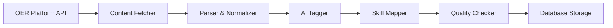
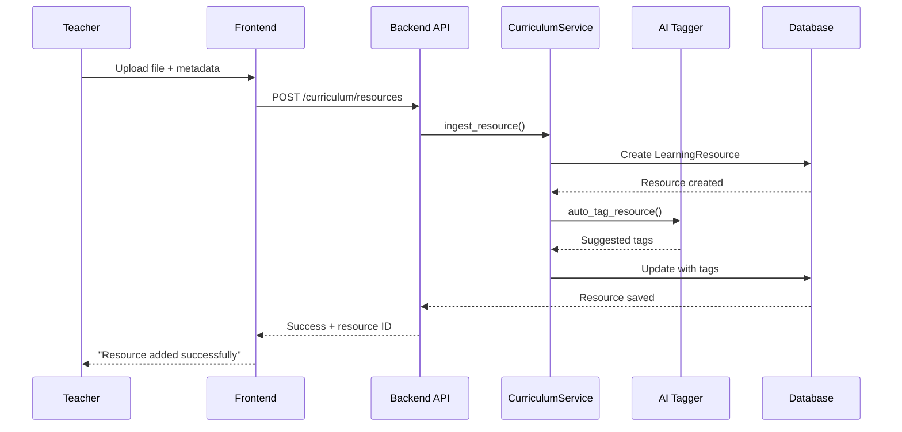
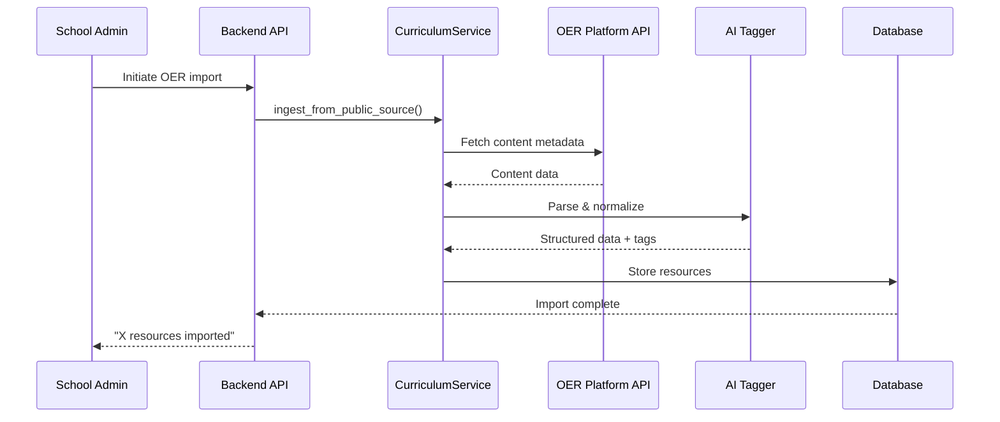
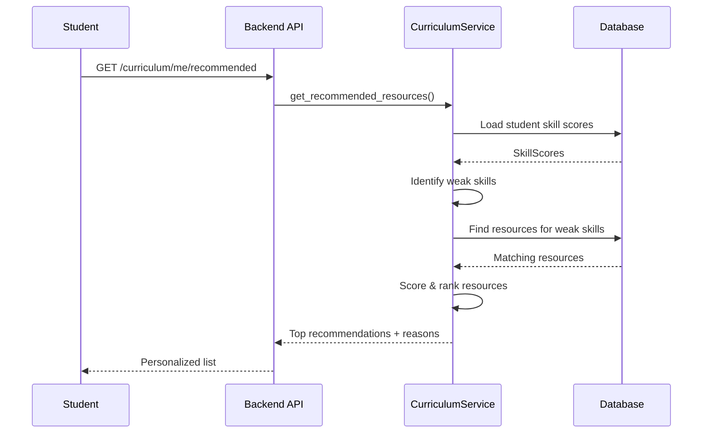

# Stellar AI Curriculum Engine

**Version:** 1.0
**Date:** 2025-11-14
**Purpose:** Content Ingestion, Management & AI-Powered Recommendations

---

## Executive Summary

The Stellar AI Curriculum Engine is a sophisticated content management system that ingests, organizes, and recommends learning resources from multiple sources. It bridges the gap between diverse educational content and personalized student learning needs through intelligent mapping to skills and AI-powered recommendations.

**Key Features:**
- **Multi-Source Ingestion:** Schools, teachers, public OER, AI-generated content
- **Skill Mapping:** Links resources to specific competencies
- **AI Recommendations:** Personalized content suggestions based on student needs
- **Quality Tracking:** Engagement metrics and quality scores
- **LVO Integration:** Seamlessly supports Learn-Verify-Own architecture

---

## Content Sources

### 1. School Internal Systems

**Description:** Content from school's proprietary systems, LMS platforms, or curriculum databases

**Integration Methods:**
- API connections (Canvas, Google Classroom, Schoology)
- MCP (Model Context Protocol) tools for real-time data access
- Manual uploads via admin interface
- Batch imports (CSV, JSON)

**Example:**
```
School: Lincoln Elementary
Content: "Multiplication Word Problems Workbook"
Source Type: school_internal
Access: School-specific, not public
```

### 2. Teacher Uploads

**Description:** Content created or curated by individual teachers

**Formats Supported:**
- PDFs, Word documents, presentations
- Videos (uploaded or linked)
- Interactive exercises
- Worksheets and assessments

**Workflow:**
1. Teacher creates/finds content
2. Uploads via teacher dashboard
3. Tags with subject, grade, skills
4. System auto-suggests additional tags via AI
5. Content available to students in teacher's classes

**Example:**
```
Teacher: Ms. Rodriguez
Content: "Fractions Pizza Game"
Type: interactive_exercise
Skills: [Basic Fractions, Visual Fractions, Real-World Math]
```

### 3. Public Open Educational Resources (OER)

**Description:** Openly licensed content from reputable educational platforms

**Supported Sources:**
- Khan Academy
- OpenStax
- MIT OpenCourseWare
- CK-12
- PhET Simulations
- NASA STEM Resources
- Library of Congress
- National Geographic Education

**Ingestion Process:**


**Automatic Tagging:**
- Subject classification (NLP analysis)
- Grade level inference (readability scores)
- Skill mapping (LLM-powered analysis)
- Difficulty assessment
- Language detection

### 4. Intel Input (AI-Assisted Content)

**Description:** Content created or enhanced with external AI tools (ChatGPT, Claude, etc.)

**Use Cases:**
- Teachers use AI to generate practice problems
- AI creates personalized explanations
- AI translates content to other languages
- AI generates differentiated versions (easier/harder)

**Quality Assurance:**
- Teacher review required before publication
- Flagged as "AI-assisted" for transparency
- Student feedback tracked
- Automatic quality scoring based on engagement

### 5. Stellar AI Generated

**Description:** Content dynamically generated by Stellar AI's own systems

**Capabilities:**
- Custom exercises based on student weak skills
- Personalized story problems featuring student interests
- Adaptive difficulty adjustments
- Real-time feedback and hints

---

## Data Model

### LearningResource

Primary content entity with complete metadata:

| Field | Type | Description |
|-------|------|-------------|
| `id` | UUID | Unique identifier |
| `title` | String(500) | Resource title |
| `description` | Text | Full description |
| `resource_type` | Enum | text, video, pdf, quiz, interactive_exercise, etc. |
| `url` | String(1000) | External URL (if applicable) |
| `file_path` | String(1000) | Local storage path (if uploaded) |
| `language` | String(10) | Content language (ISO code) |
| `subject` | String(100) | Subject area (math, reading, science, etc.) |
| `grade_min` / `grade_max` | Integer | Grade range (0-12) |
| `age_min` / `age_max` | Integer | Age range (6-18) |
| `estimated_minutes` | Integer | Time to complete |
| `source_type` | Enum | school_internal, teacher_uploaded, public_open_content, etc. |
| `source_attribution` | Text | Original author/platform credit |
| `license_type` | String(100) | Copyright/license info |
| `created_by_user_id` | UUID | User who added resource |
| `school_id` | UUID | School that owns resource (if applicable) |
| `is_active` | Boolean | Currently available |
| `is_public` | Boolean | Shareable across schools |
| `difficulty_level` | String(50) | beginner, intermediate, advanced |
| `quality_score` | Integer | 0-100 based on usage and feedback |
| `view_count` | Integer | Number of views |
| `completion_count` | Integer | Number of completions |
| `resource_metadata` | JSON | Additional flexible data |

### ResourceSkillLink (Many-to-Many)

Links resources to the skills they teach:

```python
resource_skills = Table(
    "resource_skills",
    Column("resource_id", UUID, ForeignKey("learning_resources.id")),
    Column("skill_id", UUID, ForeignKey("skills.id"))
)
```

This enables:
- Finding all resources that teach a specific skill
- Listing all skills covered by a resource
- Skill-based recommendations
- Learning path resource suggestions

---

## AI-Powered Recommendations

### Recommendation Algorithm

**Goal:** Suggest the most relevant resources for each student's current needs

**Strategy:**

```python
def recommend_resources(student):
    1. Identify weak skills (score < 60)
    2. Find resources teaching those skills
    3. Filter by age/grade appropriateness
    4. Score each resource by:
       - Skill coverage (how many weak skills addressed)
       - Skill weakness (weaker = higher priority)
       - Resource quality (engagement metrics)
       - Type variety (mix videos, exercises, readings)
    5. Return top N recommendations with reasons
```

**Relevance Scoring Formula:**

```
relevance_score = (
    skill_coverage_ratio * 0.4 +
    resource_quality_score * 0.3 +
    skill_weakness_factor * 0.3
)
```

**Example Output:**

```json
{
  "student_id": "uuid-123",
  "recommendations": [
    {
      "resource_id": "uuid-456",
      "title": "Fraction Fundamentals Video",
      "resource_type": "video",
      "estimated_minutes": 12,
      "relevance_score": 0.85,
      "reason": "This resource helps you practice Basic Fractions and Visual Fractions",
      "target_skills": ["Basic Fractions", "Visual Fractions", "Equivalent Fractions"]
    },
    {
      "resource_id": "uuid-789",
      "title": "Interactive Fraction Pizza Game",
      "resource_type": "interactive_exercise",
      "estimated_minutes": 20,
      "relevance_score": 0.82,
      "reason": "This resource helps you practice Visual Fractions and 2 more skills you're working on",
      "target_skills": ["Visual Fractions", "Comparing Fractions", "Real-World Math"]
    }
  ]
}
```

---

## LVO Integration

### LEARN Phase

**Resources as Learning Content:**
- Mentors recommend resources during conversations
- Students browse recommendations in dashboard
- Resources mapped to LearningModules
- Progress tracked through resource completion

**Workflow:**
```
Student has weak skill → AI recommends resource →
Student completes resource → Skill score updated →
New recommendations generated
```

### VERIFY Phase

**Resources for Assessment:**
- Quizzes and exercises provide verification evidence
- Completion triggers skill score updates
- High performance may trigger automatic verification
- Teachers review student work on resources

### OWN Phase

**Resources Contribute to Credentials:**
- Resource completion counts toward skill mastery
- Module resources lead to module credentials
- Path resources lead to path credentials
- Resource metadata included in credential evidence

---

## API Endpoints

### Create Resource
```
POST /api/v1/curriculum/resources
Body: LearningResourceCreate
Auth: teacher, school_admin
```

### List/Search Resources
```
GET /api/v1/curriculum/resources
Query params:
  - query: text search
  - subject: filter by subject
  - resource_type: filter by type
  - grade_min/max: grade range
  - source_type: filter by source
  - is_public: public/private
Auth: any authenticated user
```

### Get Resource Details
```
GET /api/v1/curriculum/resources/{id}
Returns: LearningResourceWithSkills
Auth: any authenticated user
```

### Link Resource to Skills
```
POST /api/v1/curriculum/resources/{id}/skills
Body: List[UUID] (skill IDs)
Auth: teacher, school_admin
```

### Get Personalized Recommendations
```
GET /api/v1/curriculum/me/recommended
Query params:
  - limit: number of recommendations (default 5)
Returns: StudentResourceRecommendations
Auth: student
```

### Ingest from Public Source
```
POST /api/v1/curriculum/ingest/public
Body: { content_data }
Auth: school_admin
```

---

## Content Ingestion Workflows

### Workflow 1: Teacher Manual Upload



### Workflow 2: Public OER Ingestion



### Workflow 3: Student Gets Recommendations



---

## Mapping Resources to Skills

### Manual Mapping (Teacher-Driven)

**Teacher Interface:**
1. Select resource
2. Click "Map to Skills"
3. Search/browse skill library
4. Select relevant skills
5. Save mapping

**Example:**
```
Resource: "Photosynthesis Video"
Mapped Skills:
  - Plant Biology Basics
  - Energy Transformation
  - Scientific Observation
  - Ecosystem Understanding
```

### Automatic Mapping (AI-Driven)

**AI Analysis:**
1. Extract resource title, description, content (if available)
2. Use LLM to identify topics and concepts
3. Match topics to existing skills in database
4. Suggest skills with confidence scores
5. Teacher reviews and confirms

**Prompt Example:**
```
Analyze this educational resource and identify which skills it teaches:

Title: "Introduction to Fractions"
Description: "Learn about fractions with visual examples using pizza slices.
Understand numerators, denominators, and equivalent fractions."

Available skills: [list of math skills]

Output the most relevant skills with confidence scores.
```

---

## Quality Metrics

### Engagement Tracking

**Metrics Collected:**
- `view_count`: How many students viewed
- `completion_count`: How many completed
- `average_time_spent`: Actual vs. estimated time
- `return_rate`: Students who revisit
- `skill_improvement`: Avg skill score change after use

**Quality Score Calculation:**

```python
quality_score = (
    completion_rate * 40 +
    skill_improvement_avg * 30 +
    student_rating * 20 +
    return_rate * 10
)
```

### Teacher Reviews

Teachers can:
- Rate resources (1-5 stars)
- Flag inappropriate/broken content
- Suggest improvements
- Share with colleagues

---

## Future Enhancements

### Phase 2
- Real-time OER API integration (Khan Academy, OpenStax)
- Advanced AI content generation
- Multilingual auto-translation
- Accessibility compliance checking
- Standards alignment (CCSS, NGSS)

### Phase 3
- Adaptive content sequencing
- Student-created content sharing
- Peer review system
- Content marketplace
- Integration with major LMS platforms

### Phase 4
- VR/AR content support
- Live tutoring session integration
- Collaborative learning resources
- Parent-child learning resources
- Cross-school content sharing network

---

## Technical Implementation

### Database Migration

Run Alembic migration to create curriculum tables:

```bash
cd backend
alembic revision -m "add_curriculum_tables"
alembic upgrade head
```

### Service Usage

```python
from app.services.curriculum import CurriculumService

# Ingest a resource
resource = await CurriculumService.ingest_resource(
    resource_data={
        "title": "Fraction Basics",
        "resource_type": ResourceType.VIDEO,
        "url": "https://example.com/video",
        "subject": "math",
        "source_type": SourceType.TEACHER_UPLOADED
    },
    db=db,
    created_by_user_id=teacher_id
)

# Link to skills
await CurriculumService.link_resource_to_skills(
    resource_id=resource.id,
    skill_ids=[skill1_id, skill2_id],
    db=db
)

# Get recommendations for student
recommendations = await CurriculumService.get_recommended_resources_for_student(
    student_id=student_id,
    db=db,
    limit=5
)
```

---

## Stakeholder Benefits

### Schools
- Centralized content library
- Quality control and curation
- Content reuse across teachers
- Standards alignment tracking
- Cost savings (leverage free OER)

### Teachers
- Save time finding/creating content
- Access to vast resource library
- Easy content sharing
- Automatic skill mapping suggestions
- Student engagement analytics

### Students
- Personalized content recommendations
- Variety of learning formats
- Self-paced learning
- Clear connection to skills
- Engaging, high-quality materials

### Parents
- See what child is learning
- Access to same resources at home
- Support homework and practice
- Understand curriculum alignment

---

## Success Metrics

**Content Library:**
- Number of resources per subject
- Public vs. school-specific ratio
- Resource type diversity
- Language variety

**Engagement:**
- Average resources viewed per student per week
- Completion rates by resource type
- Time spent vs. estimated time
- Return rates (repeat usage)

**Learning Impact:**
- Skill score improvements post-resource
- Resource-to-credential correlation
- Student satisfaction ratings
- Teacher adoption rates

**Quality:**
- Average quality scores by source type
- Flagged content rate (should be <1%)
- Teacher curation activity
- Skill mapping accuracy

---

## Conclusion

The Stellar AI Curriculum Engine transforms diverse educational content from multiple sources into a unified, personalized learning ecosystem. By intelligently mapping resources to skills and leveraging AI for recommendations, it ensures every student receives the right content at the right time, maximizing learning effectiveness while minimizing teacher workload.

**Key Differentiators:**
✅ Multi-source ingestion (not limited to proprietary content)
✅ AI-powered personalization (not one-size-fits-all)
✅ Skill-based architecture (clear learning outcomes)
✅ LVO integration (content → competency → credentials)
✅ Open and extensible (APIs for integration)

This is education content management done right - intelligent, personalized, and student-centered.

---

**End of Document**
