# Stellar AI - Complete Demo Story

**Version:** 1.0
**Last Updated:** November 14, 2025
**For:** Investors, School Administrators, Educational Decision Makers

---

## Table of Contents

1. [Executive Summary](#executive-summary)
2. [Demo Scenario Overview](#demo-scenario-overview)
3. [The Four User Journeys](#the-four-user-journeys)
4. [Complete Demo Script](#complete-demo-script)
5. [Technical Architecture Flow](#technical-architecture-flow)
6. [Key Differentiators](#key-differentiators)
7. [Demo Data](#demo-data)

---

## Executive Summary

**Stellar AI** is an AI-powered personalized learning platform that brings together:

- **8 Unique AI Mentor Avatars** with distinct teaching personalities
- **Learn-Verify-Own (LVO) Architecture** for verified, blockchain-backed credentials
- **Intelligent Curriculum Engine** with AI-powered content recommendations
- **Multi-Source Content Ingestion** (school systems, teachers, public OER, AI-generated)
- **Comprehensive Admin & CRM Layer** for schools and teachers

**This demo showcases a complete end-to-end learning experience** across 4 user roles:
1. School Administrator
2. Teacher
3. Student
4. Parent

---

## Demo Scenario Overview

### Setting: Dubai Future Academy

**School:** Dubai Future Academy
**Class:** Grade 3A – English Focus
**Student:** Amira Hassan (8 years old, Grade 3)
**Teacher:** Sara Thompson
**Parent:** Hassan Al-Sharif
**Admin:** Dr. Ahmed Al-Mansouri

### The Story

Amira is a bright 3rd grader at Dubai Future Academy. She excels at reading simple sentences but struggles with identifying the main idea in stories. The Stellar AI platform:

1. **Detects** her weak skill (Reading A1 – Main Idea, score: 45/100)
2. **Recommends** personalized learning resources
3. **Connects her with Luna**, a gentle AI mentor avatar suited to her age and needs
4. **Tracks her progress** through verified assessments
5. **Issues blockchain credentials** when she achieves mastery
6. **Keeps stakeholders informed** (teacher, parent, admin)

---

## The Four User Journeys

### Journey 1: School Administrator - Dr. Ahmed

**Goal:** Manage school-wide curriculum, monitor student progress, ensure quality

#### Key Actions:

1. **Login:** `admin@stellar-demo.school` / `StellarDemo123!`
2. **Dashboard View:**
   - Total students: 1 (expandable)
   - Total skills: 5
   - Total learning paths: 2
   - Total resources: 4
   - Credentials issued: 1
   - Total XP earned: 85

3. **Navigate to Content Management:**
   - View all 4 learning resources
   - See resource quality scores, view counts, completion rates
   - Filter by subject, grade, skill

4. **Add New Resource:**
   - Title: "English A1 Story – The Lost Treasure"
   - Type: Interactive Exercise
   - Subject: Reading
   - Grade: 3-4
   - Link to skills: "Reading A1 – Main Idea"
   - Source: Teacher uploaded
   - Save & publish

5. **View Skills Dashboard:**
   - See all 5 skills
   - View which students struggle with each
   - See resource coverage per skill

6. **Student Overview:**
   - View Amira's complete LVO profile
   - Skills: 3 assessed, 1 weak (Main Idea: 45)
   - Learning paths: 2 active
   - Credentials: 1 earned ("Simple Sentences Bronze")
   - Recommended resources: 3 matched to weak skills

#### Admin Value Props:
- **Data-driven decisions:** See exactly where students struggle
- **Quality control:** Manage and curate all learning content
- **ROI visibility:** Track credentials issued, XP earned, engagement
- **Scalability:** One admin can manage hundreds of students

---

### Journey 2: Teacher - Sara Thompson

**Goal:** Support students, assign tasks, monitor class progress

#### Key Actions:

1. **Login:** `teacher.sara@stellar-demo.school` / `StellarDemo123!`

2. **Class Dashboard:**
   - View Class: "Grade 3A – English Focus"
   - Student roster: Amira Hassan
   - Overall class performance snapshot

3. **Open Amira's Profile:**
   - Current XP: 85 (Level 0 → approaching Level 1)
   - Active learning paths: 2
   - Module progress:
     - ✅ Simple Sentences (completed, 78%)
     - 🔄 Short Stories (in progress, 45%)
   - **Weak skill alert:** Reading Main Idea (45)

4. **Assign Personalized Resource:**
   - Platform recommends: "Finding the Main Idea - Animated Story"
   - Teacher assigns it to Amira
   - Sets due date: 3 days

5. **Review Verifications:**
   - See AI verification for "Simple Sentences" skill
   - Evidence: 2 tasks completed, 78% average
   - Status: Verified ✅

6. **Track Credentials:**
   - Amira earned: "English A1 – Simple Sentences (Bronze)"
   - Blockchain credential minted (simulated)
   - Ready to share with parents/future schools

#### Teacher Value Props:
- **Time saved:** AI recommends resources automatically
- **Personalization at scale:** Every student gets custom path
- **Evidence-based:** Verifications show actual mastery
- **Engagement:** Gamification (XP, levels, badges) motivates students

---

### Journey 3: Student - Amira Hassan

**Goal:** Learn, practice skills, earn credentials, have fun

#### Key Actions:

1. **Login:** `amira.student@stellar-demo.school` / `StellarDemo123!`

2. **Dashboard View:**
   - Welcome message: "Hi Amira! 🌙"
   - Current XP: 85 / 100 (15 XP away from Level 1!)
   - Skills:
     - 🟢 Simple Sentences: 72 (good!)
     - 🔴 Main Idea: 45 (needs practice)
     - 🟡 Add to 20: 68 (improving!)

3. **See Weak Skill Alert:**
   - "Let's work on: Reading A1 – Main Idea"
   - Recommended resources:
     - 🎥 Finding the Main Idea - Animated Story (8 min)
     - 📝 Main Idea Practice Worksheet
     - 🎮 Story Detective Game

4. **Choose a Mentor:**
   - See 8 mentor avatars
   - Luna 🌙: "The Gentle Guide - Perfect for reading!"
   - Click "Start Learning with Luna"

5. **Conversation with Luna:**
   - Amira: "Can you help me understand the main idea?"
   - Luna: "Of course, Amira! I see you've been working on reading – great job completing Simple Sentences! Let's practice finding the main idea together. Imagine a story about a cat who lost her kitten. What do you think the story is mostly about?"
   - [Luna knows Amira's name, progress, weak skills, and adapts tone]

6. **Complete Resource:**
   - Watch "Finding the Main Idea - Animated Story"
   - Answer 5 questions
   - Score: 75/100 (+30 improvement!)

7. **Earn XP & See Progress:**
   - +30 XP for completing resource!
   - Total XP: 115 → **Level 1 Achieved!** 🎉
   - Main Idea skill updated: 45 → 60 (improved!)

8. **View Credentials:**
   - Badge earned: "Reading Rookie" 🏅
   - Certificate: "English A1 – Simple Sentences (Bronze)"
   - Blockchain verified ✅
   - Can share with parents

#### Student Value Props:
- **Fun & engaging:** Avatars, games, stories, XP, levels
- **Personalized:** Always working on the right skill at the right level
- **Motivating:** Clear progress, rewards, achievements
- **Empowering:** Own verified credentials for life

---

### Journey 4: Parent - Hassan Al-Sharif

**Goal:** Monitor child's progress, understand strengths/weaknesses, support learning at home

#### Key Actions:

1. **Login:** `parent.hassan@stellar-demo.school` / `StellarDemo123!`

2. **Child Overview:**
   - Child: Amira Hassan (Grade 3)
   - Current level: 1 (115 XP)
   - Learning streaks: 5 days

3. **Skills Dashboard:**
   - Strengths:
     - ✅ Simple Sentences: 72
     - ✅ Add to 20: 68
   - Areas to practice:
     - ⚠️ Main Idea: 60 (improving! was 45)
     - ⚠️ Word Problems: not yet assessed

4. **View Learning Paths:**
   - English A1 Path: 35% complete
     - Module 1: Simple Sentences ✅ (78%)
     - Module 2: Short Stories 🔄 (60% in progress)
   - Math Basics Path: 20% complete

5. **Recent Activity:**
   - Completed: "Finding the Main Idea - Animated Story"
   - Earned: +30 XP, Level 1 Achievement
   - Skill improved: Main Idea (45 → 60)

6. **Credentials Earned:**
   - "English A1 – Simple Sentences (Bronze)"
   - Blockchain verified
   - Download certificate PDF
   - Share on LinkedIn (for portfolio)

7. **Recommendations for Home:**
   - Practice main idea with bedtime stories
   - Ask "What was the story mostly about?"
   - Suggested family activity: Story Detective game together

8. **Mentor Interactions:**
   - Last session with Luna (Nov 14, 3:45 PM)
   - Topics discussed: Main idea, story comprehension
   - Luna's assessment: "Amira is making great progress! She's starting to identify main ideas in simple stories."

#### Parent Value Props:
- **Transparency:** See exactly what child is learning
- **Verified progress:** Not just grades - blockchain credentials
- **Actionable:** Know how to help at home
- **Peace of mind:** AI mentor provides quality, safe guidance
- **Future-proof:** Credentials transfer to new schools

---

## Complete Demo Script

### Full Demo Flow (15-20 minutes)

```mermaid
graph TD
    A[Start: School Admin Login] --> B[Admin Dashboard - Overview Stats]
    B --> C[View Student: Amira Hassan]
    C --> D[See Weak Skill: Main Idea Score 45]
    D --> E[View Recommended Resources]
    E --> F[Add New Resource to Library]
    F --> G[Switch to Teacher Login]
    G --> H[Teacher: Assign Resource to Amira]
    H --> I[Switch to Student Login]
    I --> J[Student: See Recommendation]
    J --> K[Choose Mentor Luna]
    K --> L[Conversation: Luna Helps with Main Idea]
    L --> M[Complete Resource Video]
    M --> N[Earn XP + Level Up!]
    N --> O[Skill Score Updates: 45 → 60]
    O --> P[Switch to Parent Login]
    P --> Q[Parent: See Progress & Credentials]
    Q --> R[View Blockchain Certificate]
    R --> S[End: Complete LVO Loop Demonstrated]
```



### Opening Script (for presenter):

> "Welcome to Stellar AI - the world's first AI-powered learning platform that combines personalized mentor avatars with blockchain-verified credentials.
>
> Today I'll show you a complete learning journey through the eyes of 4 users: a school administrator, a teacher, a student named Amira, and her parent.
>
> What makes Stellar AI unique is our Learn-Verify-Own architecture. Students don't just learn - they earn verified, blockchain-backed credentials that they own for life.
>
> Let's start with Dr. Ahmed, the school administrator..."

---

## Technical Architecture Flow


### Data Flow: Personalized Learning Recommendation


---

## Key Differentiators

### vs. Traditional LMS (Canvas, Moodle, Google Classroom)

| Feature | Stellar AI | Traditional LMS |
|---------|-----------|----------------|
| **Personalization** | AI analyzes every student's skill gaps, recommends specific resources | Manual course assignment |
| **Mentorship** | 8 AI avatars with distinct personalities, age-aware teaching | Generic text responses or none |
| **Verification** | Multi-source verification (AI + teacher + peer) | Teacher grades only |
| **Credentials** | Blockchain NFTs, portable, verifiable | Platform-locked badges |
| **Content** | Multi-source ingestion (school + OER + AI-generated) | Manual upload only |
| **Curriculum** | AI-powered recommendations based on weak skills | Static lesson plans |

### vs. AI Tutors (Khan Academy, Duolingo)

| Feature | Stellar AI | AI Tutors |
|---------|-----------|-----------|
| **Personas** | 8 distinct mentors (Luna, Sage, Nova, etc.) | Single AI voice |
| **LVO Architecture** | Learn → Verify → Own (blockchain credentials) | Learn only |
| **School Integration** | Admin panel, teacher tools, parent dashboards | Student-facing only |
| **Content Management** | Schools can add their own curriculum | Fixed content library |
| **Multi-stakeholder** | Students, teachers, parents, admins | Students only |

### vs. Blockchain Education (Blockcerts, Learning Economy)

| Feature | Stellar AI | Blockchain Ed |
|---------|-----------|---------------|
| **Learning Platform** | Full LMS + AI mentors + curriculum | Credential issuance only |
| **AI Tutoring** | 8 personalized avatars | None |
| **Content** | Intelligent curriculum engine | None |
| **User Experience** | Gamified, engaging, avatar-driven | Technical, credential-focused |

**Stellar AI = LMS + AI Tutor + Blockchain Credentials + Content Marketplace**

---

## Demo Data

### Demo Credentials

| Role | Email | Password |
|------|-------|----------|
| **Admin** | `admin@stellar-demo.school` | `StellarDemo123!` |
| **Teacher** | `teacher.sara@stellar-demo.school` | `StellarDemo123!` |
| **Student** | `amira.student@stellar-demo.school` | `StellarDemo123!` |
| **Parent** | `parent.hassan@stellar-demo.school` | `StellarDemo123!` |

### Demo School Data

- **School:** Dubai Future Academy
- **Location:** Dubai Knowledge Park, Dubai, UAE
- **Class:** Grade 3A – English Focus
- **Subjects:** English A1, Math Basics

### Demo Skills (5 total)

1. Reading A1 – Simple Sentences
2. Reading A1 – Main Idea ⚠️ (Amira's weak skill)
3. Math – Add to 20
4. Math – Word Problems (Beginner)
5. Critical Thinking – Pattern Recognition

### Demo Learning Paths (2 total)

**English A1 – Starter Path:**
- Module 1: Simple Sentences (Amira completed ✅)
- Module 2: Short Stories (Amira in progress 🔄)

**Math Basics – Grade 3:**
- Module 1: Addition to 20
- Module 2: Word Problems

### Demo Resources (4 total)

1. **Finding the Main Idea - Animated Story** (Video, 8 min)
   - Subject: Reading
   - Skills: Main Idea
   - Quality: 85/100

2. **Simple Sentences Practice Worksheet** (PDF, 15 min)
   - Subject: Reading
   - Skills: Simple Sentences
   - Quality: 90/100

3. **Add to 20 – Number Line Game** (Interactive, 12 min)
   - Subject: Math
   - Skills: Add to 20
   - Quality: 88/100

4. **Word Problems for Beginners** (Exercise, 20 min)
   - Subject: Math
   - Skills: Word Problems
   - Quality: 82/100

### Demo Student: Amira Hassan

- **Grade:** 3
- **Total XP:** 85 (approaching Level 1)
- **Weak Skill:** Main Idea (score: 45)
- **Strong Skills:** Simple Sentences (72), Add to 20 (68)
- **Credentials Earned:** 1 ("English A1 – Simple Sentences Bronze")
- **Badges:** 1 ("Reading Rookie")
- **Learning Paths:** 2 active (English A1, Math Basics)

---

## Presentation Tips

### For Investor Demos:

1. **Start with the problem:** Traditional education is one-size-fits-all, students fall through the cracks
2. **Show the student journey first:** Amira's story is compelling and human
3. **Then show the admin value:** Data, ROI, scalability
4. **End with differentiation:** LMS + AI + Blockchain in one platform
5. **Call to action:** Pilot program with 1-2 schools

### For School Demos:

1. **Start with admin dashboard:** Show data visibility
2. **Show teacher workflow:** Time-saving, personalization
3. **Demo student experience:** Engagement, gamification
4. **Show parent dashboard:** Transparency, peace of mind
5. **Call to action:** Free trial for one classroom

### For Education Conferences:

1. **Start with pedagogy:** LVO architecture, verified learning
2. **Show AI mentors:** Personalized, age-aware, diverse teaching styles
3. **Demo curriculum engine:** Multi-source, AI-powered recommendations
4. **Show credentials:** Blockchain, portable, lifelong
5. **Call to action:** Partnership, content providers, school networks

---

## Appendix: Quick Start Commands

### Setup Demo Database:
```bash
cd backend
./scripts/run_demo_seed.sh
```

### Start Backend:
```bash
cd backend
uvicorn app.main:app --reload --host 0.0.0.0 --port 8000
```

### Start Frontend:
```bash
npm run dev
```

### Access Points:
- Frontend: http://localhost:5173
- Backend API: http://localhost:8000
- API Docs: http://localhost:8000/docs

---

**Ready to revolutionize education with Stellar AI!** 🌟
