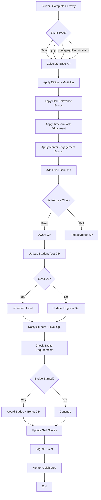
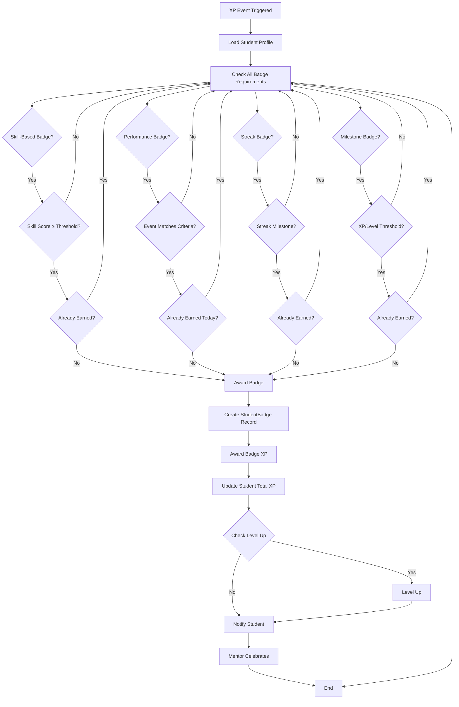
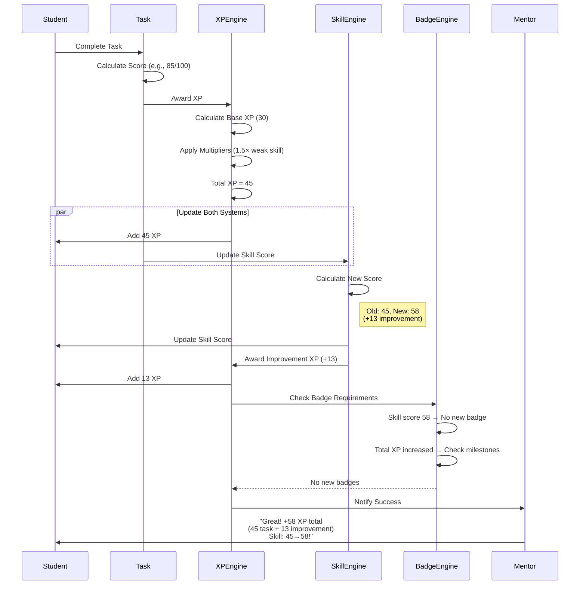

# Stellar AI Gamification & XP Engine

**Version:** 1.0  
**Date:** November 15, 2025  
**Status:** Production Architecture Specification  
**Author:** Senior System Architect  

---

## Table of Contents

1. [Executive Summary](#executive-summary)
2. [Core Philosophy: "Motivation · Mastery · Momentum"](#core-philosophy-motivation--mastery--momentum)
3. [Complete XP System](#complete-xp-system)
4. [Badge System](#badge-system)
5. [Streak System](#streak-system)
6. [Skill Progression Link](#skill-progression-link)
7. [Integration with LVO (Learn – Verify – Own)](#integration-with-lvo-learn--verify--own)
8. [Integration with AI Mentors](#integration-with-ai-mentors)
9. [Anti-Abuse Protection](#anti-abuse-protection)
10. [Example Student Journey](#example-student-journey)
11. [Technical Architecture](#technical-architecture)
12. [API Endpoints](#api-endpoints)
13. [JSON Schemas](#json-schemas)
14. [Mermaid Diagrams](#mermaid-diagrams)
15. [Future Extensions](#future-extensions)
16. [Final Summary](#final-summary)

---

## Executive Summary

The **Stellar AI Gamification & XP Engine** is the motivational heart of the platform. It transforms learning from a chore into an engaging, rewarding journey by applying proven game mechanics and behavioral psychology principles.

**What Makes It Revolutionary:**

- **Not Just Points:** XP represents actual learning effort and comprehension, not completion alone
- **Multi-Dimensional Rewards:** XP, levels, badges, streaks, and credentials work together
- **Anti-Gaming Design:** Smart cooldowns, diminishing returns, and AI-detection prevent exploitation
- **Skill-Linked:** XP awards correlate directly with skill score improvements
- **Mentor-Integrated:** Each AI mentor celebrates progress in their unique voice
- **Evidence-Based:** Built on proven frameworks: Self-Determination Theory, Flow State, Growth Mindset

**Core Goals:**

1. **Motivate** continuous learning through visible progress
2. **Reward** effort and improvement, not just perfection
3. **Build habits** through streaks and daily engagement
4. **Celebrate milestones** through badges and level-ups
5. **Connect** gamification to actual skill mastery (LVO integration)

**Key Metrics:**
- Student engagement: Daily active usage, session length
- Learning outcomes: Skill score improvements correlated with XP
- Retention: Weekly/monthly return rates
- Motivation: Self-reported enjoyment and persistence

---

## Core Philosophy: "Motivation · Mastery · Momentum"

### 1. **Motivation** – Why Students Want to Learn

**Intrinsic Motivation Drivers:**
- **Autonomy:** Students choose their learning paths and mentors
- **Competence:** Clear feedback showing growth and achievement
- **Relatedness:** Connection with AI mentors who remember and celebrate them

**Extrinsic Motivation (Used Wisely):**
- **XP and Levels:** Tangible progress markers
- **Badges:** Recognition of accomplishments
- **Streaks:** Commitment visualization
- **Leaderboards (Future):** Healthy, opt-in competition

**Key Principle:** Extrinsic rewards support intrinsic motivation, never replace it.

### 2. **Mastery** – True Learning, Not Just Completion

**Gamification Must Reflect Real Learning:**
- High XP rewards for difficult skills mastered
- Bonus XP for improving weak skills (effort where it matters)
- Diminishing returns for repeating easy content
- AI-adjusted difficulty rewards: harder tasks = more XP

**Quality Over Quantity:**
- Completing 10 easy tasks ≠ Completing 1 challenging task
- System rewards depth and understanding
- Verification gates ensure XP represents real competency

### 3. **Momentum** – Building Sustainable Habits

**Streak System:**
- Daily learning streaks create commitment
- Lost streak logic encourages comeback
- Weekly/monthly milestones provide variety

**Progressive Challenge:**
- Early levels: Fast, encouraging progress
- Mid levels: Steady growth
- High levels: Mastery demonstration

**Continuous Feedback:**
- Real-time XP notifications
- Celebratory animations for milestones
- Mentor encouragement at key moments

---

## Complete XP System

### XP Events – What Earns XP

| Event | Base XP | Notes |
|-------|---------|-------|
| **Task Completion** | 10-50 | Varies by task complexity |
| **Quiz Passed** | 20-100 | Based on difficulty and score |
| **Module Completion** | 100-300 | Significant milestone |
| **Learning Path Completion** | 500-1000 | Major achievement |
| **Conversation with Mentor** | 5-20 | Per meaningful exchange |
| **Resource Viewed** | 5-15 | Video, article, interactive |
| **Resource Completed** | 10-30 | With assessment passed |
| **Skill Score Improvement** | 1 XP per point | E.g., 45→60 = +15 XP |
| **First Task of the Day** | +10 bonus | Encourages daily habit |
| **Streak Milestone** | 50-200 | 7, 14, 30, 60, 100 days |
| **Badge Earned** | 25-100 | Per badge tier |
| **Credential Issued** | 200-500 | Major LVO achievement |
| **Perfect Score** | +20% bonus | 100% on assessment |
| **Helped Another Student (Future)** | 30-50 | Peer tutoring |

### XP Weighting – Dynamic Adjustments

**Difficulty Multiplier:**
```
XP_awarded = base_XP × difficulty_multiplier

difficulty_multiplier:
- Beginner: 1.0×
- Intermediate: 1.3×
- Advanced: 1.6×
- Expert: 2.0×
```

**Skill Relevance Multiplier:**
```
IF student has weak skill (score < 60):
    XP_awarded × 1.5 (Effort Bonus)

IF student improving struggling skill:
    XP_awarded × 1.3 (Growth Bonus)
```

**Time-on-Task Bonus:**
```
IF time_spent > expected_time AND quality_high:
    XP_awarded × 1.2 (Persistence Bonus)

IF time_spent < 50% expected_time:
    XP_awarded × 0.7 (Possible rushing penalty)
```

**Mentor Engagement Bonus:**
```
IF student asked clarifying questions:
    XP_awarded × 1.1 (Curiosity Bonus)

IF student engaged in deep conversation:
    XP_awarded × 1.2 (Engagement Bonus)
```

### Leveling Curve – From Beginner to Master

**Level Progression Formula:**
```python
def xp_required_for_level(level):
    """
    Exponential growth with smoothing
    Ensures early levels feel achievable, later levels require mastery
    """
    if level == 0:
        return 0
    if level == 1:
        return 100
    
    # Exponential curve: base_xp * (level ^ exponent)
    base_xp = 100
    exponent = 1.5
    return int(base_xp * (level ** exponent))

# Level thresholds:
Level 1: 100 XP
Level 2: 283 XP
Level 3: 520 XP
Level 4: 800 XP
Level 5: 1,118 XP
Level 6: 1,470 XP
Level 7: 1,850 XP
Level 8: 2,263 XP
Level 9: 2,702 XP
Level 10: 3,162 XP (Master)
Level 20: 8,944 XP
Level 50: 35,355 XP
Level 100: 100,000 XP (Legendary)
```

**Level Titles:**
```
Level 0: Newcomer 🌱
Level 1: Explorer 🔍
Level 2: Apprentice 📚
Level 3: Learner 🎓
Level 4: Scholar 📖
Level 5: Achiever 🏅
Level 6: Expert ⭐
Level 7: Champion 🏆
Level 8: Master 👑
Level 9: Virtuoso 💎
Level 10: Legend 🌟
```

### Anti-Exploit Rules

**1. Cooldown System:**
```python
# Prevent XP farming by repeating same activity
COOLDOWN_RULES = {
    "task_completion": {
        "same_task_retry": 3600,  # 1 hour cooldown
        "max_retries_per_day": 3
    },
    "resource_viewed": {
        "same_resource": 1800,  # 30 min cooldown
        "max_views_per_day": 5  # Diminishing returns after
    },
    "conversation_xp": {
        "same_mentor_session": 300,  # 5 min cooldown
        "max_conversations_per_day": 10
    }
}
```

**2. Diminishing Returns:**
```python
def calculate_diminishing_return(activity_count, base_xp):
    """
    Repeated activities earn less XP
    """
    if activity_count <= 3:
        return base_xp
    elif activity_count <= 6:
        return base_xp * 0.7
    elif activity_count <= 10:
        return base_xp * 0.5
    else:
        return base_xp * 0.3
```

**3. Quality Gates:**
```
XP only awarded if:
- Task score ≥ 60%
- Time spent ≥ 30% expected duration (no instant-clicking)
- Engagement detected (e.g., mentor interaction, progress)
```

**4. Fraud Detection:**
```python
# AI monitors for suspicious patterns
SUSPICIOUS_PATTERNS = [
    "rapid_task_completion",  # < 10% expected time
    "identical_answers",  # Copy-paste detection
    "non_human_patterns",  # Bot-like behavior
    "xp_spike_anomaly"  # Unusual XP gain rate
]

# Response: Flag for review, temporarily freeze XP, notify teacher
```

### Class/Subject Modifiers

**Per-School Configuration:**
```json
{
  "school_id": "dubai_future_academy",
  "xp_modifiers": {
    "math": 1.0,
    "reading": 1.2,  // School prioritizes reading
    "science": 1.0,
    "arts": 0.9
  },
  "bonus_events": {
    "weekend_learning": 1.5,  // Encourage weekend practice
    "after_school": 1.2
  }
}
```

**Teacher Overrides:**
```python
# Teachers can adjust XP for specific students or activities
teacher_override = {
    "student_id": "amira_hassan",
    "task_id": "main_idea_practice",
    "xp_multiplier": 2.0,  # Double XP for targeted improvement
    "reason": "Weak skill focus"
}
```

### AI-Adjusted Difficulty Rewards

**Adaptive XP Based on Student Performance:**
```python
def calculate_adaptive_xp(task, student):
    """
    AI analyzes student's current level and adjusts XP accordingly
    """
    base_xp = task.base_xp
    
    # If task is significantly above student's current skill level
    skill_gap = task.required_skill_level - student.current_skill_level
    
    if skill_gap > 20:  # Challenge
        multiplier = 1.8
    elif skill_gap > 10:  # Stretch
        multiplier = 1.4
    elif skill_gap > 0:  # Appropriate
        multiplier = 1.0
    elif skill_gap > -10:  # Review
        multiplier = 0.7
    else:  # Too easy
        multiplier = 0.5
    
    return int(base_xp * multiplier)
```

**Example:**
- Student Amira's Main Idea skill: 45/100
- Task difficulty: 60/100 (Intermediate)
- Skill gap: +15 (stretch zone)
- Base XP: 30
- Adjusted XP: 30 × 1.4 = **42 XP**

**Mentor Notification:**
> "Great job, Amira! You earned **42 XP** for tackling this challenging task. That's extra XP because you're stretching yourself! 🌟"

---

## Badge System

### Badge Categories

**1. Skill-Based Badges** (Mastery Recognition)
**2. Performance Badges** (Achievement Unlocks)
**3. Streak Badges** (Consistency Rewards)
**4. Milestone Badges** (Progress Markers)
**5. Special Badges** (Unique Accomplishments)

### 1. Skill-Based Badges

**Template:**
```
[Skill Name] – [Tier]
Bronze: Score 60-74
Silver: Score 75-89
Gold: Score 90-100
```

**Examples:**
- **Fraction Master** (Bronze/Silver/Gold)
  - Requirements: Achieve score threshold in "Fractions" skill
  
- **Reading Rookie** → **Reading Champion** → **Reading Legend**
  - Requirements: Progressive reading comprehension scores

- **Math Wizard** (Bronze/Silver/Gold)
  - Requirements: Master 5/10/15 math skills

**Badge Design:**
- Visual: Skill icon + tier color (bronze/silver/gold)
- Description: "Mastered [Skill] at [Tier] level"
- Rarity: Common (Bronze), Uncommon (Silver), Rare (Gold)

### 2. Performance Badges

| Badge Name | Requirement | XP Reward | Rarity |
|------------|-------------|-----------|--------|
| **Perfect Score** | Score 100% on any assessment | 50 | Common |
| **Triple Threat** | Complete 3 tasks in one session | 30 | Common |
| **Marathon Learner** | 2+ hours of learning in one day | 75 | Uncommon |
| **Early Bird** | Complete task before 8 AM | 25 | Common |
| **Night Owl** | Complete task after 8 PM | 25 | Common |
| **Speed Demon** | Complete module 50% faster than average | 40 | Uncommon |
| **Deep Thinker** | Spend 2× expected time with high quality | 60 | Uncommon |
| **Question Master** | Ask 10+ questions to mentor in one session | 50 | Uncommon |
| **Resource Hunter** | Complete 10 different resources | 100 | Rare |
| **Comeback Kid** | Improve score by 20+ points after failure | 75 | Uncommon |

### 3. Streak Badges

| Badge Name | Requirement | XP Reward | Rarity |
|------------|-------------|-----------|--------|
| **Getting Started** | 3-day streak | 50 | Common |
| **Dedicated Learner** | 7-day streak | 100 | Common |
| **Two Weeks Strong** | 14-day streak | 150 | Uncommon |
| **Monthly Champion** | 30-day streak | 300 | Rare |
| **Unstoppable** | 60-day streak | 500 | Epic |
| **Legendary Streak** | 100-day streak | 1000 | Legendary |
| **Weekend Warrior** | Learn on 4 consecutive weekends | 200 | Rare |

### 4. Milestone Badges

| Badge Name | Requirement | XP Reward | Rarity |
|------------|-------------|-----------|--------|
| **First Steps** | Complete first task | 25 | Common |
| **Level 5 Achiever** | Reach Level 5 | 100 | Common |
| **Level 10 Master** | Reach Level 10 | 250 | Rare |
| **Century Club** | Earn 100 total XP | 50 | Common |
| **Thousand Strong** | Earn 1,000 total XP | 200 | Uncommon |
| **XP Legend** | Earn 10,000 total XP | 1000 | Epic |
| **Skill Collector** | Assessed in 5 different skills | 100 | Common |
| **Jack of All Trades** | Score 60+ in 10 different skills | 300 | Rare |
| **Module Master** | Complete 5 modules | 150 | Uncommon |
| **Path Pioneer** | Complete 1 full learning path | 500 | Rare |

### 5. Special Badges

| Badge Name | Requirement | XP Reward | Rarity |
|------------|-------------|-----------|--------|
| **Comeback Star** | Return after 30+ day absence | 100 | Uncommon |
| **Mentor's Favorite** | 50+ conversations with one mentor | 150 | Rare |
| **Renaissance Learner** | Engage with all 8 mentors | 200 | Rare |
| **Certified** | Earn first blockchain credential | 500 | Epic |
| **Credential Collector** | Earn 5 blockchain credentials | 1000 | Epic |
| **Peer Helper** (Future) | Help 5 other students | 200 | Uncommon |
| **Content Creator** (Future) | Upload custom resource used by others | 300 | Rare |

### Badge Awarding Logic

```python
def check_and_award_badges(student, event):
    """
    Triggered after any XP-earning event
    Checks all badge requirements
    """
    new_badges = []
    
    # Skill-based badges
    for skill in student.skill_scores:
        if skill.score >= 90 and not student.has_badge(f"{skill.name}_gold"):
            new_badges.append(create_badge(skill.name, "gold"))
        elif skill.score >= 75 and not student.has_badge(f"{skill.name}_silver"):
            new_badges.append(create_badge(skill.name, "silver"))
        elif skill.score >= 60 and not student.has_badge(f"{skill.name}_bronze"):
            new_badges.append(create_badge(skill.name, "bronze"))
    
    # Streak badges
    if student.current_streak == 7:
        new_badges.append(Badge("Dedicated Learner", 100))
    elif student.current_streak == 30:
        new_badges.append(Badge("Monthly Champion", 300))
    
    # XP milestone badges
    if student.total_xp >= 1000 and not student.has_badge("Thousand Strong"):
        new_badges.append(Badge("Thousand Strong", 200))
    
    # Performance badges
    if event.type == "task_completion" and event.score == 100:
        new_badges.append(Badge("Perfect Score", 50))
    
    # Award badges and XP
    for badge in new_badges:
        student.badges.append(badge)
        student.total_xp += badge.xp_reward
        notify_badge_earned(student, badge)
    
    return new_badges
```

---

## Streak System

### Maintaining Streaks

**Definition:** A streak is the number of consecutive days a student completes at least one learning activity.

**Minimum Activity to Maintain Streak:**
```
At least ONE of:
- Complete a task (score ≥ 60%)
- Watch/read a resource
- Have a meaningful conversation with mentor (≥ 5 exchanges)
- Complete a quiz
- Minimum 10 XP earned that day
```

**Streak Counter:**
```
Current Streak: 14 days 🔥
Longest Streak: 30 days 🏆
Weekly Streak: 2 weeks ✅
Monthly Streak: Active 🌟
```

**Daily Reminder:**
- Notification at 6 PM if no activity yet
- "Keep your 14-day streak alive! Just 10 minutes today."

### Lost Streak Logic

**Grace Period (Streak Freeze):**
```python
# Students get 1 "Streak Freeze" per month
if student.missed_day and student.has_streak_freeze_available():
    student.use_streak_freeze()
    notify("Streak freeze activated! Your streak is safe. 🛡️")
else:
    student.current_streak = 0
    student.longest_streak = max(student.longest_streak, previous_streak)
    notify("Your streak ended at {previous_streak} days. Start a new one today!")
```

**Comeback Encouragement:**
```
After losing streak:
- Mentor message: "I know it's tough when a streak ends, but every day is a fresh start! Let's begin a new streak together. 💪"
- Bonus XP for first activity after lost streak: +20 XP
- Badge opportunity: "Comeback Star" for returning after 7+ days
```

### Monthly & Weekly Streaks

**Weekly Streaks:**
```
Definition: Learn at least 5 out of 7 days in a week
Reward: +50 XP bonus on 5th day
Badge: "Weekly Warrior" (4 consecutive weeks)
```

**Monthly Streaks:**
```
Definition: Learn at least 20 out of 30 days in a month
Reward: +200 XP bonus at month end
Badge: "Monthly Champion"
Visual: Calendar view with completed days highlighted
```

**Streak Leaderboard (Optional, Future):**
```
Top Streaks in Your Class:
1. Maria - 45 days 🔥
2. Alex - 38 days 🔥
3. Amira - 30 days 🔥
You: 14 days - Keep going! 💪
```

---

## Skill Progression Link

### How XP Maps into Skill Score Updates

**Principle:** XP is the **input** (effort and engagement), Skill Scores are the **output** (mastery).

**Relationship:**
```
XP earned → Evidence of learning activity
Task/Assessment Performance → Evidence of understanding
AI + System Verification → SkillScore update

XP ≠ Skill Score (but correlated)
- High XP with low performance → Effort recognized, but no mastery yet
- High performance → Skill score increases AND XP awarded
```

**Example Flow:**
```
1. Amira completes "Main Idea Practice" task
2. Task difficulty: Intermediate (60/100)
3. Amira's score: 75/100 (Good!)
4. XP awarded: 30 base × 1.5 (weak skill bonus) = 45 XP
5. SkillScore updated: Main Idea 45 → 52 (+7 points)
6. Additional XP for improvement: +7 XP
7. Total XP earned: 52 XP
8. Mentor celebrates: "Fantastic work, Amira! You earned 52 XP and improved your Main Idea skill by 7 points! 🎉"
```

### How Mastery Thresholds Work

**Skill Score Tiers:**
```
0-20: Novice 🌱
21-40: Developing 📚
41-60: Competent ✅
61-80: Proficient ⭐
81-100: Expert 💎
```

**Mastery Threshold:**
```
Mastery = Score ≥ 80
- Required for Gold badge
- Required for credential issuance
- Unlocks advanced content
```

**Progression Gates:**
```python
def can_progress_to_next_module(student, current_module):
    """
    Students must demonstrate competency to advance
    """
    required_skills = current_module.required_skills
    
    for skill in required_skills:
        skill_score = student.get_skill_score(skill)
        if skill_score < 60:  # Competency threshold
            return False, f"Please improve {skill.name} to 60+ before advancing"
    
    return True, "Ready to advance!"
```

### How XP Feeds into Certification Readiness

**Credential Issuance Requirements:**
```json
{
  "credential_name": "English A1 - Reading Comprehension",
  "requirements": {
    "skill_scores": {
      "Simple Sentences": 75,
      "Main Idea": 80,
      "Inference": 70
    },
    "module_completions": [
      "Module 1: Basic Reading",
      "Module 2: Story Analysis"
    ],
    "verifications": {
      "ai_verified": true,
      "teacher_verified": true
    },
    "minimum_xp": 500,  // Ensures sufficient practice
    "badges_required": [
      "Reading Rookie (Bronze)"
    ]
  }
}
```

**Certification Progress Tracking:**
```
Credential: English A1 - Reading Comprehension

Progress:
✅ Simple Sentences: 72/75 (96%)
🔄 Main Idea: 60/80 (75%) - Keep practicing!
⚠️ Inference: 45/70 (64%) - Needs improvement

✅ Module 1: Complete
✅ Module 2: Complete

✅ AI Verified
⚠️ Teacher Review: Pending

XP Progress: 450 / 500 (90%)

Badges: ✅ Reading Rookie

Readiness: 85% - Almost there! Focus on Main Idea and Inference.
```

**XP as Evidence of Engagement:**
- Minimum XP requirement ensures student has meaningful practice
- Prevents "lucky pass" scenarios
- Demonstrates sustained effort and commitment

---

## Integration with LVO (Learn – Verify – Own)

### How XP Supports LEARN

**Personalized Learning Recommendations:**
```python
def recommend_next_task(student):
    """
    AI considers both skill gaps AND XP history
    """
    weak_skills = student.get_weak_skills()  # Score < 60
    recent_xp_activities = student.get_recent_xp_events(days=7)
    
    # Prioritize weak skills student hasn't practiced recently
    for skill in weak_skills:
        if skill not in recent_xp_activities:
            task = find_engaging_task(skill, student.level)
            return task, "You haven't practiced {skill} this week. Let's work on it!"
    
    # If all weak skills practiced, recommend variety
    return find_varied_task(student), "Great consistency! Let's try something new."
```

**Engagement Motivation:**
- Visible XP progress bar toward next level
- "You're only 15 XP away from Level 5!" prompts
- Mentor encouragement: "You've earned 120 XP this week - your best yet!"

### How Verification Gates Badges

**Badge Integrity:**
```
Badges are ONLY awarded when:
1. Objective criteria met (e.g., skill score ≥ 80)
2. Verification passed (AI + System + Teacher)
3. No anti-cheat flags

Badges represent VERIFIED achievement, not just activity
```

**Verification-Triggered Badges:**
```python
def on_verification_passed(student, skill, verification):
    """
    When student's skill is verified, check badge eligibility
    """
    skill_score = verification.final_score
    
    if skill_score >= 90:
        award_badge(student, f"{skill.name} - Gold")
    elif skill_score >= 75:
        award_badge(student, f"{skill.name} - Silver")
    elif skill_score >= 60:
        award_badge(student, f"{skill.name} - Bronze")
    
    # Notify student
    notify(f"✅ Your {skill.name} skill is verified at {skill_score}! Badge earned.")
```

### How Credentials Depend on XP + Scores

**Dual Requirement System:**
```
Credential Issuance = (Skill Scores + Verifications) AND (XP Threshold)

Why Both?
- Skill Scores: Prove competency
- XP: Prove sustained effort and practice

Prevents: One-time lucky test pass
Ensures: Genuine mastery through repeated demonstration
```

**Example:**
```
Student: Maria
Credential: Math - Multiplication Mastery

Requirements:
✅ Multiplication skill score: 92/100 (Req: 80)
✅ Related skills (Addition, Arrays): 85/100 (Req: 70)
✅ AI Verified: Yes
✅ Teacher Verified: Yes
✅ Module completion: 3/3
✅ XP earned in multiplication tasks: 650 XP (Req: 500)
✅ Badge: Multiplication Master (Gold)

Result: Credential issued! 🎓
```

---

## Integration with AI Mentors

### Mentor Personalities Influence XP Rewards

**Mentor-Specific Encouragement:**

Each mentor celebrates XP in their unique voice:

**Stella (Math):**
> "Brilliant! You just earned 45 XP. That's like adding another piece to your mathematical puzzle. You're only 55 XP from Level 6 - let's keep building! 🧩"

**Max (Physics):**
> "Whoa, 60 XP! That's serious momentum you've built. In physics terms, you're accelerating your learning! Let's keep that energy going! 🚀"

**Nova (Chemistry):**
> "Excellent observation! +40 XP. Every XP is like a molecule - individually small, but together they create something amazing. You're bonding knowledge beautifully! ⚗️"

**Luna (Arts):**
> "Beautiful work! +35 XP earned. Your learning journey is like a growing masterpiece - every brushstroke (XP) adds to the beauty. Keep creating! 🎨"

**Lexis (Language):**
> "Wonderful expression! You've earned 50 XP - that's like adding 50 new words to your vocabulary of achievement. Your story is getting richer! 📚"

### Mentor Feedback Loops

**Real-Time XP Contextualization:**
```python
def mentor_xp_feedback(xp_event, student, mentor):
    """
    Mentor provides context-aware XP celebration
    """
    xp_earned = xp_event.amount
    event_type = xp_event.type
    
    # Milestone detection
    if student.just_leveled_up:
        return mentor.celebrate_level_up(student.current_level)
    
    # Weak skill improvement
    if xp_event.improved_weak_skill:
        return mentor.celebrate_growth(xp_event.skill, xp_event.improvement)
    
    # Streak milestone
    if student.current_streak % 7 == 0:
        return mentor.celebrate_streak(student.current_streak)
    
    # Standard encouragement
    return mentor.standard_xp_message(xp_earned, student.xp_to_next_level)
```

**Example Conversation:**
```
Student: "I finished the fraction task!"

Stella: "Fantastic work! Let me check... You scored 85/100 - that's excellent! 
You earned 45 XP, and I noticed your Fractions skill improved from 62 to 68. 
That's real progress! 📈

You're now at 245 XP, just 55 XP away from Level 3. Want to try one more 
task today and level up? I believe you can do it! 💪"
```

### Encouragement Messages

**Contextual Encouragement Triggers:**

1. **After Struggle:**
```
"I noticed this task was challenging. You earned 30 XP for your effort and persistence - that's what learning is all about! Mistakes help us grow. Ready to try a similar one with my help?"
```

2. **After Big Win:**
```
"WOW! 100 XP in one task! That's one of your best performances yet. You're really mastering this skill. I'm so proud of your progress! 🌟"
```

3. **Approaching Milestone:**
```
"You're only 10 XP away from Level 5! One more quick task and you'll level up. Want to finish strong?"
```

4. **Returned After Break:**
```
"Welcome back! I missed you. I see you're ready to rebuild your streak. Let's start with something you enjoy - how about a conversation task? Even 10 XP today gets you back on track!"
```

5. **Consistent Effort:**
```
"I've noticed you've been learning every day this week. Your consistency is incredible! You've earned 280 XP this week alone. That dedication will take you far! 🔥"
```

**Mentor XP Notifications Table:**

| Scenario | Mentor Response Style |
|----------|----------------------|
| First XP earned | Warm welcome, explain XP system simply |
| Level up | Enthusiastic celebration, preview next level |
| Badge earned | Proud recognition, connect to skill mastery |
| Streak maintained | Acknowledge commitment, encourage continuation |
| Weak skill improvement | Specific praise for growth mindset |
| Perfect score | Celebrate excellence, challenge to try harder content |
| Returned after absence | Welcoming, no shame, focus on fresh start |
| Struggling | Empathetic, reframe as learning opportunity, offer scaffolding |

---

## Anti-Abuse Protection

### Bot Protection

**Detection Mechanisms:**
```python
class BotDetector:
    """
    Identifies non-human interaction patterns
    """
    
    def check_bot_behavior(self, student_activity):
        red_flags = []
        
        # 1. Inhuman speed
        if student_activity.average_task_completion_time < 10% expected:
            red_flags.append("SPEED_ANOMALY")
        
        # 2. Perfect consistency
        if student_activity.time_variance < 5%:
            red_flags.append("ROBOTIC_CONSISTENCY")
        
        # 3. No idle time
        if student_activity.has_zero_idle_time:
            red_flags.append("NO_BREAKS")
        
        # 4. No errors ever
        if student_activity.error_rate == 0 over 50+ tasks:
            red_flags.append("PERFECT_RECORD_SUSPICIOUS")
        
        # 5. Identical interaction patterns
        if student_activity.repeating_exact_sequences:
            red_flags.append("SCRIPTED_BEHAVIOR")
        
        if len(red_flags) >= 2:
            return True, red_flags
        return False, []
```

**Response:**
```
IF bot detected:
1. Freeze XP accumulation
2. Notify teacher: "Suspicious activity detected for [Student]"
3. Require CAPTCHA or verification task
4. Flag account for manual review
```

### Spamming Prevention

**Rapid-Fire Task Completion:**
```python
class SpamPrevention:
    
    RATE_LIMITS = {
        "tasks_per_hour": 10,
        "tasks_per_day": 50,
        "same_task_retries": 3
    }
    
    def check_spam(self, student, task):
        recent_activity = student.get_activity(hours=1)
        
        # Too many tasks too quickly
        if recent_activity.task_count > self.RATE_LIMITS["tasks_per_hour"]:
            return "RATE_LIMIT_EXCEEDED", "Slow down! Take a break. Quality over speed! 🧘"
        
        # Repeating same task
        if recent_activity.count(task) > self.RATE_LIMITS["same_task_retries"]:
            return "REPEAT_LIMIT", "You've already done this task 3 times today. Let's try something new!"
        
        return "OK", None
```

**Cooldown Enforcement:**
```
Task completed → Cooldown timer starts → Task locked for X minutes

Cooldown durations:
- Same task: 60 minutes
- Same skill area: 15 minutes
- Same resource: 30 minutes
```

**UI Indication:**
```
[Task: Fraction Practice]
⏱️ Available again in 45 minutes

Suggestion: Try "Decimal Introduction" while you wait!
```

### Repeated-Resource Penalty

**Diminishing Returns Algorithm:**
```python
def calculate_resource_xp(resource, student_view_count):
    """
    First time: Full XP
    Repeat views: Reduced XP
    """
    base_xp = resource.xp_value
    
    xp_multipliers = {
        1: 1.0,    # First view: 100%
        2: 0.7,    # Second view: 70%
        3: 0.5,    # Third view: 50%
        4: 0.3,    # Fourth view: 30%
        5+: 0.1    # Fifth+ view: 10% (minimal credit)
    }
    
    multiplier = xp_multipliers.get(student_view_count, 0.1)
    
    return int(base_xp * multiplier)
```

**Student Notification:**
```
"You've watched this video before. You'll earn 7 XP (70% of original) this time. 
Want to explore something new instead? Fresh content earns full XP!"
```

**Why Allow Repeat Views?**
- Spaced repetition is educationally valuable
- Some students need multiple exposures to master concepts
- But reduced XP discourages pure farming

---

## Example Student Journey

### Narrative with XP Numbers, Streaks, and Badges

**Meet Alex: Grade 3 Student**

---

**Day 1 - First Login**

Alex logs into Stellar AI for the first time.

**Event:**
- Completes onboarding
- Chooses Stella as favorite mentor for Math

**XP:**
- +25 XP (Badge: "First Steps")

**Status:**
- Level 0 → 0 XP
- Current streak: 0 days
- Badges: 1

**Stella's Message:**
> "Welcome, Alex! I'm so excited to be your math mentor. You just earned your first 25 XP and your first badge! Let's start with something fun - ready for your first mission?"

---

**Day 1 (Later) - First Task**

Alex completes "Introduction to Multiplication" task.

**Performance:**
- Task difficulty: Beginner
- Score: 65/100
- Time: 15 minutes (expected: 20)

**XP Calculation:**
```
Base XP: 20
Difficulty: Beginner (1.0×)
First task bonus: +10 XP
Total: 30 XP
```

**Skill Update:**
- Multiplication: 0 → 35 (Developing)

**Status:**
- Total XP: 55/100 (Level 0 → Level 1: 55% complete)
- Current streak: 1 day 🔥
- Badges: 1

**Stella's Message:**
> "Great first effort, Alex! You earned 30 XP. Multiplication is new to you, but scoring 65% on your first try shows promise! You're 45 XP away from Level 1. Want to try another task?"

---

**Day 2 - Building Momentum**

Alex returns and completes two tasks:

1. **Multiplication Arrays (Interactive Game)**
   - Score: 80/100
   - XP: 35 (base 25 + 10 first-of-day bonus)
   - Skill: Multiplication 35 → 48

2. **Word Problems - Multiplication**
   - Score: 70/100
   - XP: 30 (base 30)
   - Skill: Word Problems 0 → 40

**Status:**
- Total XP: 120/283 (Level 1 → Level 2: 42%)
- Current streak: 2 days 🔥
- Just leveled up! Level 0 → **Level 1: Explorer** 🔍

**Badge Earned:**
- "Triple Threat" (3 tasks in 2 days)
- Badge XP: +30

**Stella's Message:**
> "🎉 LEVEL UP! You're now a Level 1 Explorer! You've earned 95 XP today alone. I can see your multiplication understanding growing - from 35 to 48! That's solid progress. Keep this momentum going!"

---

**Day 3-7 - Streak Building**

Alex learns consistently:
- Completes 1-2 tasks per day
- Watches a video resource
- Has conversations with Stella

**Day 7 Milestone:**
- Current streak: **7 days** 🔥
- Badge earned: "Dedicated Learner" (+100 XP)
- Total XP: 450/520 (Level 2 → Level 3: 87%)
- Multiplication skill: 62 (Competent ✅)

**Stella's Message:**
> "🔥 7-DAY STREAK! Alex, you've shown up every single day this week. That's what dedication looks like! You earned the 'Dedicated Learner' badge and 100 bonus XP. You're SO close to Level 3 - just 70 XP away!"

---

**Day 9 - Oh No! Streak Broken**

Alex forgets to learn on Day 8.

**Event:**
- Streak lost 😢
- Longest streak recorded: 7 days

**Stella's Message:**
> "I noticed you missed yesterday - no worries! Every great learner has off days. Your 7-day streak is still recorded as your best. Ready to start a fresh streak today? I'm here whenever you're ready! 💪"

**Comeback:**
Alex logs in on Day 9.
- Completes one task
- Earns +20 XP (Comeback bonus)
- New streak: 1 day

---

**Day 14 - Weak Skill Focus**

System detects Alex struggling with "Word Problems" (score: 42).

**Stella's Recommendation:**
> "Alex, I see Word Problems is tricky for you (score: 42). Let's focus here today. I have the perfect task to help - and you'll earn BONUS XP (1.5×) for working on a weak skill!"

**Task:**
- "Word Problems - Guided Practice"
- Score: 78/100 (Improvement!)
- Base XP: 40
- Weak skill bonus: 1.5×
- **Total XP: 60**

**Skill Update:**
- Word Problems: 42 → 58 (+16 points)
- Improvement XP: +16

**Stella's Message:**
> "WOW! From 42 to 58 - that's a 16-point improvement! You earned 76 XP total (60 for the task + 16 for improvement). You're proving that practice works. I'm so proud! 🌟"

---

**Day 20 - Badge Collection**

**Badges Earned:**
1. ✅ First Steps (Day 1)
2. ✅ Triple Threat (Day 2)
3. ✅ Dedicated Learner (Day 7 streak)
4. ✅ Multiplication - Bronze (Score 60+)
5. ✅ Level 5 Achiever (Reached Level 5)
6. ✅ Two Weeks Strong (14-day streak)

**Status:**
- Total XP: 1,250
- Level: 5 (Achiever 🏅)
- Current streak: 12 days 🔥
- Skills mastered: 2 (Multiplication: 72, Addition: 68)

---

**Day 30 - Credential Earned!**

Alex completes all requirements for **Math - Multiplication Mastery** credential.

**Requirements Met:**
- ✅ Multiplication skill: 82/100
- ✅ Related skills (Addition, Arrays): 75+
- ✅ Module completion: 3/3
- ✅ XP earned: 650 (Req: 500)
- ✅ Badge: Multiplication Master (Gold)
- ✅ AI + Teacher verified

**Credential Issued!** 🎓

**XP Reward:**
- +500 XP (Credential issuance)
- Badge: "Certified" (+500 XP)

**Total XP:**
- 2,500 XP
- Level: 7 (Champion 🏆)
- Longest streak: 30 days

**Stella's Message:**
> "🎉🎓 CONGRATULATIONS, ALEX! You've earned your FIRST BLOCKCHAIN CREDENTIAL! This proves to the world that you've mastered multiplication. You OWN this achievement forever. I'm incredibly proud of the effort and growth you've shown. You went from not knowing multiplication to becoming a verified expert in 30 days. What should we master next? 🚀"

---

**Summary of Alex's Journey:**

| Metric | Value |
|--------|-------|
| Days active | 30 |
| Total XP earned | 2,500 |
| Current level | 7 (Champion) |
| Longest streak | 30 days |
| Badges earned | 10 |
| Skills mastered (60+) | 4 |
| Skills expert (80+) | 1 |
| Credentials earned | 1 |
| Tasks completed | 45 |
| Resources viewed | 18 |
| Mentor conversations | 35 |

**Learning Outcome:**
- Multiplication skill: 0 → 82 (Expert)
- Word Problems: 0 → 58 (Competent)
- Overall engagement: 87% (High)

---

## Technical Architecture

### Database Schema

**XPEvent Model:**
```python
class XPEvent(Base):
    """
    Records every XP-earning event for analytics and audit
    """
    __tablename__ = "xp_events"
    
    id = Column(UUID, primary_key=True)
    student_id = Column(UUID, ForeignKey("students.id"))
    
    # Event details
    event_type = Column(Enum(XPEventType))  # task, quiz, resource, conversation, etc.
    event_id = Column(UUID)  # ID of related task/resource/etc.
    
    # XP calculation
    base_xp = Column(Integer)
    multiplier = Column(Float, default=1.0)
    bonus_xp = Column(Integer, default=0)
    total_xp = Column(Integer)  # base_xp * multiplier + bonus_xp
    
    # Context
    skill_id = Column(UUID, ForeignKey("skills.id"), nullable=True)
    mentor_id = Column(String, nullable=True)  # Which mentor was involved
    
    # Metadata
    created_at = Column(DateTime, default=datetime.utcnow)
    metadata = Column(JSONB)  # Additional context
    
    # Relationships
    student = relationship("Student", back_populates="xp_events")
    skill = relationship("Skill")
```

**Badge Model:**
```python
class Badge(Base):
    """
    Badge definition - template for all badges
    """
    __tablename__ = "badges"
    
    id = Column(UUID, primary_key=True)
    name = Column(String, unique=True)
    description = Column(Text)
    category = Column(Enum(BadgeCategory))  # skill, performance, streak, milestone, special
    tier = Column(Enum(BadgeTier))  # bronze, silver, gold, epic, legendary
    
    # Requirements (stored as JSON for flexibility)
    requirements = Column(JSONB)
    # Example: {"skill_id": "uuid", "min_score": 80, "verification_required": true}
    
    # Rewards
    xp_reward = Column(Integer)
    
    # Visual
    icon_url = Column(String)
    color = Column(String)
    
    # Metadata
    rarity = Column(Enum(BadgeRarity))
    created_at = Column(DateTime, default=datetime.utcnow)
```

**StudentBadge Model:**
```python
class StudentBadge(Base):
    """
    Badges earned by students - many-to-many with metadata
    """
    __tablename__ = "student_badges"
    
    id = Column(UUID, primary_key=True)
    student_id = Column(UUID, ForeignKey("students.id"))
    badge_id = Column(UUID, ForeignKey("badges.id"))
    
    # When and how earned
    earned_at = Column(DateTime, default=datetime.utcnow)
    evidence = Column(JSONB)  # What triggered the badge
    
    # Display
    is_featured = Column(Boolean, default=False)  # Student can "pin" badges
    
    # Relationships
    student = relationship("Student", back_populates="badges")
    badge = relationship("Badge")
```

**Student Model (Extended):**
```python
class Student(Base):
    """
    Extended with gamification fields
    """
    # ... existing fields ...
    
    # XP and Levels
    total_xp = Column(Integer, default=0)
    current_level = Column(Integer, default=0)
    
    # Streaks
    current_streak = Column(Integer, default=0)
    longest_streak = Column(Integer, default=0)
    last_activity_date = Column(Date)
    streak_freeze_available = Column(Boolean, default=True)
    streak_freeze_last_used = Column(Date, nullable=True)
    
    # Analytics
    weekly_xp = Column(Integer, default=0)  # Reset weekly
    monthly_xp = Column(Integer, default=0)  # Reset monthly
    
    # Relationships
    xp_events = relationship("XPEvent", back_populates="student")
    badges = relationship("StudentBadge", back_populates="student")
```

### SkillScore Model (Reference)

```python
class SkillScore(Base):
    """
    Links XP to skill mastery
    """
    __tablename__ = "skill_scores"
    
    id = Column(UUID, primary_key=True)
    student_id = Column(UUID, ForeignKey("students.id"))
    skill_id = Column(UUID, ForeignKey("skills.id"))
    
    # Mastery tracking
    score = Column(Integer, default=0)  # 0-100
    last_assessed_at = Column(DateTime)
    assessment_count = Column(Integer, default=0)
    
    # History
    score_history = Column(JSONB)  # [{timestamp, score, event}]
    
    # Relationships
    student = relationship("Student")
    skill = relationship("Skill")
```

---

## API Endpoints

### Student XP Endpoints

#### `GET /api/v1/students/me/xp`
**Description:** Get student's XP summary

**Response:**
```json
{
  "student_id": "uuid",
  "total_xp": 1250,
  "current_level": 5,
  "level_title": "Achiever",
  "xp_to_next_level": 118,
  "next_level": 6,
  "weekly_xp": 280,
  "monthly_xp": 1100,
  "xp_rank_in_class": 3,
  "recent_events": [
    {
      "event_type": "task_completion",
      "xp_earned": 45,
      "timestamp": "2025-11-15T10:30:00Z",
      "description": "Completed Fraction Practice"
    }
  ]
}
```

#### `GET /api/v1/students/me/xp/history`
**Description:** Get detailed XP history

**Query Params:**
- `days`: Number of days (default: 30)
- `event_type`: Filter by event type (optional)

**Response:**
```json
{
  "period": "30_days",
  "total_xp_earned": 850,
  "daily_breakdown": [
    {
      "date": "2025-11-15",
      "xp_earned": 65,
      "event_count": 3
    }
  ],
  "events_by_type": {
    "task_completion": 450,
    "resource_viewed": 100,
    "skill_improvement": 150,
    "badges": 150
  }
}
```

### Awarding XP Endpoint

#### `POST /api/v1/xp/award`
**Description:** Award XP to student (internal or teacher use)

**Request:**
```json
{
  "student_id": "uuid",
  "event_type": "task_completion",
  "event_id": "task_uuid",
  "base_xp": 30,
  "multiplier": 1.5,
  "bonus_xp": 10,
  "skill_id": "skill_uuid",
  "metadata": {
    "task_name": "Fraction Practice",
    "score": 85,
    "difficulty": "intermediate"
  }
}
```

**Response:**
```json
{
  "success": true,
  "xp_awarded": 55,
  "new_total_xp": 1305,
  "level_up": false,
  "current_level": 5,
  "badges_earned": [],
  "message": "You earned 55 XP! Great work on Fraction Practice."
}
```

### Computing Levels Endpoint

#### `GET /api/v1/levels/{level}/requirements`
**Description:** Get XP requirements for a specific level

**Response:**
```json
{
  "level": 5,
  "title": "Achiever",
  "xp_required": 1118,
  "xp_to_next": 352,
  "next_level_title": "Expert",
  "perks": [
    "Unlock advanced content",
    "Custom avatar customization"
  ]
}
```

#### `GET /api/v1/levels/progression`
**Description:** Get full level progression table

**Response:**
```json
{
  "levels": [
    {"level": 1, "title": "Explorer", "xp_required": 100},
    {"level": 2, "title": "Apprentice", "xp_required": 283},
    {"level": 5, "title": "Achiever", "xp_required": 1118},
    {"level": 10, "title": "Legend", "xp_required": 3162}
  ]
}
```

### Awarding Badges Endpoint

#### `POST /api/v1/badges/award`
**Description:** Award badge to student

**Request:**
```json
{
  "student_id": "uuid",
  "badge_id": "uuid",
  "evidence": {
    "skill_name": "Multiplication",
    "score": 85,
    "verification_id": "uuid"
  }
}
```

**Response:**
```json
{
  "success": true,
  "badge": {
    "id": "uuid",
    "name": "Multiplication Master - Gold",
    "description": "Achieved 90+ in Multiplication",
    "xp_reward": 100,
    "tier": "gold",
    "icon_url": "/badges/multiplication_gold.png"
  },
  "total_badges": 8,
  "xp_awarded": 100
}
```

#### `GET /api/v1/students/me/badges`
**Description:** Get student's earned badges

**Response:**
```json
{
  "total_badges": 8,
  "badges_by_category": {
    "skill": 3,
    "performance": 2,
    "streak": 2,
    "milestone": 1
  },
  "badges": [
    {
      "badge_id": "uuid",
      "name": "Multiplication Master - Gold",
      "earned_at": "2025-11-10T12:00:00Z",
      "is_featured": true,
      "category": "skill",
      "tier": "gold"
    }
  ],
  "featured_badges": [...]
}
```

### Streak Endpoints

#### `GET /api/v1/students/me/streaks`
**Description:** Get student's streak information

**Response:**
```json
{
  "current_streak": 14,
  "longest_streak": 30,
  "last_activity_date": "2025-11-15",
  "streak_at_risk": false,
  "streak_freeze_available": true,
  "weekly_streak": {
    "current_week": 5,
    "weeks_completed": 2
  },
  "monthly_streak": {
    "days_this_month": 18,
    "target": 20
  },
  "next_milestone": {
    "days": 30,
    "badge": "Monthly Champion",
    "days_remaining": 16
  }
}
```

#### `POST /api/v1/students/me/streaks/freeze`
**Description:** Use streak freeze (once per month)

**Response:**
```json
{
  "success": true,
  "message": "Streak freeze activated! Your 14-day streak is safe.",
  "streak_preserved": 14,
  "next_freeze_available": "2025-12-15"
}
```

---

## JSON Schemas

### XPEvent Schema

```json
{
  "$schema": "http://json-schema.org/draft-07/schema#",
  "type": "object",
  "properties": {
    "id": {"type": "string", "format": "uuid"},
    "student_id": {"type": "string", "format": "uuid"},
    "event_type": {
      "type": "string",
      "enum": [
        "task_completion",
        "quiz_passed",
        "module_completion",
        "path_completion",
        "conversation",
        "resource_viewed",
        "resource_completed",
        "skill_improvement",
        "first_of_day",
        "streak_milestone",
        "badge_earned",
        "credential_issued"
      ]
    },
    "event_id": {"type": "string", "format": "uuid"},
    "base_xp": {"type": "integer", "minimum": 0},
    "multiplier": {"type": "number", "minimum": 0},
    "bonus_xp": {"type": "integer", "minimum": 0},
    "total_xp": {"type": "integer", "minimum": 0},
    "skill_id": {"type": "string", "format": "uuid"},
    "mentor_id": {"type": "string"},
    "created_at": {"type": "string", "format": "date-time"},
    "metadata": {"type": "object"}
  },
  "required": ["student_id", "event_type", "base_xp", "total_xp"]
}
```

### Badge Schema

```json
{
  "$schema": "http://json-schema.org/draft-07/schema#",
  "type": "object",
  "properties": {
    "id": {"type": "string", "format": "uuid"},
    "name": {"type": "string"},
    "description": {"type": "string"},
    "category": {
      "type": "string",
      "enum": ["skill", "performance", "streak", "milestone", "special"]
    },
    "tier": {
      "type": "string",
      "enum": ["bronze", "silver", "gold", "epic", "legendary"]
    },
    "requirements": {
      "type": "object",
      "properties": {
        "skill_id": {"type": "string"},
        "min_score": {"type": "integer"},
        "streak_days": {"type": "integer"},
        "xp_threshold": {"type": "integer"},
        "verification_required": {"type": "boolean"}
      }
    },
    "xp_reward": {"type": "integer"},
    "icon_url": {"type": "string"},
    "color": {"type": "string"},
    "rarity": {
      "type": "string",
      "enum": ["common", "uncommon", "rare", "epic", "legendary"]
    }
  },
  "required": ["name", "description", "category", "tier", "xp_reward"]
}
```

### StudentBadge Schema

```json
{
  "$schema": "http://json-schema.org/draft-07/schema#",
  "type": "object",
  "properties": {
    "id": {"type": "string", "format": "uuid"},
    "student_id": {"type": "string", "format": "uuid"},
    "badge_id": {"type": "string", "format": "uuid"},
    "earned_at": {"type": "string", "format": "date-time"},
    "evidence": {
      "type": "object",
      "properties": {
        "skill_name": {"type": "string"},
        "score": {"type": "integer"},
        "verification_id": {"type": "string"},
        "event_id": {"type": "string"}
      }
    },
    "is_featured": {"type": "boolean"}
  },
  "required": ["student_id", "badge_id", "earned_at"]
}
```

---

## Mermaid Diagrams

### XP Flow Diagram



### Leveling Curve Diagram

```mermaid
graph LR
    A[Level 0<br/>0 XP<br/>Newcomer] -->|+100 XP| B[Level 1<br/>100 XP<br/>Explorer]
    B -->|+183 XP| C[Level 2<br/>283 XP<br/>Apprentice]
    C -->|+237 XP| D[Level 3<br/>520 XP<br/>Learner]
    D -->|+280 XP| E[Level 4<br/>800 XP<br/>Scholar]
    E -->|+318 XP| F[Level 5<br/>1,118 XP<br/>Achiever]
    F -->|+352 XP| G[Level 6<br/>1,470 XP<br/>Expert]
    G -->|+380 XP| H[Level 7<br/>1,850 XP<br/>Champion]
    H -->|+413 XP| I[Level 8<br/>2,263 XP<br/>Master]
    I -->|+439 XP| J[Level 9<br/>2,702 XP<br/>Virtuoso]
    J -->|+460 XP| K[Level 10<br/>3,162 XP<br/>Legend]
    
    style A fill:#e0e0e0
    style B fill:#90ee90
    style C fill:#90ee90
    style F fill:#87ceeb
    style H fill:#ffd700
    style K fill:#ff69b4
```



### Badge Awarding Logic Diagram



### Skill Score + XP Integration



---

## Future Extensions

### 1. AI Adaptive Difficulty XP

**Concept:** AI continuously adjusts XP rewards based on real-time student performance patterns.

**Implementation:**
```python
class AdaptiveXPEngine:
    """
    ML-powered XP adjustment
    """
    
    def predict_optimal_xp(self, student, task):
        """
        Use ML model to predict XP that maximizes engagement
        """
        features = {
            "student_level": student.current_level,
            "task_difficulty": task.difficulty,
            "recent_engagement": student.recent_activity_score,
            "skill_gap": task.skill_level - student.skill_level,
            "time_of_day": datetime.now().hour,
            "previous_task_performance": student.last_5_tasks_avg
        }
        
        predicted_xp = ml_model.predict(features)
        return predicted_xp
```

**Benefits:**
- Maximizes intrinsic motivation
- Prevents XP inflation/deflation
- Personalizes rewards per student

### 2. Teacher-Configurable XP Rules

**Concept:** Teachers can create custom XP rules for their class.

**UI Mockup:**
```
Teacher Dashboard → XP Configuration

Custom Rules:
[ ] Enable "Homework Heroes" - 2× XP for tasks completed at home
[ ] Enable "Morning Momentum" - 1.5× XP before 9 AM
[ ] Enable "Weak Skill Focus Week" - 3× XP for designated skill

Custom Events:
+ Create Custom XP Event
  Event Name: "Science Fair Participation"
  XP Award: 200
  Trigger: Manual award by teacher
```

**Backend:**
```python
class CustomXPRule:
    rule_id: UUID
    teacher_id: UUID
    class_id: UUID
    name: str
    description: str
    condition: dict  # Flexible JSON condition
    xp_multiplier: float
    active: bool
    start_date: datetime
    end_date: datetime
```

### 3. School-Level XP Multipliers

**Concept:** Schools can set institution-wide XP policies.

**Use Cases:**
- **Reading Month:** 2× XP for all reading tasks in April
- **STEM Focus:** 1.5× XP for math/science during semester
- **Summer Learning:** 3× XP to encourage summer engagement

**Configuration:**
```json
{
  "school_id": "dubai_future_academy",
  "xp_policies": [
    {
      "name": "Reading Month",
      "multiplier": 2.0,
      "start_date": "2026-04-01",
      "end_date": "2026-04-30",
      "applies_to": ["reading", "english"]
    }
  ]
}
```

### 4. Season Pass / Rewards

**Concept:** Battle Pass-style progression with exclusive rewards.

**Structure:**
```
Season 1: "Winter Learning Quest"
Duration: 3 months

Tiers:
Tier 1 (100 XP): Custom avatar item
Tier 2 (300 XP): Exclusive badge
Tier 3 (600 XP): Special mentor voice line
Tier 4 (1000 XP): Unique credential frame
Tier 5 (1500 XP): Featured on school leaderboard

Premium Pass (optional): Unlocks extra rewards at each tier
```

**Benefits:**
- Long-term engagement
- Collectible rewards
- Revenue opportunity (premium pass)

**Implementation:**
```python
class SeasonPass:
    season_id: UUID
    name: str
    start_date: datetime
    end_date: datetime
    tiers: List[SeasonTier]
    
class SeasonTier:
    tier_number: int
    xp_required: int
    free_reward: Reward
    premium_reward: Reward
```

### 5. Leaderboards (Optional, Healthy Competition)

**Types:**
1. **Class Leaderboard:** Top XP earners in class (opt-in)
2. **Improvement Leaderboard:** Biggest skill score gains
3. **Streak Leaderboard:** Longest active streaks
4. **Badge Leaderboard:** Most badges earned

**Privacy Controls:**
```
Student Settings:
[ ] Show me on class leaderboard
[ ] Show me on school leaderboard
[ ] Anonymous participation (show rank, hide name)
```

**Design Principles:**
- **Opt-in only** - No forced competition
- **Multiple categories** - Everyone can shine somewhere
- **Celebrate improvement** - Not just absolute performance
- **Time-limited** - Weekly/monthly resets

### 6. XP Gifting (Peer Recognition)

**Concept:** Students can gift small amounts of XP to peers for helping them.

**Rules:**
```
- Max 10 XP per gift
- Max 3 gifts per day
- Requires written reason ("Thank you for explaining fractions!")
- Teacher can review and approve/deny
```

**Benefits:**
- Encourages collaboration
- Builds community
- Recognizes peer teaching

### 7. XP to Unlock Content

**Concept:** Certain premium content requires XP investment.

**Example:**
```
🔒 Advanced Physics Module
   Cost: 500 XP
   Content: 10 expert-level tasks
   Reward: Exclusive "Physics Master" credential
   
Your XP: 650
[Unlock for 500 XP]
```

**Design:**
- Creates XP as "currency" with strategic value
- Encourages saving and goal-setting
- Premium content feels earned

### 8. Mentor-Specific XP Bonuses

**Concept:** Each mentor gives slight XP bonuses for their specialty.

**Example:**
```
Stella (Math Mentor):
- +10% XP for math tasks
- +5% XP for logic puzzles

Luna (Arts Mentor):
- +10% XP for creative tasks
- +5% XP for reflective writing
```

**Strategic Choice:**
- Students choose mentors not just for personality, but also for XP optimization
- Encourages engagement with all 8 mentors

---

## Final Summary

The **Stellar AI Gamification & XP Engine** is far more than a point system—it is a comprehensive **motivational architecture** designed to:

### 1. **Align Incentives with Learning**
- XP rewards **effort, improvement, and mastery**
- Not just completion, but comprehension
- Weak skill focus ensures XP guides students to where they need growth

### 2. **Build Sustainable Habits**
- Streaks encourage daily engagement
- Progressive levels create long-term goals
- Badges celebrate milestones along the journey

### 3. **Integrate Seamlessly with LVO**
- LEARN: XP motivates students to engage with personalized paths
- VERIFY: Badges require verified skill mastery
- OWN: Credentials are the ultimate reward (500-1000 XP)

### 4. **Respect the Learning Process**
- Anti-abuse systems prevent gaming
- Diminishing returns discourage repetition without growth
- Quality gates ensure XP represents real effort

### 5. **Personalize the Experience**
- AI mentors celebrate XP in unique voices
- Adaptive XP rewards match student's zone of proximal development
- Teacher and school customization for institutional priorities

### 6. **Scale from One Student to Millions**
- Automated XP calculation and badge awarding
- Clear API contracts for integration
- Extensible architecture for future gamification features

---

### Key Takeaway

**Gamification is not a gimmick—it is a pedagogically sound framework that transforms the learning experience from obligation to opportunity.**

When students see their XP grow, their level increase, their badges accumulate, and their credentials unlock, they're not just playing a game. They're **witnessing their own growth**. And that visible progress is one of the most powerful motivators in education.

**Stellar AI's Gamification Engine doesn't replace learning—it amplifies the joy of it.**

---

**End of Document**

---

**Ready to level up education? Let's build it. 🚀**