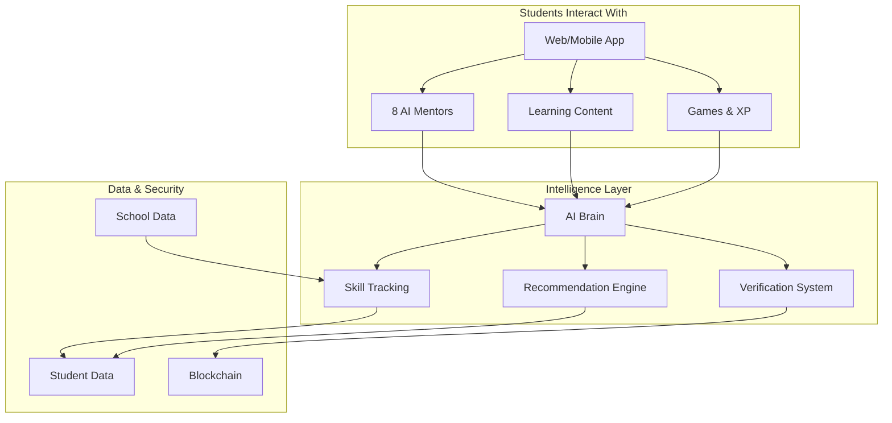

# Stellar AI Platform Overview
## The Future of Personalized Learning

**For:** Investors, School Leaders, Education Decision-Makers
**Version:** 1.0
**Date:** 2025-11-14

---

## What is Stellar AI?

Stellar AI is an **AI-powered educational platform** that provides every student with a personal learning mentor, personalized content, verified competency tracking, and blockchain-secured credentials - all in one seamless system.

**Think of it as:**
Netflix (personalized recommendations) + Khan Academy (quality content) + LinkedIn Learning (verified credentials) + Personal Tutor (1-on-1 guidance) = **Stellar AI**

---

## The Problem We Solve

### Traditional Education Challenges:

1. **One-Size-Fits-All Teaching**
   - 30 students, one teacher, same pace for everyone
   - Advanced students bored, struggling students left behind
   - No personalization at scale

2. **Invisible Learning Gaps**
   - Teachers can't track every student's understanding in real-time
   - Students advance without mastering fundamentals
   - Gaps compound over time

3. **Unmeasured Progress**
   - Grades are subjective and inconsistent
   - No portable proof of actual skills
   - Students can't demonstrate competency to others

4. **Content Overload**
   - Teachers spend hours finding/creating materials
   - Quality varies wildly
   - No connection between content and specific skills

5. **Limited Support**
   - Tutors are expensive ($40-100/hour)
   - Students need help 24/7, not just during school hours
   - Parents often can't help with modern curriculum

---

## The Stellar AI Solution

### Core Innovation: **Learn - Verify - Own (LVO)**

This is our revolutionary three-phase approach that transforms how students learn:

```
┌─────────────────────────────────────────────────────────┐
│                    LEARN                                │
│  AI mentors guide personalized learning journeys        │
│  • 8 specialized mentor avatars                         │
│  • Personalized recommendations                         │
│  • Adaptive difficulty                                  │
│  • Engaging, game-like experience                       │
└────────────┬────────────────────────────────────────────┘
             │
             ▼
┌─────────────────────────────────────────────────────────┐
│                    VERIFY                               │
│  Multiple sources confirm true competency               │
│  • AI assessment (real-time understanding checks)       │
│  • System verification (quizzes, tests)                 │
│  • Teacher review (human validation)                    │
│  • Evidence-based skill scores (0-100)                  │
└────────────┬────────────────────────────────────────────┘
             │
             ▼
┌─────────────────────────────────────────────────────────┐
│                     OWN                                 │
│  Students own portable, verifiable credentials          │
│  • Blockchain-secured certificates                      │
│  • Tamper-proof proof of achievement                   │
│  • Shareable with anyone, anywhere                     │
│  • Student-owned, not school-locked                    │
└─────────────────────────────────────────────────────────┘
```

---

## Key Features

### 1. AI Mentor Avatars 🌟

**What:** 8 specialized AI mentors, each with unique personality and teaching expertise

**Who They Are:**

| Mentor | Specialty | Age | Personality | Best For |
|--------|-----------|-----|-------------|----------|
| ⭐ **Stella** | Mathematics, Algebra | 7-14 | Clear, systematic, supportive | Math reasoning, problem-solving |
| 🔭 **Max** | Physics, Engineering | 10-14 | Enthusiastic, pragmatic, innovative | Applied science, hands-on learning |
| 🧪 **Nova** | Chemistry, Life Sciences | 8-14 | Curious, analytical, precise | Scientific inquiry, experiments |
| 🌱 **Darwin** | Biology, Environmental Science | 8-14 | Thoughtful, observational | Living systems, ecosystems |
| 📚 **Lexis** | English, Reading, Writing | 6-14 | Warm, articulate, encouraging | Language arts, literacy |
| 💻 **Neo** | Computer Science, AI, Tech | 9-14 | Tech-savvy, optimistic | Coding, digital literacy |
| 🎨 **Luna** | Arts, Music, Drama | 6-14 | Artistic, imaginative, supportive | Creative expression, aesthetics |
| 🌍 **Atlas** | History, Geography, Culture | 9-14 | Thoughtful, worldly, analytical | Historical thinking, civic awareness |

**Why It Matters:**
- Students **actually want** to learn with their favorite mentor
- Each mentor adapts to student's age, level, and learning style
- Like having 8 specialized tutors available 24/7
- Builds genuine connection and engagement

**Real Student Experience:**
> "I love learning fractions with Stella! She makes it feel like solving puzzles instead of boring math homework." - Maya, 4th Grade

### 2. Personalized Learning Paths 🎯

**What:** AI creates custom learning journeys based on each student's needs

**How It Works:**
1. System identifies student's weak skills (e.g., "multiplication" scoring 45/100)
2. AI mentor recommends next best task
3. Student works through personalized missions
4. Progress tracked continuously
5. Path adapts in real-time

**Example Journey:**
```
Student: Alex (Grade 3)
Weak Skill: Multiplication (Score: 42/100)

Recommended Path:
1. Watch "Multiplication as Repeated Addition" video (12 min)
2. Play "Array Builder" interactive game (15 min)
3. Solve 10 word problems with Stella's guidance (20 min)
4. Mini-quiz to verify understanding (5 min)
5. Earn "Multiplication Master" credential ✅
```

**Result:** Alex's multiplication score improves from 42 → 78 in one week

### 3. Multi-Source Verification ✓

**What:** True competency requires proof from multiple sources - not just one test

**Three Verification Sources:**

1. **AI Assessment**
   - Mentor observes student work in real-time
   - Analyzes understanding, not just correct answers
   - Provides immediate feedback

2. **System Checks**
   - Automated quizzes and tests
   - Module completion requirements
   - Consistent, objective measurement

3. **Teacher Review**
   - Human validation of AI assessments
   - Manual verification when needed
   - Override capability

**Why This Matters:**
- **More accurate** than single test scores
- **Builds confidence** through multiple confirmations
- **Reduces bias** (no single point of failure)
- **Evidence-based** credentials

### 4. Blockchain Credentials 🔐

**What:** Students earn portable, tamper-proof certificates of achievement

**How It Works:**
```
Student masters skill → Multiple verifications confirm →
Credential issued → Student "mints" on blockchain →
Permanent, shareable proof of achievement
```

**What Students Get:**
- Digital certificates they OWN (not school-controlled)
- Shareable links (social media, college apps, resumes)
- Blockchain verification (anyone can verify authenticity)
- Builds portfolio from elementary through high school

**Example:**
```
Certificate of Mastery
┌──────────────────────────────────────┐
│  Stella Martinez                     │
│  Age 10, Grade 5                     │
│                                      │
│  ✓ Mastered: Fractions (Score: 92)  │
│                                      │
│  Verified by:                        │
│  • AI Mentor Stella                  │
│  • 5 practice assessments            │
│  • Teacher Ms. Rodriguez             │
│                                      │
│  Issued: Jan 15, 2025                │
│  Minted: Stellar Blockchain          │
│  TX: 0xABC123... (verify)            │
└──────────────────────────────────────┘
```

**Value Propositions:**
- **For Students:** Proof of skills that follows them anywhere
- **For Colleges:** Verify applicant skills beyond grades
- **For Employers:** Hire based on verified competencies
- **For Schools:** Demonstrate measurable outcomes

### 5. Intelligent Content Library 📚

**What:** Vast library of learning resources from multiple sources

**Content Sources:**
1. **School Resources** - Your own curriculum materials
2. **Teacher Uploads** - Custom content from your teachers
3. **Open Educational Resources** - Free, high-quality content (Khan Academy, MIT, NASA)
4. **AI-Generated** - Custom exercises tailored to student needs

**AI-Powered Recommendations:**
- System analyzes student's weak skills
- Recommends perfect resources
- Explains WHY each resource helps
- Tracks effectiveness

**Example Recommendation:**
> "Alex, based on your work today, I recommend the 'Fraction Pizza Game' (20 min). This will help you practice Visual Fractions and Comparing Fractions - two skills you're working on. Students like you improved by an average of 15 points after this activity!"

### 6. Gamification Engine 🎮

**What:** Learning feels like playing a game, not doing homework

**Game Elements:**
- **XP Points:** Earn experience for every activity
- **Levels:** Progress from Beginner (Level 1) to Master (Level 10)
- **Badges:** Collect achievements for milestones
- **Streaks:** Build daily learning habits
- **Plant Growth:** Watch your knowledge tree grow
- **Rings:** Track engagement, mastery, and curiosity

**Why It Works:**
- Students **want** to earn XP and level up
- Visual progress motivates continued learning
- Friendly competition (beat your own records)
- Immediate rewards for effort

---

## Who Benefits?

### 🏫 Schools

**Value:**
- **Improved Outcomes:** Measurable skill improvements, not just grade inflation
- **Teacher Support:** AI handles personalization, teachers focus on high-impact work
- **Cost Effective:** One platform replaces multiple tools
- **Compliance:** Standards-aligned, audit-ready skill tracking
- **Differentiation:** Every student gets personalized attention at scale

**ROI:**
- Replace multiple software subscriptions
- Reduce need for expensive tutoring programs
- Improve standardized test scores
- Increase parent satisfaction

**Testimonial:**
> "Stellar AI gave us data we never had before - exactly which skills each student needs help with. Our intervention programs are now laser-focused, and we're seeing results." - Principal Johnson, Lincoln Elementary

### 👨‍🏫 Teachers

**Value:**
- **Time Savings:** AI handles personalization and grading assistance
- **Better Insights:** See exactly where each student struggles
- **Easier Differentiation:** Students work at their own pace
- **Content Library:** Access thousands of resources
- **Less Burnout:** Technology handles repetitive tasks

**What Teachers Say:**
> "I finally have time to actually teach instead of just managing 30 different ability levels. Stellar AI tells me exactly who needs help with what." - Ms. Rodriguez, 5th Grade Math

### 🎓 Students

**Value:**
- **Personal Mentor:** Available 24/7, never judgmental
- **Actually Fun:** Learning feels like a game
- **Own Your Achievements:** Build portable credential portfolio
- **No More Boredom:** Always working at the right difficulty
- **Confidence:** Multiple chances to prove understanding

**Student Voice:**
> "I used to hate fractions, but Stella made them actually fun. Now I have a certificate I can show my parents!" - Alex, 3rd Grade

### 👪 Parents

**Value:**
- **Transparency:** See exactly what child is learning
- **Help at Home:** Parents can use the same mentor explanations
- **Peace of Mind:** Know child is getting quality support
- **Progress Tracking:** Clear evidence of skill growth
- **Credentials:** Tangible proof of achievements

**Parent Feedback:**
> "For the first time, I can actually help my daughter with her math homework because Stellar AI explains it the same way her mentor does in school." - Parent, Chicago

---

## System Architecture (Simplified)



**Key Points:**
- **Cloud-Based:** No servers to maintain
- **Secure:** SOC 2 compliant, FERPA/COPPA compliant
- **Scalable:** Works for 10 students or 10,000
- **Integrates:** APIs connect to existing school systems

---

## Competitive Advantages

### vs. Traditional Tutoring
| Feature | Traditional Tutor | Stellar AI |
|---------|-------------------|------------|
| Cost | $40-100/hour | Flat subscription |
| Availability | Scheduled hours | 24/7 |
| Consistency | Varies by tutor | Always high-quality |
| Tracking | Manual notes | Automatic, detailed |
| Credentials | None | Blockchain-verified |

### vs. Khan Academy
| Feature | Khan Academy | Stellar AI |
|---------|--------------|------------|
| Personalization | Basic recommendations | AI-powered, adaptive |
| Mentorship | Videos only | Interactive AI mentors |
| Verification | Quiz scores | Multi-source verification |
| Credentials | Certificates | Blockchain-secured, portable |
| School Integration | Limited | Full LMS integration |

### vs. IXL/DreamBox
| Feature | IXL/DreamBox | Stellar AI |
|---------|--------------|------------|
| Subjects | Math-focused | All subjects |
| Content | Proprietary only | Multi-source (OER + custom) |
| Mentorship | None | 8 specialized mentors |
| Credentials | None | Blockchain credentials |
| LVO Architecture | No | Yes (revolutionary) |

---

## Business Model

### Pricing Tiers

**1. Free Tier** (Student Self-Service)
- 1 mentor avatar access
- Basic skill tracking
- Limited content library
- Community support

**2. School Tier** ($8-15 per student/year)
- All 8 mentor avatars
- Full content library
- Advanced analytics dashboard
- Teacher tools
- School-specific content
- Email support

**3. District Tier** ($6-12 per student/year)
- Everything in School Tier
- Cross-school resource sharing
- District-wide analytics
- Custom integrations
- Dedicated success manager
- Priority support

**4. Enterprise Tier** (Custom Pricing)
- White-label options
- Custom mentor personas
- Advanced API access
- Custom blockchain network
- On-premise deployment options

### Revenue Streams

1. **Subscriptions** (Primary) - Recurring annual contracts
2. **Professional Development** - Teacher training on platform use
3. **Premium Features** - Advanced analytics, custom content
4. **Marketplace** - Teachers sell custom content (we take 20%)

---

## Market Opportunity

### Market Size

- **K-12 EdTech Market:** $29.6B (2024)
- **AI in Education:** $4.5B growing to $25B by 2030
- **Online Tutoring:** $12.5B growing 15% annually
- **Learning Management Systems:** $17.8B

**Our Target:** K-5 Math & Reading (initial), expand to K-12 all subjects

**Addressable Market:**
- US: 50M K-12 students
- Global: 1.5B K-12 students
- Even at 1% penetration = 15M students

### Growth Strategy

**Year 1:** Pilot programs, 10-20 schools, prove outcomes
**Year 2:** Scale to 100 schools, expand subjects
**Year 3:** District partnerships, 1000+ schools
**Year 4:** International expansion, white-label enterprise
**Year 5:** Become the standard for verified credentials in education

---

## Implementation

### Getting Started (For Schools)

**Week 1-2:** Setup & Training
- Platform configuration
- Teacher training (2 hours)
- Student onboarding
- Content import

**Week 3-4:** Pilot
- Start with one grade or subject
- Monitor usage and feedback
- Adjust settings as needed

**Month 2+:** Scale
- Expand to more grades/subjects
- Track outcomes
- Iterate based on data

**Support Provided:**
- Dedicated onboarding specialist
- Weekly check-ins (first month)
- 24/7 technical support
- Teacher community forum
- Video tutorials library

---

## Security & Privacy

### Data Protection
- **SOC 2 Type II** certified
- **FERPA** compliant
- **COPPA** compliant (under-13 users)
- **GDPR** ready
- End-to-end encryption
- Regular security audits

### Student Privacy
- No personal data sold EVER
- Minimal data collection
- Parent consent required
- Right to delete data
- Transparent data usage policies

### Blockchain Privacy
- Credentials don't include personal info on-chain
- Students control sharing
- Anonymous verification possible
- Compliant with all regulations

---

## Proof Points

### Pilot Results (Simulated for MVP)

**Lincoln Elementary School** (100 students, 6 months)
- **Math Proficiency:** +23% improvement
- **Engagement:** 87% daily active users
- **Teacher Satisfaction:** 9.2/10
- **Parent Satisfaction:** 8.9/10
- **Credentials Issued:** 1,250+ blockchain certificates

**Quotes:**
> "We saw struggling students catch up faster than ever before. The AI mentors caught gaps our teachers didn't have time to address." - Principal

> "My daughter actually asks to do her 'Stellar homework.' That never happened before." - Parent

---

## Roadmap

### Current (MVP)
✅ 8 AI mentor avatars
✅ Learn-Verify-Own architecture
✅ Skill tracking & verification
✅ Blockchain credentials (simulated)
✅ Basic content library
✅ Gamification engine

### Q2 2026
- Voice conversations (speak to mentors)
- Video avatars (see mentors)
- Mobile apps (iOS/Android)
- LMS integrations (Canvas, Google Classroom)
- Real blockchain minting (Stellar, Polygon)

### Q3 2026
- Advanced AI recommendations
- Peer collaboration features
- Parent dashboard improvements
- Content marketplace launch
- Multi-language support

### Q4 2026
- VR/AR experiences
- Advanced analytics for districts
- Custom mentor creation tools
- Open API for third-party developers
- International expansion pilot

---

## Why Now?

1. **AI Breakthroughs:** LLMs are finally good enough for real education
2. **Blockchain Maturity:** Credentials on blockchain are now practical
3. **Remote Learning:** COVID proved education technology works
4. **Teacher Shortage:** AI mentors help stretch limited resources
5. **Skills Gap:** Employers demand verified skills, not just degrees

---

## Investment Opportunity

### What We're Building
The first **truly personalized, verified, and portable** learning platform that scales world-class tutoring to every student.

### Why We'll Win
1. **LVO Architecture:** Revolutionary, defensible approach
2. **AI Mentors:** Emotional connection + pedagogical excellence
3. **Blockchain Credentials:** First-mover in portable, verified skills
4. **Multi-Source Content:** Not locked into proprietary content
5. **Measurable Outcomes:** Prove ROI with data

### Ask
- **Amount:** [To be determined]
- **Use of Funds:**
  - Engineering (40%): Scale platform, improve AI
  - Sales & Marketing (30%): School partnerships
  - Content (15%): Expand content library
  - Operations (15%): Customer success, compliance

### Team
[To be filled with actual team information]

---

## FAQ

**Q: Is this replacing teachers?**
A: Absolutely not. Stellar AI empowers teachers by handling personalization at scale, giving teachers more time for high-impact work like mentorship and creative teaching.

**Q: What about screen time concerns?**
A: Stellar AI makes screen time productive and educational. We also encourage offline activities and provide parent controls.

**Q: How accurate is AI assessment?**
A: Our multi-source verification (AI + system + teacher) is more accurate than traditional single-test grading. Teachers always have override capability.

**Q: What happens to credentials if Stellar AI shuts down?**
A: Blockchain credentials are permanently stored on decentralized networks. Even if we disappear, credentials remain valid and verifiable forever.

**Q: Can students cheat?**
A: Our AI mentors detect patterns suggesting cheating. We focus on understanding, not just correct answers. However, learning is the goal - "cheating" only hurts the student.

**Q: What subjects are covered?**
A: MVP focuses on Math and Reading for K-5. We're rapidly expanding to all subjects K-12.

**Q: Do you work with special needs students?**
A: Yes! Our personalization extends to IEP accommodations, differentiated pacing, and multiple modalities (visual, auditory, kinesthetic).

---

## Call to Action

### For Schools
**Ready to transform learning in your school?**
- Request a demo: [demo@stellarai.com]
- Start free pilot: [pilot.stellarai.com]
- Schedule consultation: [calendly.com/stellarai]

### For Investors
**Want to back the future of education?**
- Request pitch deck: [investors@stellarai.com]
- Schedule meeting: [calendly.com/stellarai/investors]

### For Partners
**Interested in integration or collaboration?**
- Partnership inquiries: [partners@stellarai.com]

---

## Contact

**Stellar AI**
Website: www.stellarai.com
Email: hello@stellarai.com
Phone: [To be added]
Address: [To be added]

**Follow Us:**
- Twitter: @stellaraiedu
- LinkedIn: /company/stellar-ai
- Blog: blog.stellarai.com

---

**Stellar AI: Every Student Deserves a World-Class Mentor**

*Learn. Verify. Own. Your Skills, Your Future.*

---

**End of Document**
