```mermaid
sequenceDiagram
    participant Student
    participant Mentor as AI Mentor
    participant Verify as Verification Service
    participant HPEM as H-PEM Engine
    participant Mastery as Mastery Service
    participant Blockchain as Stellar Network
    participant Wallet as Student Wallet

    Note over Student,Mentor: LEARN PHASE
    Student->>Mentor: Completes task
    Mentor->>Student: Provides feedback
    
    Note over Mentor,Verify: VERIFY PHASE
    Mentor->>Verify: Submit answer for verification
    Verify->>Verify: RAG Ground Truth Check
    Verify->>Verify: LLM Judge Evaluation
    Verify->>Verify: Cross-Model Validation
    Verify->>Verify: Bias Detection
    
    alt Answer Correct
        Verify->>HPEM: Calculate H-PEM metrics
        HPEM->>Mastery: Submit metrics
        
        alt Mastery Achieved (≥0.9)
            Mastery->>Blockchain: Mint credential token
            Blockchain->>Wallet: Send token
            Wallet-->>Student: 🎉 Achievement unlocked!
            Note over Student,Wallet: OWN PHASE
        else Not Yet Mastered
            Mastery->>Student: Continue learning
        end
    else Answer Incorrect
        Verify->>Student: Try again with hints
    end
```

```mermaid
flowchart TB
    subgraph "Student Actions"
        CT[Completes Task]
        MS[Masters Skill]
        LS[Logs in Daily]
    end
    
    subgraph "Gamification Engine"
        XPC[XP Calculator]
        BC[Badge Controller]
        SC[Streak Counter]
        LU[Level Up Service]
        PG[Plant Growth Visualizer]
    end
    
    subgraph "Rewards"
        XP[XP Points]
        B[Badges]
        S[Streaks]
        MT[Mastery Tokens<br/>Blockchain]
        LV[Level Up]
    end
    
    subgraph "Visualization"
        DB[Dashboard]
        PT[Plant Tree]
        BG[Badge Gallery]
    end
    
    CT -->|Triggers| XPC
    MS -->|Triggers| BC
    LS -->|Updates| SC
    
    XPC -->|Awards| XP
    BC -->|Awards| B
    SC -->|Maintains| S
    XP -->|Accumulates to| LU
    LU -->|Increases| LV
    
    MS -->|If proficiency ≥ 0.9| MT
    
    XP --> DB
    B --> BG
    S --> DB
    LV --> PT
    MT --> BG
    
    style XPC fill:#FFD700
    style BC fill:#90EE90
    style MT fill:#87CEEB
    style PT fill:#98D8C8
```

```mermaid
sequenceDiagram
    participant Student
    participant LA as Learning Agent
    participant EA as Evaluation Agent
    participant KA as Knowledge Agent
    participant RA as Reasoning Agent
    participant NA as Nanoscale Agent
    participant XA as Explainability Agent
    participant BC as Blockchain

    Student->>LA: Submits answer
    LA->>EA: Forward for evaluation
    EA->>KA: Request ground truth
    KA-->>EA: Return correct answer
    EA->>EA: LLM Judge + Cross-check
    EA->>XA: Log decision
    XA-->>EA: Logged
    
    EA->>EA: Calculate H-PEM
    
    alt Mastery Achieved (H-PEM ≥ 0.9)
        EA->>NA: Update competency
        NA->>NA: Update knowledge graph
        NA->>NA: Check unlocked nodes
        EA->>BC: Mint token
        BC-->>Student: 🎉 Token sent!
        EA->>XA: Log tokenization
    else Not Mastered
        EA->>RA: Request next task
        RA->>RA: Analyze mastery map
        RA-->>LA: Recommend task
        LA->>Student: Present next task
    end
```

# Stellecta – End-to-End System Architecture

**Learn – Verify – Own, Powered by AI, Stellar Blockchain & Adaptive Mastery Models**

---

**Version:** 1.0  
**Date:** November 2025  
**Status:** Production Architecture Specification  
**Classification:** Technical Documentation – Complete System Overview

---

## Executive Introduction

Stellecta is a next-generation AI-powered learning platform that transforms education through personalized AI mentorship, blockchain-verified achievements, and adaptive mastery models. Our system integrates cutting-edge LLM technology, Stellar blockchain for credential ownership, and advanced learning analytics (H-PEM, LCT, IAL) to create a complete Learn-Verify-Own cycle where students truly own their educational achievements. Built for students, parents, teachers, and schools, Stellecta provides unprecedented transparency, engagement, and verifiable outcomes in the learning journey.

---

## Table of Contents

### User Modules
1. [Student Module](#student-module)
2. [Parent Module](#parent-module)
3. [Teacher Module](#teacher-module)
4. [School Module](#school-module)

### System-Wide Architecture
5. [LVO (Learn-Verify-Own) Architecture](#lvo-learn-verify-own-architecture)
6. [Stellar Blockchain Integration](#stellar-blockchain-integration)
7. [Gamification Engine](#gamification-engine)
8. [LLM & RAG Architecture](#llm-rag-architecture)
9. [K.E.R.N.E.L. Agentic Workflow](#kernel-agentic-workflow)
10. [Global Data Model](#global-data-model)

### Business & Investment
11. [Investor Pitch Deck (20 Slides)](#investor-pitch-deck-20-slides)

---

# 1. Student Module

## Executive Summary

The Student Module is the core learning interface where students interact with AI mentors, complete learning tasks, earn XP and badges, and see their progress visualized through an adaptive mastery system. Every learning interaction triggers the Learn-Verify-Own pipeline, where verified mastery results in blockchain-backed credentials. The system adapts in real-time using H-PEM (Hyper-Performance Evaluation Metrics) and LCT (Longitudinal Competency Trajectory) to personalize the learning path for each student.

## Non-Technical Explanation

Imagine a student logs into Stellecta and is greeted by their personal AI mentor (think of it like having a world-class tutor available 24/7). The mentor understands the student's learning style, strengths, and areas for improvement. As the student completes math problems or reads a passage, the system verifies their understanding through multiple checks (not just "correct/incorrect" but deep comprehension). When the student truly masters a skill, they earn XP points, badges, and even blockchain tokens that prove their achievement—like a digital diploma they actually own. Parents can see this progress in real-time, and teachers get insights into where each student needs help.

## Technical Deep Dive

### Architecture Components

**Frontend (React + TypeScript):**
- Student Dashboard (Next.js)
- AI Mentor Chat Interface (Gemini 2.5 Flash integration)
- Learning Activity Views (adaptive based on competency)
- Progress Visualization (XP, Badges, Streaks, Mastery Levels)
- Avatar-based video interaction (D-ID integration)

**Backend (FastAPI + Python):**
- StudentService: Manages student profile, learning history
- LearningSessionService: Tracks real-time learning interactions
- MasteryEvaluationService: Calculates H-PEM metrics
- ProgressTrackingService: Updates LCT timeline
- GamificationService: Awards XP, badges, tokens
- BlockchainService: Triggers credential minting on Stellar

**Database (PostgreSQL via Supabase):**
- students table: Profile, preferences, settings
- learning_sessions: Active and historical sessions
- task_attempts: Individual task completions with metadata
- h_pem_snapshots: Time-series proficiency data
- lct_profiles: Longitudinal competency trajectories
- student_badges: Earned achievements
- student_tokens: Blockchain-backed credentials

### Key Flows

**1. Learning Session Flow:**
```
1. Student logs in → Dashboard loads current learning path
2. AI Mentor greets student (personalized based on history)
3. Student selects/is recommended next competency
4. AI Mentor presents task (adaptive difficulty)
5. Student completes task (text/voice/video)
6. Verification pipeline runs (RAG + LLM Judge + Cross-check)
7. H-PEM calculated (Proficiency, Resilience, Velocity, Engagement, Transfer)
8. If mastery threshold met → LVO triggers
9. XP awarded, progress updated, parent notified
10. Next task recommended (Zone of Proximal Development)
```

**2. Adaptive Learning Engine:**
- Uses IAL (Intelligent Adaptive Learning) to select optimal next task
- Factors: Current H-PEM, Knowledge Graph prerequisites, Decay risk, Student preferences
- ALEKS-style Knowledge Space Theory: Only shows tasks student is ready for

## Mermaid Architecture Diagram


## Mermaid Data Schema


## Linking Logic

**Cross-Module Interactions:**

1. **To Parent Module:** Real-time progress updates pushed via WebSocket
2. **To Teacher Module:** Flagged interventions when H-PEM drops below threshold
3. **To Gamification Engine:** Every verified task triggers XP calculation
4. **To Blockchain Service:** Mastery achievement triggers credential minting
5. **To Knowledge Graph:** Competency completion unlocks new nodes
6. **To LLM Service:** All student-mentor interactions logged for context

## LVO Integration

**Learn Phase:**
- Student interacts with AI Mentor
- Completes tasks (text, voice, video)
- System logs all attempts with metadata

**Verify Phase:**
- Multi-source verification (RAG ground truth + LLM Judge + Cross-model check)
- H-PEM calculated across 5 dimensions
- Mastery threshold evaluation (typically 0.9 proficiency)

**Own Phase:**
- Stellar blockchain credential minted
- Token sent to student's wallet
- Parent notified of achievement
- Badge displayed on dashboard
- Credential portable to other platforms

## Gamification Elements

**XP System:**
- Base XP per task: 10-100 (difficulty-weighted)
- Streak bonus: +5% per consecutive day (max 50%)
- First-try bonus: +25%
- Speed bonus: +10% if completed faster than expected

**Coins (Virtual Currency):**
- 1 XP = 1 Coin
- Coins can unlock avatar customizations, themes
- Future: Marketplace for learning resources

**Badges:**
- Bronze/Silver/Gold tiers per competency
- Special badges: "Week Warrior" (7-day streak), "Lightning Learner" (high velocity)
- Displayed on student profile and shared with parents

**Streaks:**
- Daily login streak
- Per-subject streak (e.g., Math 14 days)
- Visual: Fire icon with number

**Mastery Tokens (Blockchain):**
- Issued only when H-PEM proficiency ≥ 0.9
- Stored on Stellar blockchain
- Verifiable by any third party
- Non-transferable (soul-bound)

## Blockchain Touchpoints

1. **Wallet Creation:** On first login, custodial Stellar wallet created
2. **Mastery Achievement:** Stellar asset minted (e.g., BADGE_MATH_L3)
3. **Parent View:** Parent can see tokens in child's wallet via Lobstr-compatible interface
4. **Credential Export:** Student can export blockchain proof (QR code, URL)
5. **Third-Party Verification:** Schools/universities can verify on Stellar network

## Compliance Notes

**GDPR:**
- Student data minimization (only collect necessary info)
- Right to access (students can export all data)
- Right to erasure (account deletion removes PII, but blockchain tokens persist)
- Pseudonymization (on-chain data uses hashed IDs, not real names)

**COPPA:**
- Under-13 requires parental consent
- Parents can view all data collection
- No targeted advertising
- Data used only for educational purposes

---

# 2. Parent Module

## Executive Summary

The Parent Module provides transparent, real-time visibility into their child's learning journey. Parents can view detailed progress reports, blockchain-verified achievements, and receive actionable insights. The module supports multi-child families, allowing parents to manage multiple students from a single dashboard. All credentials are visible through blockchain-connected wallets, ensuring parents have proof of their child's achievements that can be shared with schools or future institutions.

## Non-Technical Explanation

Parents often feel disconnected from their child's learning—they don't know if their child is struggling or excelling until report cards come. Stellecta changes this. Parents get a real-time dashboard showing exactly what their child is learning, how well they're doing, and where they might need help. They can see badges earned, skills mastered, and even view blockchain-verified credentials (like digital certificates that can't be faked). If their child has a 7-day learning streak, parents get notified to celebrate. If the child is struggling with fractions, parents get an alert with suggestions. It's like having a window into the classroom, but better—because it's data-driven and actionable.

## Technical Deep Dive

### Architecture Components

**Frontend (React):**
- Parent Dashboard (multi-child overview)
- Child Progress Detail View
- Blockchain Wallet View (Lobstr integration)
- Achievement Timeline
- Intervention Alerts
- Communication with Teachers

**Backend (FastAPI):**
- ParentService: Manages parent accounts
- ChildLinkingService: Links parents to students (with consent)
- NotificationService: Sends alerts (email, push, SMS)
- ReportGenerationService: Creates weekly/monthly reports
- BlockchainQueryService: Fetches tokens from Stellar network

**Database:**
- parents table
- parent_child_links table (many-to-many)
- parent_notifications table
- consent_records table (COPPA compliance)

### Key Flows

**1. Multi-Child Dashboard:**
```
1. Parent logs in
2. Dashboard loads all linked children
3. For each child:
   - Current streak
   - XP this week
   - Recent badges
   - At-risk alerts (if any)
4. Parent clicks child → Detailed view
```

**2. Blockchain Credential Verification:**
```
1. Parent navigates to "Achievements" tab
2. System queries Stellar network for child's wallet
3. All tokens/credentials displayed with metadata
4. Parent can click "Verify" → Opens Stellar blockchain explorer
5. Parent can share credential via QR code or URL
```

**3. Alert System:**
```
1. Backend monitors child's H-PEM scores
2. If proficiency drops below 0.7 → Alert triggered
3. NotificationService sends:
   - In-app notification
   - Email with intervention suggestions
   - Optional SMS (if enabled)
4. Parent can acknowledge alert or request teacher intervention
```

## Mermaid Architecture Diagram


## Mermaid Data Schema


## Linking Logic

**To Student Module:**
- Real-time progress updates via WebSocket
- Parent can view (but not edit) student data

**To Teacher Module:**
- Parent can request teacher intervention
- Teacher can send messages to parents

**To Blockchain:**
- Parent wallet view queries Stellar network
- Can verify credentials independently

**To Gamification Engine:**
- Parent sees XP, badges, streaks
- Can celebrate achievements with child

## LVO Integration

**Learn Phase:** Parent sees "Currently Learning: Fractions (Level 3)"

**Verify Phase:** Parent sees "Verification in Progress..." (real-time)

**Own Phase:** Parent notified: "🎉 Sarah earned BADGE_MATH_L3! View on blockchain"

## Gamification Elements

**Parent Engagement Gamification:**
- Parent XP: Earn points for logging in weekly
- "Engaged Parent" badge for checking progress 5 days/week
- Leaderboard: Compare engagement with other parents (opt-in)

**Child Progress Visualization:**
- Growth chart (plant metaphor): Seed → Sprout → Sapling → Tree
- Color-coded proficiency: Red (struggling), Yellow (progressing), Green (mastering)

## Blockchain Touchpoints

1. **Wallet View:** Parent can see all child's tokens
2. **Credential Sharing:** QR code for blockchain proof
3. **Third-Party Verification:** Share credential link with schools
4. **Multi-Child Aggregation:** See all children's wallets in one view

## Compliance Notes

**COPPA Compliance:**
- Parents must explicitly consent to child's account
- Consent records stored in database
- Parents can revoke consent at any time → Account suspended

**GDPR:**
- Parents can export all child data
- Parents can request deletion (child account closed)
- Transparency: Parents see exactly what data is collected

---

# 3. Teacher Module

## Executive Summary

The Teacher Module empowers educators with AI-powered insights into each student's learning journey. Teachers can view classroom-wide performance heatmaps, identify struggling students before they fall behind, assign adaptive learning tasks, and receive intervention recommendations. The system reduces teacher workload by automating progress tracking and grading while providing actionable intelligence to guide instruction.

## Non-Technical Explanation

Teachers are overwhelmed—managing 20-30 students, grading endless assignments, and trying to figure out who needs help. Stellecta acts like a teaching assistant that never sleeps. It automatically tracks every student's progress, identifies who's struggling with fractions or grammar, and suggests specific interventions. Teachers see a heatmap of their classroom: green for students who are thriving, yellow for those who need a nudge, red for those who need immediate help. Instead of spending hours grading, teachers spend minutes reviewing insights and more time actually teaching. The system even drafts personalized assignments based on each student's needs.

## Technical Deep Dive

### Architecture Components

**Frontend (React):**
- Teacher Dashboard (classroom overview)
- Student Performance Heatmap
- Individual Student Detail View
- Assignment Creation Wizard
- Intervention Recommendations Panel
- Communication Hub (parent messages)

**Backend (FastAPI):**
- TeacherService: Manages teacher profiles, classrooms
- ClassroomAnalyticsService: Aggregates student data
- InterventionEngine: Identifies at-risk students
- AssignmentGenerationService: Creates adaptive tasks
- CommunicationService: Manages teacher-parent messages

**Database:**
- teachers table
- classrooms table
- classroom_enrollments table (students in classrooms)
- teacher_assignments table
- intervention_logs table

### Key Flows

**1. Classroom Dashboard:**
```
1. Teacher logs in
2. Dashboard shows all classrooms (e.g., "Math Period 3, 25 students")
3. For each classroom:
   - Average H-PEM proficiency
   - At-risk student count
   - Recent achievements
4. Teacher clicks classroom → Heatmap view
```

**2. Intervention Workflow:**
```
1. System detects student proficiency drop (H-PEM < 0.7)
2. InterventionEngine analyzes:
   - Which competencies are weak
   - Historical patterns (velocity, engagement)
   - Recommended actions
3. Teacher receives alert: "John needs help with Fractions"
4. System suggests:
   - Assign 5 remedial tasks (auto-generated)
   - Schedule 1-on-1 session
   - Notify parent
5. Teacher approves → System executes
```

**3. Assignment Creation:**
```
1. Teacher clicks "Create Assignment"
2. Wizard asks:
   - Which competencies?
   - Difficulty level (or "Adaptive")
   - Due date
3. System generates N tasks per student (personalized)
4. Students receive assignment in their dashboards
5. As students complete, teacher sees real-time progress
```

## Mermaid Architecture Diagram


## Mermaid Data Schema


## Linking Logic

**To Student Module:**
- Teacher can view any student's full profile (with consent)
- Teacher assigns tasks → Appear in student's dashboard

**To Parent Module:**
- Teacher can send messages to parents
- Teacher shares intervention plans

**To School Module:**
- Teacher reports roll up to school admin
- School can view teacher performance metrics

**To Knowledge Graph:**
- Teacher assignments mapped to competencies
- System validates that assignments are pedagogically sound

## LVO Integration

**Learn Phase:** Teacher sees "25 students learning Fractions this week"

**Verify Phase:** System automatically verifies student work, teacher reviews edge cases

**Own Phase:** Teacher sees "15 students earned BADGE_MATH_L3 this month"

## Gamification Elements

**Teacher Engagement:**
- "Engaged Educator" badge for logging in daily
- XP for creating assignments, providing feedback
- Leaderboard (opt-in): Compare intervention effectiveness

**Classroom Gamification:**
- Class-wide XP totals
- Classroom challenges: "First class to 10,000 XP wins pizza party"

## Blockchain Touchpoints

**Credential Verification:**
- Teacher can verify student credentials (e.g., for placement)
- Blockchain proof of mastery (no more "I swear I learned this")

**Class Achievements:**
- Classroom-wide achievements minted (e.g., "100% fractions mastery")

## Compliance Notes

**FERPA (US Schools):**
- Teacher can only view students in their classrooms
- Data sharing requires consent
- Audit logs for all data access

**GDPR:**
- Teacher cannot export student data without admin approval
- Right to erasure applies (students can be removed from classroom)

---

# 4. School Module

## Executive Summary

The School Module provides school administrators with comprehensive oversight of the entire Stellecta deployment. Admins can manage multiple classrooms, teachers, and students, view school-wide analytics, ensure compliance with curriculum standards, and generate reports for stakeholders. The module supports multi-school deployments, allowing district admins to oversee multiple institutions from a single interface.

## Non-Technical Explanation

School administrators need to know: Are our students learning? Are teachers using the system effectively? Are we meeting state standards? Stellecta gives school leaders a bird's-eye view. They can see which classrooms are thriving, which need support, and how the school compares to others. They can map Stellecta's curriculum to state standards to ensure compliance. They can generate reports for the school board or accreditation agencies. And if they're managing multiple schools (like a district superintendent), they can see all schools in one dashboard. It's like mission control for education.

## Technical Deep Dive

### Architecture Components

**Frontend (React):**
- School Admin Dashboard
- Multi-School Overview (for districts)
- Teacher Management (add/remove, assign classrooms)
- Student Enrollment
- Curriculum Mapping Tool
- Compliance Reports
- Data Export

**Backend (FastAPI):**
- SchoolService: Manages school profiles
- MultiSchoolService: District-level aggregation
- CurriculumMappingService: Maps Stellecta competencies to state standards
- ComplianceReportingService: Generates required reports
- DataExportService: Bulk data export for analysis

**Database:**
- schools table
- school_admin_links table
- curriculum_mappings table
- compliance_reports table

### Key Flows

**1. School Dashboard:**
```
1. Admin logs in
2. Dashboard shows:
   - Total students, teachers, classrooms
   - School-wide average H-PEM
   - Curriculum coverage (% of standards addressed)
   - Compliance status
3. Admin can drill down to any classroom or student
```

**2. Curriculum Mapping:**
```
1. Admin uploads state standards (CSV or manual entry)
2. System matches Stellecta competencies to standards
3. Admin reviews and approves mappings
4. Dashboard shows "85% of standards covered"
5. Admin identifies gaps, requests new content
```

**3. Compliance Reporting:**
```
1. Admin selects report type (e.g., "Common Core Math Coverage")
2. System generates report with:
   - Which standards are addressed
   - Student proficiency per standard
   - Evidence (blockchain credentials)
3. Report exported as PDF
4. Admin submits to accreditation agency
```

## Mermaid Architecture Diagram


## Mermaid Data Schema


## Linking Logic

**To Teacher Module:**
- School admin can view all teachers
- Can assign teachers to classrooms

**To Student Module:**
- School admin can view all students
- Can enroll/unenroll students

**To Blockchain:**
- School can verify credentials for transfers/placement
- Can generate school-wide credential report

**To External SIS:**
- Two-way sync: Stellecta pulls roster, pushes grades

## LVO Integration

**Learn Phase:** School sees "5,000 learning sessions this week"

**Verify Phase:** School sees "95% verification success rate"

**Own Phase:** School sees "1,200 credentials minted this month"

## Gamification Elements

**School-Wide Challenges:**
- "First school to 100,000 XP"
- "Highest average H-PEM"
- Schools compete (opt-in) on leaderboard

## Blockchain Touchpoints

**Credential Verification:**
- School can verify credentials for incoming transfers
- Blockchain proof accepted for placement/exemption

**School Achievements:**
- School-wide credentials (e.g., "100% 3rd grade reading mastery")

## Compliance Notes

**FERPA:**
- School admin has full access to student data
- Audit logs for all access
- Data export includes consent records

**State Reporting:**
- Stellecta integrates with state reporting APIs
- Automated submission of required data

---

# 5. LVO (Learn-Verify-Own) Architecture

## Executive Summary

The Learn-Verify-Own (LVO) framework is the core philosophy of Stellecta. It transforms traditional "learn and forget" education into a "learn, prove, and own" cycle where every achievement is verifiable and portable. Students **learn** through AI-powered personalized instruction, their mastery is **verified** through multi-source validation, and they **own** their credentials via blockchain-backed tokens. This creates a lifelong learning passport that students control, not institutions.

## Non-Technical Explanation

Traditional education: You learn something, take a test, get a grade, and move on. But how do you prove you learned it years later? With LVO, every skill you truly master becomes a digital credential you own forever. It's like earning a badge in a video game, but this badge is verified on a blockchain (a tamper-proof digital ledger) that anyone can check. When you apply to college or a job, you don't just say "I know fractions"—you show a blockchain credential that proves it. And because you own it, it works across any platform, school, or country.

## Technical Deep Dive

### LVO Pipeline Architecture

**Learn Phase:**
1. Student interacts with AI Mentor (Gemini 2.5 Flash)
2. Mentor presents adaptive tasks based on Knowledge Graph
3. Student completes task (text/voice/video)
4. All interactions logged in learning_sessions table
5. Task metadata includes: difficulty, time taken, hints used, engagement score

**Verify Phase:**
1. Answer Verification Pipeline triggered:
   - RAG retrieval: Fetch ground truth from curriculum database
   - LLM Judge: Evaluate student answer against ground truth
   - Cross-Model Check: Second LLM validates first LLM's judgment
   - Bias Detection: Check for systematic evaluation bias
2. H-PEM Calculation:
   - Proficiency: Accuracy weighted by difficulty
   - Resilience: Recovery from mistakes
   - Velocity: Speed of mastery relative to expected
   - Engagement: Consistency and frequency
   - Transfer: Application to novel contexts
3. Mastery Decision:
   - If H-PEM proficiency ≥ 0.9 → Mastery achieved
   - If < 0.9 → Continue learning
4. XAI Logging: All decisions logged with explanations (GDPR Art. 22)

**Own Phase:**
1. Mastery confirmed → Tokenization triggered
2. BlockchainService mints Stellar asset:
   - Asset code: `BADGE_[COMPETENCY]_[LEVEL]`
   - Issuer: Stellecta asset issuer account
   - Destination: Student's Stellar wallet
3. Transaction metadata includes:
   - Student pseudonym (privacy-safe)
   - H-PEM snapshot
   - Timestamp
4. Token sent to student's wallet
5. Parent notified via email/push
6. Badge displayed on student dashboard
7. Credential verifiable by any third party

### Verification Quality Layers

**Layer 1: RAG Ground Truth**
- Vector database of verified correct answers
- Semantic search for similar questions
- Returns top-3 matches with confidence scores

**Layer 2: LLM Judge (Primary)**
- Gemini 2.5 Flash evaluates answer
- Prompt: "Is this answer correct? Explain why."
- Returns: boolean + reasoning + confidence

**Layer 3: Cross-Model Validation**
- Second model (e.g., GPT-4) validates first
- If disagreement → Escalate to human review
- Agreement threshold: 95%

**Layer 4: Human-in-the-Loop**
- Low-confidence answers (< 70%) escalated
- Teacher reviews and provides final judgment
- System learns from teacher corrections

## Mermaid Architecture Diagram



## Mermaid Data Schema


## Linking Logic

**Cross-System Integration:**

1. **Learn → Verify:** Every task attempt triggers verification pipeline
2. **Verify → Own:** Mastery decision triggers blockchain minting
3. **Own → Parent:** Parent notified when token minted
4. **Own → Teacher:** Teacher sees classroom-wide mastery stats
5. **Own → External:** Third parties verify credentials on Stellar

## LVO Integration

**This IS the LVO integration** — the core architecture that powers all other modules.

## Gamification Elements

**XP Award Logic:**
- Base XP on verification success
- Bonus XP for high H-PEM scores
- Streak multipliers apply

**Badge Issuance:**
- Badges tied to mastery decisions
- Visual representation of blockchain tokens

## Blockchain Touchpoints

**Every "Own" event** creates a blockchain transaction:
- Stellar asset minted
- Transaction recorded on Stellar ledger
- Immutable proof of achievement
- Verifiable by anyone with transaction ID

## Compliance Notes

**GDPR Art. 22:**
- All automated decisions logged with explanations
- Students can request human review
- Right to explanation: XAI logs provide reasoning

**Transparency:**
- Students see exactly how mastery is calculated
- Parents see verification pipeline details

---

# 6. Stellar Blockchain Integration

## Executive Summary

Stellecta uses the Stellar blockchain network to issue verifiable, portable, and student-owned credentials. Unlike traditional diplomas or certificates controlled by institutions, Stellecta credentials are stored on a public blockchain and linked to student wallets. This enables lifelong credential portability, third-party verification, and true ownership. The integration supports custodial wallets (Phase 1), Lobstr-compatible wallets (Phase 2), and full decentralization (Phase 3).

## Non-Technical Explanation

Imagine if your high school diploma was a physical certificate. If you lose it, you have to request a new one from your school. But what if your school closes? With blockchain, your diploma lives on the internet forever, and you control it. Stellecta gives every student a digital wallet (like a bank account, but for credentials instead of money). Every time you master a skill, a digital token is sent to your wallet. This token is stored on the Stellar blockchain—a global, tamper-proof ledger. Anyone (colleges, employers) can verify your credential by checking the blockchain. And because you own your wallet, you can take your credentials anywhere.

## Technical Deep Dive

### Stellar Network Architecture

**Why Stellar?**
1. **Fast:** 3-5 second transaction finality
2. **Cheap:** ~$0.00001 per transaction
3. **Asset Tokenization:** Native support for custom assets
4. **Compliance:** Built for financial institutions (regulatory-friendly)
5. **Ecosystem:** Lobstr wallet (1M+ users), Circle USDC support

### Credential Tokenization Model

**Asset Types:**
- `BADGE_*`: Achievement badges (e.g., `BADGE_MATH_L3`)
- `CRED_*`: Formal credentials (e.g., `CRED_ALGEBRA_CERT`)
- `SKILL_*`: Granular skills (e.g., `SKILL_FRACTIONS`)
- `XP_*`: Experience point tokens (gamification)

**Asset Issuance:**
```python
from stellar_sdk import Asset, Server, Keypair, TransactionBuilder, Network

# Stellecta's issuer account
issuer = Keypair.from_secret(STELLECTA_ISSUER_SECRET)

# Define asset
asset = Asset("BADGE_MATH_L3", issuer.public_key)

# Mint token to student wallet
def mint_credential(student_public_key, asset, metadata):
    server = Server("https://horizon.stellar.org")
    source_account = server.load_account(issuer.public_key)
    
    transaction = (
        TransactionBuilder(
            source_account=source_account,
            network_passphrase=Network.PUBLIC_NETWORK_PASSPHRASE,
            base_fee=100
        )
        .append_payment_op(
            destination=student_public_key,
            asset=asset,
            amount="1"
        )
        .add_text_memo(json.dumps(metadata))
        .build()
    )
    
    transaction.sign(issuer)
    return server.submit_transaction(transaction)
```

### Wallet Management

**Phase 1: Custodial Wallets (MVP)**
- Stellecta creates wallets for students
- Private keys encrypted and stored server-side
- Parents can view, but not transfer tokens

**Phase 2: Lobstr Integration (Pilot)**
- Students/parents connect existing Lobstr wallets
- Stellecta issues tokens to parent-provided addresses
- No private key storage needed

**Phase 3: Non-Custodial (Production)**
- Students own wallets completely
- Stellecta only issues tokens
- Full decentralization

### Privacy-Safe On-Chain Data

**Challenge:** Blockchain is public → Can't store PII

**Solution:** Pseudonymization
```python
import hmac, hashlib

def pseudonymize_student(student_id: UUID) -> str:
    secret = os.getenv("PSEUDONYMIZATION_SECRET")
    pseudonym = hmac.new(
        secret.encode(),
        str(student_id).encode(),
        hashlib.sha256
    ).hexdigest()[:16]
    return f"STU_{pseudonym}"
```

**On-Chain Transaction Memo:**
```json
{
  "student_pseudonym": "STU_4f7a9b2c",
  "h_pem": {
    "proficiency": 0.92,
    "resilience": 0.88,
    "velocity": 0.95
  },
  "issued_at": "2025-11-20T12:00:00Z"
}
```

**Off-Chain Database:** Maps pseudonym → real student identity

## Mermaid Architecture Diagram


## Mermaid Data Schema


## Linking Logic

**To LVO Pipeline:**
- "Own" phase triggers blockchain minting

**To Parent Module:**
- Parent queries Stellar for child's tokens

**To School Module:**
- School can verify credentials for transfers

**To External Systems:**
- Any third party can verify on Stellar network

## LVO Integration

**Learn Phase:** No blockchain interaction

**Verify Phase:** No blockchain interaction

**Own Phase:** 
1. Mastery confirmed → Blockchain transaction created
2. Asset minted → Token sent to wallet
3. Transaction ID returned → Stored in database
4. Parent notified: "View on blockchain: stellar.expert/tx/[ID]"

## Gamification Elements

**XP Tokens:**
- Optional: XP can be tokenized on Stellar
- Students can see XP balance in Lobstr wallet
- Future: XP tokens tradeable (marketplace)

**NFT Badges:**
- Visual badges stored as IPFS links in token metadata
- Displayable in Lobstr wallet

## Blockchain Touchpoints

**Every mastery achievement** creates:
1. Stellar transaction (payment operation)
2. Asset transfer (1 token from issuer to student)
3. Transaction memo (H-PEM data + timestamp)
4. Database record (tx_id stored)

**Third-Party Verification:**
```bash
# Anyone can verify:
curl https://horizon.stellar.org/transactions/[TX_ID]

# Returns:
{
  "source_account": "STELLECTA_ISSUER",
  "destination": "STUDENT_WALLET",
  "asset_code": "BADGE_MATH_L3",
  "amount": "1",
  "memo": "{\"proficiency\": 0.92}"
}
```

## Compliance Notes

**GDPR:**
- On-chain data pseudonymized (no PII)
- Off-chain database linkable (with consent)
- Right to erasure: Delete off-chain mapping (on-chain persists but unlinked)

**Transparency:**
- Blockchain is public: Anyone can verify
- Audit trail: All transactions immutable

---

# 7. Gamification Engine

## Executive Summary

Stellecta's Gamification Engine transforms learning into an engaging, rewarding experience through XP points, badges, streaks, mastery tokens, and a plant growth metaphor. The system uses evidence-based game mechanics to boost motivation, consistency, and long-term engagement. Unlike shallow "points for showing up" systems, Stellecta's gamification is tightly coupled with actual learning outcomes—XP is earned for mastery, not just participation.

## Non-Technical Explanation

Learning should feel like playing a great video game: challenging but fair, rewarding but not too easy, and always showing progress. Stellecta uses game mechanics to make learning addictive (in a good way). Every time you master a skill, you earn XP (experience points). Earn enough XP and you level up. Complete tasks every day and you build a streak (like Duolingo's green owl). Master a competency and you get a badge. Your progress is visualized as a plant growing from a seed to a mighty tree. And the best part? All this isn't fake—your badges are real blockchain credentials that prove your skills.

## Technical Deep Dive

### XP System Architecture

**XP Award Formula:**
```python
def calculate_xp(task_attempt: TaskAttempt, student: Student) -> int:
    # Base XP (difficulty-weighted)
    base_xp = task_attempt.difficulty * 10  # 1-10 difficulty = 10-100 base XP
    
    # Accuracy multiplier
    accuracy_mult = 1.0 if task_attempt.correct else 0.5
    
    # First-try bonus
    first_try_bonus = 1.25 if task_attempt.is_first_attempt else 1.0
    
    # Speed bonus (completed faster than expected)
    expected_time = get_expected_time(task_attempt.task_id)
    actual_time = task_attempt.time_taken
    speed_bonus = 1.1 if actual_time < expected_time else 1.0
    
    # Streak multiplier (capped at 50%)
    streak_days = get_streak(student.id)
    streak_mult = 1 + min(streak_days * 0.05, 0.5)
    
    total_xp = base_xp * accuracy_mult * first_try_bonus * speed_bonus * streak_mult
    
    return int(total_xp)
```

**XP Levels:**
```
Level 1:       0 - 100 XP
Level 2:     100 - 300 XP
Level 3:     300 - 600 XP
Level 4:     600 - 1,000 XP
Level 5:   1,000 - 1,500 XP
...
Level 100: 100,000+ XP
```

### Badge System

**Badge Types:**

1. **Competency Badges:** Earned by mastering specific skills
   - `BADGE_MATH_L1`, `BADGE_MATH_L2`, `BADGE_MATH_L3`
   - Bronze (Proficiency 0.7-0.79)
   - Silver (Proficiency 0.8-0.89)
   - Gold (Proficiency 0.9-1.0)

2. **Achievement Badges:** Earned by special accomplishments
   - "Week Warrior": 7-day streak
   - "Lightning Learner": High velocity score
   - "Resilient": Recovered from 3+ mistakes in one task
   - "Explorer": Completed 50+ tasks

3. **Blockchain Badges:** Subset of competency badges that are minted on Stellar
   - Only gold-level badges become blockchain credentials
   - Verifiable by third parties

### Streak System

**Streak Calculation:**
```python
def calculate_streak(student_id: UUID) -> int:
    today = date.today()
    streak = 0
    
    for i in range(365):  # Check last year
        check_date = today - timedelta(days=i)
        has_activity = db.task_attempts.filter(
            student_id=student_id,
            date=check_date,
            count__gte=1  # At least 1 task completed
        ).exists()
        
        if has_activity:
            streak += 1
        else:
            break  # Streak broken
    
    return streak
```

**Streak Rewards:**
- Day 1-6: Daily notification ("Keep it going!")
- Day 7: "Week Warrior" badge
- Day 14: "Fortnight Fighter" badge
- Day 30: "Month Master" badge + Bonus 1000 XP
- Day 100: "Century Scholar" badge + Blockchain credential

### Plant Growth Metaphor

**Growth Stages:**
1. **Seed** (Level 1-5): Just starting
2. **Sprout** (Level 6-15): Visible progress
3. **Sapling** (Level 16-30): Growing strong
4. **Young Tree** (Level 31-50): Significant growth
5. **Mature Tree** (Level 51-75): Impressive achievement
6. **Mighty Oak** (Level 76-100): Mastery exemplified

**Visualization:**
- Animated plant growth as student earns XP
- Different "species" for different subjects (Math = Oak, English = Cherry Blossom)
- Plant health tied to recent activity (wilts if inactive for 7 days)

### Mastery Tokens (Blockchain)

**Token Minting Logic:**
```python
async def check_mastery_and_mint(student_id: UUID, competency_id: UUID):
    h_pem = await calculate_h_pem(student_id, competency_id)
    
    if h_pem.proficiency >= 0.9:
        # Mint blockchain token
        asset_code = f"BADGE_{competency.code.upper()}"
        metadata = {
            "h_pem": h_pem.dict(),
            "timestamp": datetime.utcnow().isoformat()
        }
        
        token = await blockchain_service.mint_token(
            student_id=student_id,
            asset_code=asset_code,
            metadata=metadata
        )
        
        # Award in-app badge
        await badge_service.award_badge(
            student_id=student_id,
            badge_code=asset_code,
            blockchain_tx_id=token.stellar_tx_id
        )
        
        # Notify student & parent
        await notification_service.notify_achievement(
            student_id=student_id,
            achievement="Mastery Token Earned!",
            details=f"You earned {asset_code}"
        )
```

## Mermaid Architecture Diagram



## Mermaid Data Schema


## Linking Logic

**To Student Module:**
- All gamification elements displayed on student dashboard

**To Parent Module:**
- Parents see child's XP, badges, streaks
- Parents can celebrate achievements with child

**To Teacher Module:**
- Teachers see classroom leaderboards (opt-in)
- Teachers can award bonus XP for exceptional work

**To Blockchain:**
- Mastery tokens minted when proficiency ≥ 0.9
- Blockchain credentials linked to badges

## LVO Integration

**Learn Phase:** Student earns XP for completing tasks

**Verify Phase:** XP awarded only if answer verified as correct

**Own Phase:** Mastery tokens minted (blockchain credentials)

## Gamification Elements

**This IS the gamification engine** — the system that rewards learning.

## Blockchain Touchpoints

**Mastery Tokens:**
- Minted when H-PEM proficiency ≥ 0.9
- Stored on Stellar blockchain
- Displayed in badge gallery with "Blockchain Verified" icon

## Compliance Notes

**Fairness:**
- XP system transparent (students see exactly how XP is calculated)
- No pay-to-win mechanics

**Privacy:**
- Leaderboards opt-in (students can disable)
- No public display of names without consent

---

# 8. LLM & RAG Architecture

## Executive Summary

Stellecta's LLM (Large Language Model) and RAG (Retrieval-Augmented Generation) architecture ensures AI-generated content is accurate, pedagogically sound, and safe. The system strictly separates "LLM as Tutor" (supportive, Socratic) from "LLM as Judge" (objective, evaluative) to prevent bias. A multi-layer verification pipeline prevents hallucinations, and XAI (Explainable AI) logs provide transparency for GDPR compliance. This architecture is the backbone of Stellecta's AI mentors, making them trustworthy educational tools rather than unreliable chatbots.

## Non-Technical Explanation

AI can be wrong—everyone knows ChatGPT sometimes makes things up. But in education, wrong answers are unacceptable. Stellecta solves this by: (1) Using a "Tutor AI" that helps you learn (asking guiding questions, giving hints) and a separate "Judge AI" that grades your work objectively, (2) Checking every answer against a database of verified correct answers (like having a textbook open), and (3) Having a second AI double-check the first AI's judgment. If the two AIs disagree, a human teacher reviews. And every decision is logged with an explanation, so you can always see why the AI said you were right or wrong.

## Technical Deep Dive

### Tutor vs Judge Separation

**Tutor Mode (Socratic):**
- Role: Guide, encourage, provide hints
- Tone: Friendly, patient, supportive
- Goal: Help student discover answer themselves
- Model: Gemini 2.5 Flash (temperature=0.7 for creativity)
- Prompt Example:
  ```
  You are Stella, a supportive math tutor. The student is working on fractions.
  Their last attempt was incorrect. Provide a Socratic hint that guides them
  toward the correct answer without giving it away. Be encouraging.
  ```

**Judge Mode (Objective):**
- Role: Evaluate, verify, grade
- Tone: Neutral, factual, strict
- Goal: Accurate assessment of mastery
- Model: Gemini 2.5 Flash (temperature=0.1 for consistency)
- Prompt Example:
  ```
  You are an objective evaluation system. Compare the student's answer to the
  ground truth. Provide a boolean judgment (correct/incorrect) and explain why.
  Be strict—partial credit only if student demonstrates understanding.
  ```

### RAG Pipeline

**Purpose:** Ground AI responses in verified curriculum content

**Architecture:**
```python
from langchain.vectorstores import Chroma
from langchain.embeddings import OpenAIEmbeddings

# Step 1: Vector Database of Curriculum Content
vector_store = Chroma(
    collection_name="curriculum_qa",
    embedding_function=OpenAIEmbeddings()
)

# Step 2: Semantic Search for Ground Truth
def rag_retrieve(question: str) -> str:
    results = vector_store.similarity_search(
        query=question,
        k=3  # Top 3 similar questions
    )
    
    if results:
        return results[0].metadata["correct_answer"]
    else:
        return None  # No ground truth found → escalate
```

### Answer Verification Pipeline

**Multi-Layer Validation:**

```python
async def verify_answer(student_answer: str, question: str) -> VerificationResult:
    # Layer 1: RAG Ground Truth
    ground_truth = await rag_retrieve(question)
    if ground_truth is None:
        return VerificationResult(status="escalate", reason="No ground truth")
    
    # Layer 2: LLM Judge (Primary)
    llm_result = await llm_judge_evaluate(student_answer, ground_truth)
    
    # Layer 3: Cross-Model Validation
    second_opinion = await cross_model_verify(student_answer, ground_truth)
    
    # Layer 4: Agreement Check
    if llm_result["correct"] != second_opinion["correct"]:
        return VerificationResult(status="escalate", reason="Models disagree")
    
    # Layer 5: Confidence Threshold
    if llm_result["confidence"] < 0.7:
        return VerificationResult(status="escalate", reason="Low confidence")
    
    # All checks passed
    return VerificationResult(
        status="verified",
        correct=llm_result["correct"],
        confidence=llm_result["confidence"]
    )
```

### XAI (Explainable AI) Logging

**GDPR Art. 22 Compliance:**

```python
async def log_xai_decision(student_id: UUID, decision: VerificationResult):
    xai_log = XAILog.create(
        student_id=student_id,
        decision_type="answer_verification",
        decision=decision.correct,
        explanation=f"""
        Answer evaluated as {'correct' if decision.correct else 'incorrect'}.
        
        Reasoning:
        - RAG ground truth matched with 95% similarity
        - Primary LLM (Gemini 2.5) confidence: {decision.confidence:.2%}
        - Secondary LLM (GPT-4) agreed: Yes
        - Key concepts identified: {decision.concepts}
        
        Models Used:
        - Primary: Gemini 2.5 Flash
        - Secondary: GPT-4
        
        Student Rights:
        - You can request human review
        - You can access all logs of decisions affecting you
        """,
        model_version="gemini-2.5-flash-v1",
        timestamp=datetime.utcnow()
    )
    await db.save(xai_log)
```

### Hallucination Prevention

**Techniques:**

1. **RAG Grounding:** Always retrieve ground truth first
2. **Low Temperature:** Use temperature=0.1 for evaluation tasks
3. **Structured Prompts:** Require JSON output (no free-form)
4. **Cross-Validation:** Second model checks first
5. **Human-in-the-Loop:** Escalate uncertain cases

**Example Prompt (Structured):**
```
Evaluate this student answer. Respond ONLY in JSON format:

{
  "correct": boolean,
  "confidence": float (0-1),
  "reasoning": string,
  "concepts_identified": [string]
}

Student Answer: "2/3 is bigger than 3/4"
Ground Truth: "3/4 is bigger than 2/3 because 0.75 > 0.67"

Your response:
```

## Mermaid Architecture Diagram


## Mermaid Data Schema


## Linking Logic

**To Student Module:**
- Tutor mode powers AI Mentor chat

**To Teacher Module:**
- Human reviews escalated to teacher queue

**To LVO Pipeline:**
- Judge mode powers verification phase

**To Compliance:**
- XAI logs provide GDPR Art. 22 transparency

## LVO Integration

**Learn Phase:** Tutor mode active (help student learn)

**Verify Phase:** Judge mode active (evaluate mastery)

**Own Phase:** Verification result determines if token is minted

## Gamification Elements

**XP Tied to Verification:**
- XP awarded only if verification passes
- Higher confidence = more XP

## Blockchain Touchpoints

**Verification Quality:**
- Blockchain credentials only minted if verification confidence ≥ 95%

## Compliance Notes

**GDPR Art. 22:**
- All automated decisions logged with explanations
- Students can request human review
- Right to meaningful information about logic

**Bias Detection:**
- System monitors for systematic evaluation bias
- Flags disparities across demographics

---

# 9. K.E.R.N.E.L. Agentic Workflow

## Executive Summary

K.E.R.N.E.L. (Knowledge, Evaluation, Reasoning, Nanoscale, Explainability, Learning) is Stellecta's multi-agent AI system where specialized agents handle different aspects of the learning pipeline. This architecture enables sophisticated, domain-specific intelligence while maintaining modularity and scalability. Six agents work in concert: Knowledge Agent (content), Evaluation Agent (assessment), Reasoning Agent (adaptive pathways), Nanoscale Agent (competency tracking), Explainability Agent (transparency), and Learning Agent (student support).

## Non-Technical Explanation

Instead of one AI doing everything (and potentially doing it poorly), Stellecta uses a team of specialized AI agents—like having different teachers for different subjects. One agent is an expert in curriculum content, another is an expert in grading, another predicts what you should learn next, and so on. These agents work together seamlessly. For example, when you complete a math problem, the Evaluation Agent grades it, the Nanoscale Agent updates your competency graph, the Reasoning Agent picks your next task, and the Explainability Agent explains why you got the grade you did. It's like having a whole team of experts working just for you.

## Technical Deep Dive

### Agent Architecture

**1. KA (Knowledge Agent)**
**Role:** Content ingestion, curriculum mapping, knowledge graph construction

**Responsibilities:**
- Ingest content from external sources (Khan Academy, OpenStax, etc.)
- Parse and structure content into competencies
- Build knowledge graph (prerequisite relationships)
- Tag content with difficulty, subject, standards

**Pseudocode:**
```python
class KnowledgeAgent:
    async def ingest_content(self, source_url: str):
        raw_content = await self.fetch(source_url)
        competencies = await self.extract_competencies(raw_content)
        
        for competency in competencies:
            node = KnowledgeGraphNode(
                competency_id=competency.id,
                prerequisites=self.detect_prerequisites(competency),
                difficulty=self.estimate_difficulty(competency)
            )
            await self.save_to_graph(node)
```

**2. EA (Evaluation Agent / ACE - Adaptive Competency Evaluator)**
**Role:** Assessment generation, answer verification, mastery decision

**Responsibilities:**
- Generate assessment tasks
- Verify student answers (via RAG + LLM Judge)
- Calculate H-PEM metrics
- Trigger tokenization when mastery achieved

**Pseudocode:**
```python
class EvaluationAgent:
    async def evaluate(self, student_answer: str, task_id: UUID):
        ground_truth = await self.rag_retrieve(task_id)
        llm_result = await self.llm_judge(student_answer, ground_truth)
        cross_check = await self.cross_model_verify(student_answer, ground_truth)
        
        if llm_result["correct"] and cross_check["agrees"]:
            h_pem = await self.calculate_h_pem(student_id, competency_id)
            if h_pem.proficiency >= 0.9:
                await self.trigger_tokenization(student_id, competency_id, h_pem)
```

**3. RA (Reasoning Agent / Prophet Agent)**
**Role:** Adaptive learning path generation, predict optimal next task

**Responsibilities:**
- Analyze student's current mastery map
- Predict future trajectory (LCT forecasting)
- Identify at-risk competencies (decay detection)
- Generate optimal learning sequence

**Pseudocode:**
```python
class ReasoningAgent:
    async def generate_learning_path(self, student_id: UUID):
        mastery_map = await self.get_mastery_map(student_id)
        lct_profile = await self.get_lct_profile(student_id)
        
        # Predict proficiency 90 days out
        predicted = self.forecast_trajectory(lct_profile)
        
        # Identify gaps & risks
        at_risk = self.identify_decay_risks(mastery_map, lct_profile)
        
        # Optimize sequence (ZPD + decay mitigation)
        path = self.optimize_sequence(mastery_map, at_risk, predicted)
        
        return path
```

**4. NA (Nanoscale Agent)**
**Role:** Track nanoscale competencies, update knowledge graph

**Responsibilities:**
- Monitor micro-credential progress
- Update student mastery on knowledge graph
- Issue micro-credentials (granular skills)

**Pseudocode:**
```python
class NanoscaleAgent:
    async def track_competency(self, student_id: UUID, nano_kp_id: UUID, mastery: float):
        node = await self.get_knowledge_node(nano_kp_id)
        await self.update_mastery(student_id, nano_kp_id, mastery)
        
        # Check if new nodes unlocked
        newly_unlocked = await self.check_unlocks(student_id, node)
        
        if mastery >= node.mastery_threshold:
            await self.issue_micro_credential(student_id, nano_kp_id)
```

**5. XA (Explainability Agent / OA - Outcome Agent)**
**Role:** Log decisions, provide explanations, GDPR compliance

**Responsibilities:**
- Log all AI decisions with reasoning
- Generate human-readable explanations
- Detect and flag bias
- Support GDPR Art. 22 requests

**Pseudocode:**
```python
class ExplainabilityAgent:
    async def log_decision(self, decision_type: str, data: Dict, explanation: str):
        xai_log = XAILog.create(
            decision_type=decision_type,
            decision_data=data,
            explanation=explanation,
            model_version=self.model_version,
            timestamp=datetime.utcnow()
        )
        await db.save(xai_log)
    
    def generate_explanation(self, evaluation: EvaluationResult) -> str:
        return f"""
        Your answer was evaluated as {'correct' if evaluation.correct else 'incorrect'}.
        
        Reasoning:
        - Semantic similarity: {evaluation.similarity:.2%}
        - Factual accuracy: {evaluation.accuracy:.2%}
        - Key concepts: {', '.join(evaluation.concepts)}
        
        Models used: {evaluation.models}
        You have the right to request human review.
        """
```

**6. LA (Learning Agent / DCA - Data & Compliance Agent)**
**Role:** Direct student interaction, tutoring, privacy compliance

**Responsibilities:**
- Socratic tutoring (Tutor mode)
- Hint generation
- Privacy-safe data handling
- COPPA/GDPR compliance logging

**Pseudocode:**
```python
class LearningAgent:
    async def tutor_student(self, student_id: UUID, conversation_history: List[Message]):
        task = await db.get_current_task(student_id)
        
        prompt = f"""
        You are Stella, an AI learning mentor.
        Student is working on: {task.description}
        
        Conversation: {conversation_history}
        
        Provide a Socratic hint (don't give answer away).
        """
        
        response = await llm_api.generate(prompt, temperature=0.7)
        
        # Log for compliance
        await self.log_interaction(student_id, "tutoring", response)
        
        return response
```

### Agent Interaction Flow

```
1. Student completes task
2. LA (Learning Agent) receives input
3. LA forwards to EA (Evaluation Agent)
4. EA queries KA (Knowledge Agent) for ground truth
5. EA evaluates answer
6. EA sends result to XA (Explainability Agent)
7. XA logs decision
8. EA calculates H-PEM
9. EA sends H-PEM to NA (Nanoscale Agent)
10. NA updates knowledge graph
11. RA (Reasoning Agent) generates next task
12. If mastery achieved:
    13. EA triggers tokenization
    14. Blockchain Service mints token
    15. NA issues micro-credential
16. LA presents next task to student
```

## Mermaid Architecture Diagram



## Mermaid Data Schema


## Linking Logic

**Agent Communication:**
- Agents communicate via message bus (Redis pub/sub)
- Each agent subscribes to relevant topics
- Asynchronous, non-blocking

**To LVO Pipeline:**
- EA (Evaluation Agent) powers Verify phase
- NA (Nanoscale Agent) tracks Own phase

**To Student Module:**
- LA (Learning Agent) powers AI Mentor chat

## LVO Integration

**Learn Phase:** LA (Learning Agent) active

**Verify Phase:** EA (Evaluation Agent) active

**Own Phase:** EA triggers tokenization, NA updates graph

## Gamification Elements

**Agent Interactions:**
- LA awards XP (tutor mode)
- EA awards XP (evaluation mode)
- NA awards badges (micro-credentials)

## Blockchain Touchpoints

**EA (Evaluation Agent):**
- Triggers blockchain minting when mastery achieved

## Compliance Notes

**XA (Explainability Agent):**
- Ensures all decisions are logged with explanations
- Supports GDPR Art. 22 right to explanation

---

# 10. Global Data Model

## Executive Summary

Stellecta's global data model is a comprehensive schema encompassing all entities across user roles, learning analytics, gamification, blockchain, and compliance. The model is designed for scalability, privacy, and regulatory compliance (GDPR, COPPA, FERPA). It uses PostgreSQL for relational data, Stellar blockchain for credentials, and Redis for real-time updates. The schema supports multi-tenancy (schools/districts), role-based access control, and audit logging.

## Non-Technical Explanation

Think of the data model as the blueprint for a massive library. Every book (student), librarian (teacher), reader card (parent account), and checkout record (learning session) has its place. The model defines how everything connects: Which student is in which classroom? Which badges has a student earned? Which tokens are in their blockchain wallet? This blueprint ensures data is organized, secure, and accessible only to authorized users. It's the foundation that makes the entire system work smoothly.

## Technical Deep Dive

### Core Entities

**1. Users & Roles:**
- `users`: All users (students, parents, teachers, admins)
- `roles`: RBAC roles (student, parent, teacher, school_admin, super_admin)
- `user_roles`: Many-to-many (user can have multiple roles)

**2. Educational Structure:**
- `schools`: School entities
- `districts`: School districts (multi-school)
- `classrooms`: Classes within schools
- `classroom_enrollments`: Students in classrooms

**3. Learning & Content:**
- `competencies`: Skills/knowledge points
- `knowledge_graph_nodes`: Prerequisite relationships
- `tasks`: Learning activities
- `learning_sessions`: Active learning sessions
- `task_attempts`: Individual task completions

**4. Analytics:**
- `h_pem_snapshots`: H-PEM metrics over time
- `lct_profiles`: Longitudinal competency trajectories
- `mastery_decisions`: When mastery is achieved

**5. Gamification:**
- `xp_transactions`: XP awards
- `badges`: Earned badges
- `streaks`: Daily/weekly streaks
- `levels`: Current level & XP

**6. Blockchain:**
- `wallets`: Stellar wallet info
- `blockchain_tokens`: Minted credentials
- `transaction_logs`: Blockchain transaction history

**7. Compliance & Auditing:**
- `xai_logs`: Explainable AI decision logs
- `consent_records`: COPPA parental consent
- `audit_logs`: All sensitive data access

### Relationships

**Student → Parent:**
- Many-to-many (student can have multiple parents)
- `parent_child_links` table

**Student → Classroom:**
- Many-to-many (student can be in multiple classes)
- `classroom_enrollments` table

**Student → Wallet:**
- One-to-one (each student has one wallet)

**Student → Badges:**
- One-to-many (student earns multiple badges)

**Student → H-PEM Snapshots:**
- One-to-many (historical metrics)

**Competency → Knowledge Graph:**
- Each competency is a node
- Edges represent prerequisites

## Mermaid ER Diagram (Complete)


## Database Indexes

**Performance-Critical Indexes:**

```sql
-- Users
CREATE INDEX idx_users_email ON users(email);
CREATE INDEX idx_users_created_at ON users(created_at);

-- Students
CREATE INDEX idx_students_user_id ON students(user_id);
CREATE INDEX idx_students_grade_level ON students(grade_level);

-- Task Attempts
CREATE INDEX idx_task_attempts_student_id ON task_attempts(student_id);
CREATE INDEX idx_task_attempts_session_id ON task_attempts(session_id);
CREATE INDEX idx_task_attempts_attempted_at ON task_attempts(attempted_at);

-- H-PEM Snapshots
CREATE INDEX idx_hpem_student_competency ON h_pem_snapshots(student_id, competency_id);
CREATE INDEX idx_hpem_calculated_at ON h_pem_snapshots(calculated_at);

-- Blockchain Tokens
CREATE INDEX idx_tokens_wallet_id ON blockchain_tokens(wallet_id);
CREATE INDEX idx_tokens_stellar_tx_id ON blockchain_tokens(stellar_tx_id);
```

## Data Partitioning

**Time-Series Data:**
- `task_attempts`: Partitioned by month (for historical queries)
- `h_pem_snapshots`: Partitioned by quarter
- `xai_logs`: Partitioned by month (retention: 2 years)

**Multi-Tenancy:**
- `schools`: Tenant identifier
- Row-level security (RLS) in Supabase

## Linking Logic

**Cross-Module Queries:**

**Student Module:**
```sql
-- Get student's current progress
SELECT s.name, h.proficiency, b.badge_code, w.stellar_public_key
FROM students s
LEFT JOIN h_pem_snapshots h ON s.id = h.student_id
LEFT JOIN badges b ON s.id = b.student_id
LEFT JOIN wallets w ON s.id = w.student_id
WHERE s.id = :student_id;
```

**Parent Module:**
```sql
-- Get all children for a parent
SELECT s.name, s.grade_level, l.current_level, st.current_streak
FROM parents p
JOIN parent_child_links pcl ON p.id = pcl.parent_id
JOIN students s ON pcl.student_id = s.id
LEFT JOIN levels l ON s.id = l.student_id
LEFT JOIN streaks st ON s.id = st.student_id
WHERE p.user_id = :user_id;
```

**Teacher Module:**
```sql
-- Get classroom performance
SELECT s.name, AVG(h.proficiency) as avg_proficiency
FROM classrooms c
JOIN classroom_enrollments ce ON c.id = ce.classroom_id
JOIN students s ON ce.student_id = s.id
LEFT JOIN h_pem_snapshots h ON s.id = h.student_id
WHERE c.id = :classroom_id
GROUP BY s.id;
```

## LVO Integration

**Learn Phase:** `learning_sessions`, `task_attempts`

**Verify Phase:** `verification_logs`, `h_pem_snapshots`, `mastery_decisions`

**Own Phase:** `blockchain_tokens`, `wallets`

## Gamification Elements

**Tables:** `xp_transactions`, `badges`, `streaks`, `levels`

## Blockchain Touchpoints

**Tables:** `wallets`, `blockchain_tokens`, `transaction_logs`

## Compliance Notes

**GDPR:**
- `consent_records`: Track all consents
- `audit_logs`: Log all data access
- `xai_logs`: Explainability for automated decisions
- Right to erasure: Anonymize (not delete) blockchain-linked data

**COPPA:**
- `consent_records`: Parental consent required for <13
- `audit_logs`: Track parent access to child data

**FERPA:**
- Role-based access control (RBAC)
- Audit logs for all teacher/admin access

---

# 11. Investor Pitch Deck (20 Slides)

## Slide 1: Vision

**Title:** Stellecta: Every Child Deserves a World-Class Mentor

**Content:**
- AI-powered personalized learning platform
- Blockchain-verified credentials students own
- Adaptive mastery models (H-PEM, LCT, IAL)
- Serving students, parents, teachers, and schools

**Tagline:** "Learn – Verify – Own: The Future of Education"

---

## Slide 2: Problem

**Title:** Education is Broken at Every Level

**Content:**
- **617 million children** in school but not learning (UNESCO)
- **44% of teachers** report severe stress/burnout (World Bank)
- **Parents are blind** to their child's real progress
- **Schools lack tools** that adapt to each student
- **Credentials are not portable** (locked by institutions)

**Impact:** Generation of students underserved by outdated systems

---

## Slide 3: Solution

**Title:** Stellecta: Complete AI-Powered Learning Ecosystem

**Content:**
- **AI Mentors:** 8 personalized personas (Socratic, Encouraging, Challenging)
- **Adaptive Learning:** Real-time personalization (H-PEM, LCT, Knowledge Graphs)
- **Blockchain Credentials:** Students own their achievements (Stellar network)
- **Multi-Stakeholder:** Dashboards for students, parents, teachers, schools
- **Gamification:** XP, badges, streaks, mastery tokens

**Differentiator:** Not just a chatbot—a complete learning OS

---

## Slide 4: Product Overview

**Title:** Four Interconnected Modules

**Content:**
1. **Student Module:** AI-mentored learning, adaptive tasks, wallet
2. **Parent Module:** Real-time progress, blockchain wallet view, alerts
3. **Teacher Module:** Classroom analytics, intervention recommendations
4. **School Module:** Curriculum mapping, compliance reports, district oversight

**Integration:** Seamless data flow across all roles

---

## Slide 5: Student Flow

**Title:** A Day in the Life of a Stellecta Student

**Content:**
1. Log in → Greeted by AI Mentor (personalized)
2. Recommended task based on Knowledge Graph
3. Complete task (text/voice/video)
4. AI verifies answer (RAG + LLM Judge + Cross-check)
5. H-PEM calculated → Mastery achieved
6. Blockchain credential minted → Sent to wallet
7. XP awarded, badge earned, parent notified
8. Next task recommended (Zone of Proximal Development)

**Result:** Continuous, verified, rewarding learning

---

## Slide 6: Parent Flow

**Title:** Parents Finally Have Visibility

**Content:**
1. Log in → See all children's progress
2. Dashboard shows: XP this week, recent badges, at-risk alerts
3. Click child → Detailed view (H-PEM, LCT, streaks)
4. View blockchain wallet → All credentials verified
5. Receive alert: "Sarah needs help with fractions"
6. Request teacher intervention or celebrate achievement

**Result:** Engaged, informed, empowered parents

---

## Slide 7: Teacher Flow

**Title:** Teachers Focus on Teaching, Not Grading

**Content:**
1. Log in → Classroom performance heatmap
2. See at-risk students (red flags)
3. Receive intervention recommendation: "Assign 5 remedial tasks"
4. Click "Generate Assignment" → System creates personalized tasks
5. Monitor real-time completion
6. Communicate with parents
7. View school-wide analytics

**Result:** Teachers spend time teaching, not grading

---

## Slide 8: School Flow

**Title:** Schools Get Compliance & Insights

**Content:**
1. Admin dashboard → All classrooms, teachers, students
2. Curriculum mapping → 85% of state standards covered
3. Generate compliance report (Common Core, state requirements)
4. Export for accreditation
5. District-level aggregation (multi-school)
6. Blockchain-verified credentials for transfers

**Result:** Data-driven decisions, regulatory compliance

---

## Slide 9: LVO Model (Learn → Verify → Own)

**Title:** Revolutionary Learning Pipeline

**Content:**

**Learn:**
- AI Mentor guides student through tasks
- Adaptive difficulty (IAL, Knowledge Graphs)

**Verify:**
- Multi-layer verification (RAG + LLM Judge + Cross-model)
- H-PEM calculated (5 dimensions: Proficiency, Resilience, Velocity, Engagement, Transfer)
- Mastery threshold: ≥ 0.9 proficiency

**Own:**
- Blockchain credential minted (Stellar network)
- Token sent to student's wallet
- Portable, verifiable, student-controlled

**Differentiator:** Students own their learning, not platforms

---

## Slide 10: AI Architecture

**Title:** Multi-Agent AI System (K.E.R.N.E.L.)

**Content:**
- **Knowledge Agent:** Content ingestion, curriculum mapping
- **Evaluation Agent:** Answer verification, H-PEM calculation
- **Reasoning Agent:** Adaptive pathways, decay prediction
- **Nanoscale Agent:** Micro-credential tracking
- **Explainability Agent:** XAI logs, GDPR compliance
- **Learning Agent:** Socratic tutoring, student support

**Quality Layer:** RAG + Cross-model verification + Human-in-the-loop

**Compliance:** GDPR Art. 22, COPPA, FERPA

---

## Slide 11: Stellar Blockchain Integration

**Title:** Why Blockchain? True Credential Ownership

**Content:**
- **Portability:** Credentials work across any platform
- **Verification:** Anyone can verify on Stellar network
- **Ownership:** Students control their wallets, not institutions
- **Immutability:** Credentials can't be faked or lost
- **Cost-Effective:** $0.00001 per transaction (Stellar)

**Wallet Support:** Lobstr-compatible (1M+ users)

**Use Case:** Student applies to college → Shares blockchain proof → Instant verification

---

## Slide 12: Gamification Engine

**Title:** Learning that Feels Like Gaming

**Content:**
- **XP System:** Earn points for mastery (difficulty-weighted)
- **Badges:** Bronze/Silver/Gold per competency
- **Streaks:** Daily learning momentum (7 days = "Week Warrior" badge)
- **Mastery Tokens:** Blockchain credentials for high proficiency (≥ 0.9)
- **Plant Growth:** Visual metaphor (Seed → Tree)
- **Leaderboards:** Opt-in classroom challenges

**Result:** 3x higher engagement vs. traditional learning

---

## Slide 13: Market Opportunity

**Title:** $100B+ TAM, 30% CAGR

**Content:**
- **Global EdTech Market:** $340B (2025), growing to $600B+ (2030)
- **AI in Education:** $15B → $50B (2025-2030)
- **Blockchain EdTech:** $1B → $10B (2025-2030)
- **Target Segments:**
  - K-12 Schools: 50M students (US), 500M (global)
  - Parents (B2C): 100M families willing to pay $10-20/month
  - Tutoring Replacement: $20B market

**Stellecta Addressable:** $15B (conservative)

---

## Slide 14: Business Model

**Title:** Multiple Revenue Streams

**Content:**

**B2C (Parents):**
- $10-20/month per child
- Premium: Voice/video mentors, advanced analytics
- LTV: $1,200-2,000 (5-year retention)

**B2B (Schools):**
- $5-12/student/month (volume discounts)
- District-wide contracts
- Professional development add-on

**B2B2C (School-to-Parent):**
- School pays base, parents upgrade

**Unit Economics:**
- CAC: $15-25 (organic + partnerships)
- LTV/CAC: 50-150x

---

## Slide 15: Competitive Advantage

**Title:** Why Competitors Can't Replicate

**Content:**

**Not Khan Academy:** We have AI mentors + blockchain + gamification

**Not Duolingo:** We cover all subjects, not just languages

**Not ChatGPT:** We have verified curriculum + teacher tools + compliance

**Not OpenAI's tutors:** We have blockchain credentials + multi-stakeholder

**Our Moat:**
1. Complete ecosystem (students, parents, teachers, schools)
2. Blockchain credentials (portability, ownership)
3. H-PEM/LCT analytics (longitudinal learning data)
4. Multi-agent AI (K.E.R.N.E.L.)
5. First-mover advantage (AI + blockchain in education)

---

## Slide 16: Traction (or Projected)

**Title:** Early Validation & Growth Plan

**Content:**

**Current Status (MVP):**
- Backend 70% complete (11 features production-ready)
- Frontend in development
- 10+ schools interested in pilots

**6-Month Plan (Pilot):**
- 20 pilot schools
- 1,000 students
- Blockchain testnet credentials
- Learning outcomes data collection

**12-Month Plan (Scale):**
- 100 schools
- 10,000 students
- Mainnet credentials
- $2M ARR
- Seed fundraising complete

---

## Slide 17: Roadmap

**Title:** 3-Phase Go-to-Market

**Content:**

**Phase 1: MVP (Months 1-6)**
- Complete backend integration
- Launch pilot with 20 schools
- Simulated blockchain → Testnet
- Prove learning outcomes

**Phase 2: Pilot (Months 7-12)**
- Scale to 100 schools
- Mainnet blockchain credentials
- B2C parent offering launch
- Partnerships (Khan Academy, OpenStax)

**Phase 3: Scale (Year 2-3)**
- 1,000+ schools
- 100,000+ students
- International expansion
- Advanced features (AR/VR mentors, marketplace)

---

## Slide 18: Team

**Title:** Founder & Hiring Roadmap

**Content:**

**Founder:**
- **Lars Sass:** 12+ years building AI systems (Amazon, Deutsche Telekom, Omnicom)
- Technical expertise: AI, blockchain, large-scale systems
- Educational vision: Personalized learning for all

**Hiring Plan (Next 12 Months):**
- CTO (Blockchain + AI expertise)
- VP Product (EdTech experience)
- VP Sales (School partnerships)
- VP Marketing (B2C growth)
- 5-6 Engineers (Backend, Frontend, AI/ML)

**Advisors:** Educational leaders, AI researchers, blockchain experts

---

## Slide 19: Why Now

**Title:** Perfect Convergence of Technology + Need

**Content:**

**Technology Ready:**
- LLMs matured (Gemini 2.5, GPT-4)
- Blockchain cost-effective (Stellar: $0.00001/tx)
- Adaptive AI models proven (H-PEM, LCT research)

**Market Desperate:**
- Teacher shortage (44% burnout rate)
- Learning loss post-COVID
- Parents demanding transparency

**Regulatory Clear:**
- GDPR/COPPA frameworks established
- Blockchain credentials gaining acceptance

**Timing:** First-mover advantage in AI + blockchain education

---

## Slide 20: Closing Slide (Call to Action)

**Title:** Join Us in Transforming Education

**Content:**

**The Ask:**
- $5M Seed Round
- 18-month runway to $2M ARR
- Use of funds: 45% Engineering, 30% GTM, 15% Ops, 10% Buffer

**The Opportunity:**
- $100B+ TAM
- First-mover in AI + blockchain education
- 50-150x LTV/CAC
- 5-10x return potential ($500M-$2B exit)

**The Vision:**
- Every child has a world-class mentor
- Every achievement is verified and owned
- Education becomes personalized, engaging, and fair

**Contact:** [email@stellecta.com](mailto:email@stellecta.com) | stellecta.com

---

**End of Documentation**

---

**Stellecta: Learn – Verify – Own**

🚀