# STELLECTA CURRICULUM INTEGRATION LAYER
## Deep Technical & Pedagogical Documentation

**Subtitle:** Global Curriculum Standards Integration for Personalized AI Learning  
**Version:** 1.0  
**Date:** November 22, 2025  
**Status:** Architecture Specification – Production Implementation  
**Classification:** Technical & Pedagogical Documentation

---

## Document Purpose & Scope

This document defines the **Stellecta Curriculum Integration Layer**—a comprehensive system that maps global educational curricula (Indian CBSE/ICSE, UK National Curriculum/IGCSE, US Common Core) to Stellecta's AI mentor platform.

**Target Audience:**
- School Leaders & Administrators
- Government Education Partners
- Investors & Strategic Stakeholders
- Engineering Teams (Backend, ML, Product)
- Pedagogical Experts & Curriculum Designers
- Parents & Educational Advocates

---

## TABLE OF CONTENTS

1. [Executive Summary](#executive-summary)
2. [Non-Technical Overview](#non-technical-overview)
3. [Curriculum Interpretation](#curriculum-interpretation)
4. [Technical Architecture](#technical-architecture)
5. [System Architecture Diagrams](#system-architecture-diagrams)
6. [Data Model Specification](#data-model-specification)
7. [Data Mapping Tables](#data-mapping-tables)
8. [Provider Logic](#provider-logic)
9. [API Design](#api-design)
10. [Agent & Curriculum Integration](#agent--curriculum-integration)
11. [Future MCP Integration](#future-mcp-integration)
12. [Appendix](#appendix)

---

## 📊 SECTION 1 — EXECUTIVE SUMMARY

### What is the Stellecta Curriculum Integration Layer?

The **Curriculum Integration Layer** is a sophisticated mapping system that bridges the gap between formal educational standards (school curricula) and Stellecta's AI-powered mentoring platform. It ensures that every interaction with our AI mentors—Stella (Math), Max (Physics), Nova (Chemistry), Darwin (Biology), Lexis (Language), Neo (Technology), Luna (Arts), and Atlas (History)—is aligned with specific grade-level learning objectives from globally recognized curricula.

### Why Indian, UK, and US Curricula?

**Strategic Market Coverage:**

| Curriculum | Geographic Reach | Student Population | Why It Matters |
|-----------|------------------|-------------------|----------------|
| **Indian (CBSE/ICSE)** | India, UAE, Middle East, Southeast Asia | 250M+ students | Dubai's largest expat community; India's education export |
| **UK (National Curriculum/IGCSE)** | UK, Commonwealth, International Schools | 150M+ students | Global standard for international schools; Dubai British schools |
| **US (Common Core)** | USA, International American Schools | 50M+ students | American curriculum schools in UAE; US expat families |

**Combined:** Coverage of **450M+ students** globally and **direct alignment** with Dubai's multicultural school ecosystem.

### How School-Grade Alignment Works

**The Challenge:**
- A Grade 4 student in Dubai might follow CBSE (Indian), British National Curriculum, or Common Core (US)
- Each curriculum has different:
  - **Grade numbering** (Year 5 in UK = Grade 4 in US/India)
  - **Subject organization** (Math "strands" vs. "domains" vs. "topics")
  - **Learning objectives** (different phrasing, different sequencing)
  - **Competency expectations** (what skills should be mastered at each level)

**Stellecta's Solution:**
- **Normalize** all three curricula into a unified **competency framework**
- **Map** each curriculum's learning objectives to Stellecta skills and mentor personas
- **Adapt** mentor responses based on the student's curriculum, grade level, and proficiency
- **Track** progress against official curriculum standards (for school reporting and compliance)

### How Integration Enhances the Platform

**1. Personalized Learning Pathways**

Before Curriculum Integration:
- Mentor provides generic math explanation
- No connection to what student is learning in school
- Parent/teacher can't see curriculum alignment

After Curriculum Integration:
- Mentor says: "This relates to CBSE Grade 5 objective 5.A.2: Understanding fractions"
- Content difficulty matches curriculum expectations for that grade
- Parent dashboard shows: "Your child is mastering UK Year 6 Science objectives"

**2. Adaptive Difficulty Calibration**

The curriculum layer informs the **LVO (Learn-Verify-Own) Engine** about:
- **What the student SHOULD know** (based on grade and curriculum)
- **What the student DOES know** (based on H-PEM proficiency scores)
- **The optimal next step** (Zone of Proximal Development aligned with curriculum progression)

Result: Mentor automatically adjusts:
- Vocabulary complexity
- Scaffolding intensity
- Problem difficulty
- Explanation depth

**3. Trust & Transparency for Schools**

Schools demand **curriculum compliance**. Stellecta provides:
- **Reports:** "95% of your Grade 7 students have mastered Common Core Math Standard 7.RP.A"
- **Alignment Dashboard:** See which curriculum objectives each student is working on
- **Teacher Controls:** Assign specific curriculum units/objectives to students
- **Audit Trail:** Every interaction tagged with curriculum objectives for accountability

**4. Dubai & Global School Framework Compliance**

Dubai Knowledge and Human Development Authority (KHDA) requires schools to demonstrate:
- Curriculum coverage
- Assessment alignment
- Progress tracking

Stellecta's curriculum layer provides:
- **Automated curriculum mapping** (mentor interactions → curriculum objectives)
- **Progress reporting** (exportable for KHDA inspections)
- **Multi-curriculum support** (critical for Dubai's diverse school landscape)

### Integration with Stellecta Core Systems

**Agents (Stella, Max, Nova, etc.):**
- Mentors receive curriculum context: "Student is learning CBSE Grade 8 Biology: Cell Structure"
- System prompts include curriculum-specific terminology and examples
- Responses cite curriculum objectives: "Great! You've just mastered IGCSE objective B2.1"

**Supervisor Logic:**
- Routes student questions to appropriate mentor AND curriculum module
- Example: "Photosynthesis question" → Routes to Darwin (Biology) + loads CBSE Grade 7 Biology objectives

**LVO (Learn-Verify-Own):**
- **LEARN:** Content aligned with curriculum progression
- **VERIFY:** Mastery criteria match curriculum proficiency standards
- **OWN:** Credentials map to curriculum competencies (e.g., "CBSE Grade 10 Math: Quadratic Equations—Mastered")

**H-PEM & LCT:**
- **H-PEM scores** contextualized by curriculum expectations
  - Example: H-PEM proficiency 0.65 for a Grade 5 student might mean "on track" if curriculum expectation is 0.60
- **LCT trajectories** predict whether student will master upcoming curriculum objectives

**LucidAI Multi-LLM Router:**
- Curriculum data enriches routing decisions
  - High-stakes curriculum verification (e.g., end-of-unit assessment) → Hybrid mode (LucidAI + external validation)
  - Creative exploration outside curriculum → External LLM (GPT-4 for creativity)
- LucidAI trained on curriculum-aligned conversations (knows Common Core phrasing vs. CBSE phrasing)

---

## 🌍 SECTION 2 — NON-TECHNICAL OVERVIEW

### How Curricula Are Structured

Imagine a curriculum as a **roadmap for learning**. Just like Google Maps breaks a journey into highways, streets, and destinations, curricula break learning into subjects, topics, and specific skills.

#### Indian Curricula (CBSE/ICSE)

**CBSE (Central Board of Secondary Education):**
- **Grades:** 1-12 (divided into Primary 1-5, Middle 6-8, Secondary 9-10, Senior Secondary 11-12)
- **Subjects:** Mathematics, Science (Physics, Chemistry, Biology combined until Grade 9), Social Studies, Languages (Hindi, English), Computer Science, Arts
- **Organization:** Each subject divided into **Units** (e.g., Math Unit 1: Number Systems)
- **Learning Objectives:** Specific skills within each unit (e.g., "Add fractions with unlike denominators")
- **Competencies:** NCERT (National Council of Educational Research and Training) defines competencies (e.g., "Problem-solving", "Critical thinking")

**ICSE (Indian Certificate of Secondary Education):**
- Similar structure but more emphasis on:
  - English language proficiency
  - Detailed syllabi
  - Project-based assessments

**Example: CBSE Grade 5 Math**
```
Subject: Mathematics
  Unit 1: Number Systems
    Objective 5.M.U1.O1: Understand place value up to 100,000
    Objective 5.M.U1.O2: Add and subtract whole numbers
  Unit 2: Fractions
    Objective 5.M.U2.O1: Understand fractions as parts of a whole
    Objective 5.M.U2.O2: Add fractions with like denominators
```

#### UK National Curriculum / IGCSE

**UK National Curriculum:**
- **Years:** Year 1-13 (Year 1 = age 5-6, roughly Grade K in US)
- **Key Stages:** KS1 (Years 1-2), KS2 (Years 3-6), KS3 (Years 7-9), KS4 (Years 10-11, GCSE exams)
- **Subjects:** Maths, English, Science (split into Biology, Chemistry, Physics at KS4), History, Geography, Art, PE, etc.
- **Organization:** **Strands** within subjects (e.g., Maths: Number, Algebra, Geometry)
- **Programmes of Study:** Define what should be taught at each Key Stage

**IGCSE (International General Certificate of Secondary Education):**
- Offered by Cambridge and Edexcel
- For students aged 14-16 (Years 10-11)
- Subject-based qualifications (e.g., IGCSE Mathematics, IGCSE Biology)

**Example: UK Year 6 Maths**
```
Subject: Mathematics
  Strand: Number and Place Value
    Objective: Read, write, order and compare numbers up to 10,000,000
  Strand: Addition, Subtraction, Multiplication, Division
    Objective: Solve multi-step problems involving all four operations
  Strand: Fractions
    Objective: Add and subtract fractions with different denominators
```

#### US Common Core State Standards

**Common Core:**
- **Grades:** K (Kindergarten) through 12
- **Subjects:** Math, English Language Arts (ELA) primarily; states add Science, Social Studies
- **Organization:** **Domains** in Math (e.g., Operations and Algebraic Thinking), **Strands** in ELA (Reading, Writing, Speaking & Listening)
- **Standards:** Specific, numbered learning goals (e.g., "CCSS.MATH.CONTENT.5.NF.A.1")
- **Competencies:** Emphasized: Problem-solving, reasoning, communication

**Example: Common Core Grade 5 Math**
```
Domain: Number and Operations—Fractions (5.NF)
  Cluster: Use equivalent fractions as a strategy to add and subtract fractions
    Standard 5.NF.A.1: Add and subtract fractions with unlike denominators
    Standard 5.NF.A.2: Solve word problems involving addition and subtraction of fractions
```

### How Stellecta Interprets Curricula

**Challenge:** Three different curricula, three different ways of organizing the same concepts.

**Stellecta's Approach:**

**1. Mapping to Universal Skills**

We identify the **core skill** regardless of curriculum phrasing:

| Curriculum | Phrasing | Stellecta Skill ID |
|-----------|----------|-------------------|
| CBSE Grade 5 | "Add fractions with like denominators" | SKILL_FRAC_ADD_LIKE |
| UK Year 6 | "Add fractions with the same denominator" | SKILL_FRAC_ADD_LIKE |
| Common Core 5 | "CCSS.5.NF.A.1 (part a): Add fractions with common denominators" | SKILL_FRAC_ADD_LIKE |

**Result:** Stellecta knows these are the SAME skill, just described differently.

**2. Mapping to Mentor Personas**

Each curriculum objective is associated with one or more mentors:

| Curriculum Objective | Primary Mentor | Support Mentors |
|---------------------|---------------|----------------|
| CBSE G5: Fractions | Stella (Math) | - |
| UK Y6: Photosynthesis | Darwin (Biology) | Nova (Chemistry - for chlorophyll discussion) |
| Common Core G5: Narrative writing | Lexis (Language) | Luna (Arts - for creative elements) |

**3. Grade/Age Alignment**

Normalizing different grade systems:

| Student Age | CBSE Grade | UK Year | US Common Core Grade | Stellecta Internal Level |
|-------------|-----------|---------|---------------------|-------------------------|
| 6-7 years | Grade 1 | Year 2 | Grade 1 | Level 1 |
| 9-10 years | Grade 4 | Year 5 | Grade 4 | Level 4 |
| 13-14 years | Grade 8 | Year 9 | Grade 8 | Level 8 |

**4. Simplifying for Younger Learners**

The system adapts language complexity:

**Curriculum Objective (Technical):**
- Common Core: "CCSS.MATH.3.NF.A.1: Understand a fraction 1/b as the quantity formed by 1 part when a whole is partitioned into b equal parts"

**Stellecta Translation for 8-year-old:**
- "A fraction like 1/4 means we cut something into 4 equal pieces, and we're talking about 1 of those pieces"

**Mentor (Stella) Response:**
- "Great question! Imagine you have a pizza. If you cut it into 4 equal slices, each slice is 1/4 of the pizza. Cool, right?"

### System Adaptation Mechanisms

**1. Complexity Adjustment**

Based on:
- **Curriculum Grade Level:** Grade 3 → simpler vocabulary than Grade 10
- **Student H-PEM Proficiency:** Student struggling (H-PEM 0.4) → extra scaffolding
- **Past Performance:** Student excels at visual explanations → include diagrams

**Example:**

*Question: "What is photosynthesis?"*

**Grade 4 Student (Basic):**
- "Photosynthesis is how plants make their own food using sunlight, water, and air. It's like cooking, but for plants!"

**Grade 10 Student (Advanced):**
- "Photosynthesis is a biochemical process where chlorophyll in plant cells absorbs light energy to convert carbon dioxide and water into glucose and oxygen. The equation is: 6CO₂ + 6H₂O + light → C₆H₁₂O₆ + 6O₂"

**2. Language Level Adaptation**

- **Grade 1-3:** Short sentences, simple words, lots of analogies
- **Grade 4-6:** Moderate complexity, introduce technical terms with definitions
- **Grade 7-9:** Academic vocabulary expected, less scaffolding
- **Grade 10-12:** Full technical terminology, advanced concepts

**3. Visual Support**

Younger students (Grade 1-5) receive:
- Emoji and visual metaphors
- Step-by-step diagrams (when possible)
- Color coding for different concepts

Older students (Grade 9-12) receive:
- Graphs, charts, equations
- Abstract representations
- Real-world applications

**4. Scaffolded Learning (Zone of Proximal Development)**

Curriculum integration ensures mentors work within the student's ZPD:

**Without Curriculum:**
- Mentor might explain Grade 8 algebra to a Grade 5 student (too hard) or repeat Grade 3 concepts to a Grade 7 student (too easy)

**With Curriculum:**
- System knows: "This student is Grade 6, so next concept should be from Grade 6 curriculum progression"
- Mentor provides just-right challenge: introduces Grade 6 concepts, reviews Grade 5 prerequisites

### Enabling Grade 1 to Grade 12

**Grade 1-2 (Ages 6-7):**
- Focus: Basic literacy, counting, shapes, colors
- Mentor style: Playful, encouraging, lots of visual aids
- Curriculum objectives: Foundation skills (recognize numbers 1-100, basic phonics)

**Grade 3-5 (Ages 8-10):**
- Focus: Core academics solidify (multiplication, fractions, reading comprehension, basic science)
- Mentor style: Patient, systematic, uses real-world examples
- Curriculum objectives: Building blocks (CBSE G5: Fractions, UK Y5: Decimals, Common Core G4: Multi-step problems)

**Grade 6-8 (Ages 11-13):**
- Focus: Abstract thinking begins (algebra, complex texts, scientific method)
- Mentor style: Socratic questioning, encourages independent reasoning
- Curriculum objectives: Conceptual mastery (CBSE G8: Linear equations, UK Y8: Probability, Common Core G7: Ratios)

**Grade 9-12 (Ages 14-17):**
- Focus: Advanced topics (calculus, literary analysis, organic chemistry, historical critique)
- Mentor style: Scholarly, discussion-based, expects critical thinking
- Curriculum objectives: Mastery & synthesis (CBSE G12: Calculus, IGCSE: Advanced Biology, Common Core G11: Argumentative writing)

**How It Works:**

1. **Student Profile:** Contains grade level, curriculum type, school
2. **Mentor Context:** Loads appropriate grade-level objectives
3. **Response Generation:** Aligned with curriculum expectations
4. **Progress Tracking:** Maps to curriculum standards for reporting

**Result:** Stellecta works seamlessly from a 6-year-old learning to count to an 18-year-old preparing for university entrance exams.

---

## 🔧 SECTION 3 — TECHNICAL OVERVIEW (HIGH-LEVEL)

### FastAPI Backend Expansion

The Stellecta backend (FastAPI + PostgreSQL) is extended with a new **`/backend/app/curriculum/` module** that handles all curriculum-related logic.

**New Module Structure:**

```
backend/app/curriculum/
├── __init__.py
├── models.py               # SQLAlchemy ORM models
├── schemas.py              # Pydantic request/response schemas
├── service.py              # CurriculumService (business logic)
├── mapping.py              # Skill/competency mapping utilities
├── providers/              # Curriculum data providers
│   ├── __init__.py
│   ├── base_provider.py    # Abstract provider interface
│   ├── indian_provider.py  # CBSE/ICSE data
│   ├── uk_provider.py      # UK National Curriculum/IGCSE
│   ├── us_provider.py      # Common Core
│   └── mcp_provider.py     # Future: MCP tool integration
└── api/
    └── curriculum.py       # FastAPI router endpoints
```

### Provider Architecture

**Problem:** Different curricula have different:
- Data formats (PDFs, websites, Excel files)
- Terminology (strands vs. domains vs. units)
- Grade numbering (Year 1 vs. Grade 1)

**Solution:** **Provider Pattern**

Each curriculum has a dedicated `Provider` class that:
1. **Fetches** curriculum data (from local files, APIs, or MCP tools)
2. **Parses** into a standardized format
3. **Normalizes** grade levels and terminology
4. **Stores** in Stellecta database

**Providers:**

**1. Indian Provider (`indian_provider.py`):**
- Sources: NCERT official PDFs, CBSE syllabi
- Handles: CBSE and ICSE curricula
- Normalizes: "Grade 1-12" → Stellecta internal levels

**2. UK Provider (`uk_provider.py`):**
- Sources: UK Government National Curriculum docs, Cambridge IGCSE specs
- Handles: National Curriculum (KS1-4) and IGCSE
- Normalizes: "Year 1-13" → Stellecta levels (Year 1 = Level 0/K, Year 2 = Level 1, etc.)

**3. US Provider (`us_provider.py`):**
- Sources: Common Core State Standards Initiative website
- Handles: Common Core Math and ELA
- Normalizes: "K-12" → Stellecta levels

**4. MCP Provider (`mcp_provider.py`)** (Future)
- Sources: Dynamic curriculum fetching via Model Context Protocol tools
- Can fetch ANY curriculum (e.g., Australian, IB, Singapore Math)
- Uses LLM to transform unstructured curriculum docs into standardized schema

### Integration Points

**SupervisorAgent:**
- Receives student profile: `{student_id, grade_level: 5, curriculum: "CBSE", school_id}`
- Calls `CurriculumService.get_objectives_for_student(student_id, subject="math")`
- Receives: List of relevant CBSE Grade 5 Math objectives
- Passes objectives to Mentor as context

**MentorEngine:**
- Builds system prompt: "You are Stella, teaching CBSE Grade 5 Math. Current objective: 5.M.U2.O2 (Add fractions with like denominators)"
- LucidAI/External LLM generates response aligned with curriculum
- Response tagged with curriculum objective ID for tracking

**LVO (Learn-Verify-Own):**
- **LEARN:** Content delivered matches curriculum progression
- **VERIFY:** Mastery thresholds calibrated to curriculum proficiency expectations
- **OWN:** Credentials map to curriculum competencies (e.g., "Mastered: Common Core 5.NF.A")

**SkillScores:**
- Each Stellecta skill (e.g., `SKILL_FRAC_ADD_LIKE`) mapped to multiple curriculum objectives
- Student's H-PEM proficiency on a skill informs which curriculum objectives are mastered
- Reporting: "Student has mastered 15 of 20 CBSE Grade 5 Math objectives"

**CurriculumObjectiveMapping:**
- Database table linking:
  - Curriculum objectives → Stellecta skills
  - Curriculum objectives → Mentor personas
  - Curriculum objectives → LVO mission paths
  - Curriculum objectives → H-PEM competency areas

### Future MCP Tooling Support

**Model Context Protocol (MCP)** enables LLMs to use external tools. Stellecta will integrate MCP to:

**1. Fetch External Curriculum Sources:**
- Tool: `curriculum_retrieval_tool`
- Input: "Fetch Australian Year 7 Science curriculum"
- Output: Raw PDF/HTML of curriculum document

**2. Transform to Standardized Schema:**
- Tool: `curriculum_transformation_tool`
- Input: Raw curriculum doc + schema definition
- Output: JSON structured as Stellecta curriculum format

**3. Validate:**
- Tool: `curriculum_validation_tool`
- Input: Transformed JSON
- Output: Validation report (missing fields, inconsistencies)

**4. Auto-Import:**
- System automatically imports validated curriculum into database
- Makes it available for students/schools immediately

**Benefits:**
- **Scalability:** Support ANY curriculum globally (200+ countries)
- **Speed:** Add new curriculum in hours (not weeks)
- **Accuracy:** LLM-powered transformation reduces manual errors

---

## 🏗️ SECTION 4 — FULL TECHNICAL ARCHITECTURE (DEEP DIVE)

### Module-by-Module Breakdown

#### 1. `models.py` — SQLAlchemy ORM Models

Defines database schema for curriculum data.

**Key Models:**

```python
# backend/app/curriculum/models.py

from sqlalchemy import Column, String, Integer, ForeignKey, Text, JSON, Boolean
from sqlalchemy.orm import relationship
from app.database.base import Base
import uuid

class Curriculum(Base):
    """
    Top-level curriculum (e.g., CBSE, UK National, Common Core)
    """
    __tablename__ = "curricula"
    
    id = Column(String(36), primary_key=True, default=lambda: str(uuid.uuid4()))
    name = Column(String(100), unique=True, nullable=False)  # "CBSE", "UK National Curriculum", "Common Core"
    country = Column(String(50), nullable=False)  # "India", "UK", "USA"
    description = Column(Text)
    official_url = Column(String(500))
    
    # Relationships
    versions = relationship("CurriculumVersion", back_populates="curriculum")

class CurriculumVersion(Base):
    """
    Version of a curriculum (curricula change over time)
    """
    __tablename__ = "curriculum_versions"
    
    id = Column(String(36), primary_key=True, default=lambda: str(uuid.uuid4()))
    curriculum_id = Column(String(36), ForeignKey("curricula.id"), nullable=False)
    version_name = Column(String(50), nullable=False)  # "2023-24", "Revised 2020"
    effective_from = Column(Date)
    effective_to = Column(Date, nullable=True)
    is_active = Column(Boolean, default=True)
    
    # Relationships
    curriculum = relationship("Curriculum", back_populates="versions")
    grade_bands = relationship("CurriculumGradeBand", back_populates="version")

class CurriculumGradeBand(Base):
    """
    Grade levels within a curriculum (e.g., "Grade 5", "Year 6", "High School")
    """
    __tablename__ = "curriculum_grade_bands"
    
    id = Column(String(36), primary_key=True, default=lambda: str(uuid.uuid4()))
    version_id = Column(String(36), ForeignKey("curriculum_versions.id"), nullable=False)
    grade_name = Column(String(50), nullable=False)  # "Grade 5", "Year 6", "KS2"
    grade_level_normalized = Column(Integer, nullable=False)  # Stellecta internal level (0-12)
    age_range_min = Column(Integer)
    age_range_max = Column(Integer)
    
    # Relationships
    version = relationship("CurriculumVersion", back_populates="grade_bands")
    subjects = relationship("CurriculumSubject", back_populates="grade_band")

class CurriculumSubject(Base):
    """
    Subject within a grade band (e.g., "Mathematics", "Science")
    """
    __tablename__ = "curriculum_subjects"
    
    id = Column(String(36), primary_key=True, default=lambda: str(uuid.uuid4()))
    grade_band_id = Column(String(36), ForeignKey("curriculum_grade_bands.id"), nullable=False)
    subject_name = Column(String(100), nullable=False)  # "Mathematics", "English Language Arts"
    subject_code = Column(String(20))  # "MATH", "ELA", "SCI"
    description = Column(Text)
    
    # Relationships
    grade_band = relationship("CurriculumGradeBand", back_populates="subjects")
    units = relationship("CurriculumUnit", back_populates="subject")

class CurriculumUnit(Base):
    """
    Unit/Strand/Domain within a subject (e.g., "Number Systems", "Fractions")
    """
    __tablename__ = "curriculum_units"
    
    id = Column(String(36), primary_key=True, default=lambda: str(uuid.uuid4()))
    subject_id = Column(String(36), ForeignKey("curriculum_subjects.id"), nullable=False)
    unit_name = Column(String(200), nullable=False)  # "Number and Operations—Fractions"
    unit_code = Column(String(50))  # "5.NF" (Common Core notation)
    sequence_order = Column(Integer)  # Order in curriculum
    description = Column(Text)
    
    # Relationships
    subject = relationship("CurriculumSubject", back_populates="units")
    objectives = relationship("CurriculumObjective", back_populates="unit")

class CurriculumObjective(Base):
    """
    Specific learning objective (finest granularity)
    """
    __tablename__ = "curriculum_objectives"
    
    id = Column(String(36), primary_key=True, default=lambda: str(uuid.uuid4()))
    unit_id = Column(String(36), ForeignKey("curriculum_units.id"), nullable=False)
    objective_code = Column(String(100), unique=True, nullable=False)  # "CBSE.G5.M.U2.O2"
    objective_text = Column(Text, nullable=False)  # "Add fractions with like denominators"
    difficulty_level = Column(Integer)  # 1-10 scale
    prerequisite_objectives = Column(JSON)  # ["CBSE.G4.M.U2.O5"]
    
    # Relationships
    unit = relationship("CurriculumUnit", back_populates="objectives")
    mappings = relationship("CurriculumObjectiveMapping", back_populates="objective")

class CurriculumObjectiveMapping(Base):
    """
    Maps curriculum objectives to Stellecta's internal systems
    """
    __tablename__ = "curriculum_objective_mappings"
    
    id = Column(String(36), primary_key=True, default=lambda: str(uuid.uuid4()))
    objective_id = Column(String(36), ForeignKey("curriculum_objectives.id"), nullable=False)
    
    # Mappings
    stellecta_skill_id = Column(String(50))  # "SKILL_FRAC_ADD_LIKE"
    mentor_persona_id = Column(String(50))  # "stella"
    lvo_mission_path_id = Column(String(50), nullable=True)
    h_pem_competency_area = Column(String(50))  # "numeracy", "scientific_reasoning"
    
    # Relationships
    objective = relationship("CurriculumObjective", back_populates="mappings")
```

#### 2. `schemas.py` — Pydantic Schemas

API request/response validation.

```python
# backend/app/curriculum/schemas.py

from pydantic import BaseModel, Field
from typing import List, Optional
from datetime import date

class CurriculumBase(BaseModel):
    name: str = Field(..., example="CBSE")
    country: str = Field(..., example="India")
    description: Optional[str] = None

class CurriculumCreate(CurriculumBase):
    pass

class CurriculumResponse(CurriculumBase):
    id: str
    official_url: Optional[str]
    
    class Config:
        from_attributes = True

class ObjectiveResponse(BaseModel):
    id: str
    objective_code: str
    objective_text: str
    difficulty_level: int
    unit_name: str
    subject_name: str
    grade_name: str
    
    class Config:
        from_attributes = True

class StudentCurriculumContext(BaseModel):
    """
    Curriculum context passed to mentors
    """
    curriculum_name: str
    grade_level: int
    subject: str
    current_objectives: List[ObjectiveResponse]
    recently_mastered: List[str]  # Objective codes
    upcoming_objectives: List[str]
```

#### 3. `service.py` — CurriculumService (Business Logic)

Core service handling curriculum queries and mappings.

```python
# backend/app/curriculum/service.py

from sqlalchemy.orm import Session
from typing import List, Optional
from .models import (
    Curriculum, CurriculumVersion, CurriculumGradeBand,
    CurriculumSubject, CurriculumUnit, CurriculumObjective,
    CurriculumObjectiveMapping
)
from .schemas import StudentCurriculumContext, ObjectiveResponse
from app.database.models import Student, School

class CurriculumService:
    def __init__(self, db: Session):
        self.db = db
    
    async def get_objectives_for_student(
        self,
        student_id: str,
        subject: str
    ) -> StudentCurriculumContext:
        """
        Get relevant curriculum objectives for a student
        """
        # 1. Load student profile
        student = self.db.query(Student).filter(Student.id == student_id).first()
        if not student:
            raise ValueError(f"Student {student_id} not found")
        
        # 2. Get school's curriculum setting
        school = self.db.query(School).filter(School.id == student.school_id).first()
        curriculum_name = school.curriculum_type  # "CBSE", "UK National", "Common Core"
        
        # 3. Load curriculum objectives
        objectives = self.db.query(CurriculumObjective).join(
            CurriculumUnit
        ).join(
            CurriculumSubject
        ).join(
            CurriculumGradeBand
        ).join(
            CurriculumVersion
        ).join(
            Curriculum
        ).filter(
            Curriculum.name == curriculum_name,
            CurriculumVersion.is_active == True,
            CurriculumGradeBand.grade_level_normalized == student.grade_level,
            CurriculumSubject.subject_code == subject.upper()
        ).all()
        
        # 4. Filter objectives based on student's progress (H-PEM)
        current_objectives = self._filter_by_proficiency(objectives, student)
        
        # 5. Build context
        return StudentCurriculumContext(
            curriculum_name=curriculum_name,
            grade_level=student.grade_level,
            subject=subject,
            current_objectives=[
                ObjectiveResponse.from_orm(obj) for obj in current_objectives
            ],
            recently_mastered=self._get_recently_mastered(student),
            upcoming_objectives=self._get_upcoming(student, objectives)
        )
    
    def _filter_by_proficiency(
        self,
        objectives: List[CurriculumObjective],
        student: Student
    ) -> List[CurriculumObjective]:
        """
        Filter objectives appropriate for student's H-PEM level
        """
        # Logic: Return objectives student hasn't mastered yet
        # but has prerequisites completed
        # (Simplified for illustration)
        return [obj for obj in objectives if obj.difficulty_level <= student.h_pem_level + 2]
```

#### 4. `mapping.py` — Mapping Utilities

Helper functions for skill/competency mappings.

```python
# backend/app/curriculum/mapping.py

from typing import Dict, List

class CurriculumMapper:
    """
    Maps curriculum objectives to Stellecta skills
    """
    
    # Predefined mappings (can be database-backed)
    OBJECTIVE_TO_SKILL = {
        "CBSE.G5.M.U2.O2": "SKILL_FRAC_ADD_LIKE",
        "UK.Y6.M.FRAC.O3": "SKILL_FRAC_ADD_LIKE",
        "CC.5.NF.A.1": "SKILL_FRAC_ADD_LIKE",
        # ... hundreds more
    }
    
    @classmethod
    def get_skill_for_objective(cls, objective_code: str) -> str:
        return cls.OBJECTIVE_TO_SKILL.get(objective_code, "SKILL_UNKNOWN")
    
    @classmethod
    def get_mentor_for_objective(cls, objective: CurriculumObjective) -> str:
        """
        Determine which mentor should handle this objective
        """
        subject_mentor_map = {
            "MATH": "stella",
            "SCI_PHYSICS": "max",
            "SCI_CHEMISTRY": "nova",
            "SCI_BIOLOGY": "darwin",
            "LANGUAGE": "lexis",
            "TECH": "neo",
            "ARTS": "luna",
            "HISTORY": "atlas"
        }
        return subject_mentor_map.get(objective.unit.subject.subject_code, "stella")
```

#### 5. `providers/` — Curriculum Data Providers

Each provider handles fetching and parsing curriculum data.

```python
# backend/app/curriculum/providers/base_provider.py

from abc import ABC, abstractmethod
from typing import List, Dict

class BaseCurriculumProvider(ABC):
    """
    Abstract base for curriculum providers
    """
    
    @abstractmethod
    async def fetch_curriculum_data(self) -> Dict:
        """Fetch raw curriculum data from source"""
        pass
    
    @abstractmethod
    async def parse_to_standard_schema(self, raw_data: Dict) -> Dict:
        """Transform to Stellecta curriculum schema"""
        pass
    
    @abstractmethod
    async def normalize_grade_levels(self, curriculum: Dict) -> Dict:
        """Normalize grade naming to Stellecta levels"""
        pass
```

```python
# backend/app/curriculum/providers/indian_provider.py

from .base_provider import BaseCurriculumProvider
import json

class IndianCurriculumProvider(BaseCurriculumProvider):
    """
    Handles CBSE and ICSE curricula
    """
    
    async def fetch_curriculum_data(self) -> Dict:
        # In production: Fetch from NCERT API or parse PDFs
        # For now: Load from local JSON
        with open("data/cbse_curriculum.json", "r") as f:
            return json.load(f)
    
    async def parse_to_standard_schema(self, raw_data: Dict) -> Dict:
        """
        Transform CBSE structure to Stellecta schema
        """
        curriculum = {
            "name": "CBSE",
            "country": "India",
            "versions": []
        }
        
        for version in raw_data["versions"]:
            curriculum["versions"].append({
                "version_name": version["year"],
                "grade_bands": self._parse_grades(version["grades"])
            })
        
        return curriculum
    
    def _parse_grades(self, grades: List[Dict]) -> List[Dict]:
        return [
            {
                "grade_name": f"Grade {g['level']}",
                "grade_level_normalized": g["level"],
                "subjects": self._parse_subjects(g["subjects"])
            }
            for g in grades
        ]
    
    # ... more parsing methods
```

#### 6. `api/curriculum.py` — FastAPI Router

REST API endpoints for curriculum access.

```python
# backend/app/curriculum/api/curriculum.py

from fastapi import APIRouter, Depends, HTTPException
from sqlalchemy.orm import Session
from typing import List
from app.core.deps import get_db, get_current_user
from ..service import CurriculumService
from ..schemas import CurriculumResponse, ObjectiveResponse, StudentCurriculumContext

router = APIRouter(prefix="/curriculum", tags=["curriculum"])

@router.get("/", response_model=List[CurriculumResponse])
async def list_curricula(db: Session = Depends(get_db)):
    """List all available curricula"""
    service = CurriculumService(db)
    return await service.list_all_curricula()

@router.get("/objectives/student/{student_id}", response_model=StudentCurriculumContext)
async def get_student_objectives(
    student_id: str,
    subject: str,
    db: Session = Depends(get_db),
    current_user = Depends(get_current_user)
):
    """Get curriculum objectives for a specific student"""
    service = CurriculumService(db)
    return await service.get_objectives_for_student(student_id, subject)
```

### Data Flow Description

**Scenario:** Grade 5 CBSE student asks Stella (Math mentor) about fractions.

```mermaid
sequenceDiagram
    participant Student
    participant Frontend
    participant API as FastAPI Gateway
    participant Supervisor
    participant CurrSvc as CurriculumService
    participant DB as PostgreSQL
    participant Mentor as Stella (Math Mentor)
    participant Router as Multi-LLM Router
    participant LucidAI

    Student->>Frontend: "How do I add 1/4 + 1/4?"
    Frontend->>API: POST /chat {message, student_id}
    API->>Supervisor: route_message(message, student)
    
    Supervisor->>CurrSvc: get_objectives_for_student(student_id, "math")
    CurrSvc->>DB: Query: Student grade + school curriculum
    DB-->>CurrSvc: Student: Grade 5, CBSE
    CurrSvc->>DB: Query: CBSE Grade 5 Math objectives
    DB-->>CurrSvc: Objectives: [5.M.U2.O2: "Add fractions like denominators", ...]
    CurrSvc-->>Supervisor: StudentCurriculumContext
    
    Supervisor->>Mentor: generate_response(message, curriculum_context)
    Note over Mentor: Builds system prompt:<br/>"You are Stella. Student learning<br/>CBSE Grade 5, Objective 5.M.U2.O2"
    
    Mentor->>Router: generate(prompt, routing_hints)
    Router->>LucidAI: [Curriculum-aligned, Grade 5 difficulty]
    LucidAI-->>Router: "Great question! When fractions have<br/>the same denominator (bottom number),<br/>we just add the numerators (top numbers).<br/>So 1/4 + 1/4 = 2/4. You've just practiced<br/>CBSE Grade 5 objective 5.M.U2.O2!"
    Router-->>Mentor: response + metadata
    
    Mentor->>DB: Log interaction with objective_id
    Mentor-->>Supervisor: response
    Supervisor-->>API: ConversationResponse
    API-->>Frontend: 200 OK {response, curriculum_tag}
    Frontend-->>Student: Displays answer + "✓ CBSE G5 Math progress!"
```



### Import Pipeline

**Goal:** Import curriculum data from source (PDF/Excel/API) into Stellecta database.

**Pipeline Stages:**

1. **Fetch:** Provider retrieves curriculum data
2. **Parse:** Transform to Stellecta schema
3. **Validate:** Check for missing fields, inconsistencies
4. **Normalize:** Convert grade names (Year 6 → Grade 5)
5. **Store:** Insert into database
6. **Map:** Create skill/mentor mappings

```python
# backend/scripts/import_curriculum.py

async def import_curriculum(curriculum_name: str):
    """
    Import a curriculum into database
    """
    # 1. Get provider
    provider = get_provider(curriculum_name)  # IndianProvider, UKProvider, etc.
    
    # 2. Fetch data
    raw_data = await provider.fetch_curriculum_data()
    
    # 3. Parse to standard schema
    parsed = await provider.parse_to_standard_schema(raw_data)
    
    # 4. Normalize grades
    normalized = await provider.normalize_grade_levels(parsed)
    
    # 5. Validate
    validation_errors = validate_curriculum_schema(normalized)
    if validation_errors:
        raise ValueError(f"Validation failed: {validation_errors}")
    
    # 6. Store in database
    db_session = SessionLocal()
    curriculum_service = CurriculumService(db_session)
    await curriculum_service.import_curriculum(normalized)
    
    # 7. Create mappings
    mapper = CurriculumMapper()
    await mapper.auto_generate_mappings(curriculum_name)
    
    print(f"Successfully imported {curriculum_name}")
```

### Query Logic

**Efficient Objective Retrieval:**

```python
def get_objectives_for_student_optimized(student_id, subject):
    """
    Optimized query with joins and filters
    """
    query = (
        db.query(CurriculumObjective)
        .join(CurriculumUnit, CurriculumUnit.id == CurriculumObjective.unit_id)
        .join(CurriculumSubject, CurriculumSubject.id == CurriculumUnit.subject_id)
        .join(CurriculumGradeBand, CurriculumGradeBand.id == CurriculumSubject.grade_band_id)
        .join(CurriculumVersion, CurriculumVersion.id == CurriculumGradeBand.version_id)
        .join(Curriculum, Curriculum.id == CurriculumVersion.curriculum_id)
        .filter(
            Curriculum.name == student.school.curriculum_type,
            CurriculumVersion.is_active == True,
            CurriculumGradeBand.grade_level_normalized == student.grade_level,
            CurriculumSubject.subject_code == subject.upper()
        )
    )
    
    return query.all()
```

**Indexes for Performance:**
```sql
CREATE INDEX idx_objective_curriculum ON curriculum_objectives(unit_id);
CREATE INDEX idx_unit_subject ON curriculum_units(subject_id);
CREATE INDEX idx_subject_grade ON curriculum_subjects(grade_band_id);
CREATE INDEX idx_grade_version ON curriculum_grade_bands(version_id);
CREATE INDEX idx_version_curriculum ON curriculum_versions(curriculum_id);
CREATE INDEX idx_active_version ON curriculum_versions(is_active);
```

### Routing Logic for Grade/Subject-Based Mentor Selection

```python
class SupervisorService:
    async def route_with_curriculum(
        self,
        student: Student,
        message: str
    ) -> MentorResponse:
        """
        Route to mentor considering curriculum context
        """
        # 1. Get curriculum objectives
        curriculum_context = await self.curriculum_service.get_objectives_for_student(
            student.id,
            subject=self.detect_subject(message)
        )
        
        # 2. Select mentor based on subject
        mentor_id = CurriculumMapper.get_mentor_for_objective(
            curriculum_context.current_objectives[0]
        )
        mentor = self.get_mentor(mentor_id)
        
        # 3. Enrich mentor context with curriculum
        enriched_context = {
            **self.base_context(student),
            "curriculum": curriculum_context,
            "grade_specific_examples": self.get_grade_examples(student.grade_level)
        }
        
        # 4. Generate response
        response = await mentor.generate_response(message, enriched_context)
        
        return response
```

---

## 📊 SECTION 5 — MERMAID DIAGRAMS

### Diagram 1: System Architecture

**Executive Summary:**
This diagram shows how curriculum data flows from external sources (CBSE, UK, US standards) through providers into Stellecta's database, and how that data enriches AI mentor responses.


### Diagram 2: Data Flow

**Executive Summary:**
This shows the journey from a raw curriculum PDF to a student receiving a curriculum-aligned answer from their AI mentor.

```mermaid
flowchart LR
    A[Curriculum Source<br/>CBSE PDF] --> B[Indian Provider<br/>Parse & Normalize]
    B --> C[Import Pipeline<br/>Validate & Transform]
    C --> D[(Database<br/>Curriculum Tables)]
    
    D --> E[Student Profile<br/>Grade 5, CBSE]
    E --> F[SupervisorAgent<br/>Get Objectives]
    F --> G[Stellecta (Math Mentor)<br/>Load Context]
    
    G --> H[Multi-LLM Router<br/>Select LucidAI]
    H --> I[LucidAI Response<br/>"You're learning CBSE G5.M.U2.O2"]
    
    I --> J[Student Sees:<br/>Answer + Curriculum Tag]
    I --> K[DB: Log Objective ID]
    K --> L[LVO: Update Progress]
    L --> M[Report: "Mastered 15/20 objectives"]
    
    style A fill:#FFE5CC
    style D fill:#90EE90
    style H fill:#FF6B6B
    style M fill:#87CEEB
```

### Diagram 3: Entity-Relationship Diagram

**Executive Summary:**
This ERD shows all curriculum database tables and their relationships, including how they connect to student and school tables.


### Diagram 4: Agent Routing with Curriculum

**Executive Summary:**
This shows the decision flow from student question → curriculum objective detection → mentor selection → LLM routing.

```mermaid
flowchart TD
    Start[Student Question:<br/>"What is photosynthesis?"] --> Profile[Load Student Profile]
    Profile --> Check{School Curriculum?}
    
    Check -->|CBSE| CBSE_Obj[Load CBSE G7<br/>Biology Objectives]
    Check -->|UK National| UK_Obj[Load UK Y8<br/>Science Objectives]
    Check -->|Common Core| CC_Obj[Load State Science<br/>Standards G7]
    
    CBSE_Obj --> Detect[Detect: Biology Topic]
    UK_Obj --> Detect
    CC_Obj --> Detect
    
    Detect --> Mentor{Select Mentor}
    Mentor --> Darwin[Darwin<br/>Biology Mentor]
    
    Darwin --> Context[Build Context:<br/>Grade, Curriculum Objective,<br/>H-PEM Proficiency]
    
    Context --> Router{Multi-LLM Router}
    Router -->|High Confidence| LucidAI[LucidAI<br/>Curriculum-trained]
    Router -->|Creative Exploration| External[External LLM<br/>GPT-4]
    
    LucidAI --> Response[Generate Response:<br/>"Photosynthesis is how plants...<br/>This relates to CBSE G7.B.U3.O1"]
    External --> Response
    
    Response --> Tag[Tag Interaction<br/>with Objective ID]
    Tag --> LVO[LVO: Update Mastery]
    LVO --> End[Student sees answer +<br/>curriculum progress]
    
    style CBSE_Obj fill:#FFE5CC
    style UK_Obj fill:#CCE5FF
    style CC_Obj fill:#E5CCFF
    style Darwin fill:#90EE90
    style Router fill:#FFD700
    style LucidAI fill:#FF6B6B
```

---

## 💾 SECTION 6 — DATA MODEL SPECIFICATION

### Curriculum

**Description:** Top-level curriculum entity (e.g., CBSE, UK National Curriculum, Common Core)

**Fields:**
- `id` (UUID, PK): Unique identifier
- `name` (String, 100, UK, NOT NULL): Curriculum name (e.g., "CBSE", "UK National Curriculum")
- `country` (String, 50, NOT NULL): Country of origin (e.g., "India", "UK", "USA")
- `description` (Text, NULLABLE): Detailed description
- `official_url` (String, 500, NULLABLE): Link to official curriculum website

**Constraints:**
- UNIQUE on `name`

**Relationships:**
- One-to-Many with `CurriculumVersion` (a curriculum has multiple versions over time)

---

### CurriculumVersion

**Description:** Specific version of a curriculum (curricula are updated periodically)

**Fields:**
- `id` (UUID, PK)
- `curriculum_id` (UUID, FK to Curriculum, NOT NULL)
- `version_name` (String, 50, NOT NULL): e.g., "2023-24", "Revised 2020"
- `effective_from` (Date, NOT NULL): When this version became active
- `effective_to` (Date, NULLABLE): When this version was replaced (NULL if current)
- `is_active` (Boolean, DEFAULT TRUE): Whether this version is currently in use

**Constraints:**
- FK to `curricula.id`

**Relationships:**
- Many-to-One with `Curriculum`
- One-to-Many with `CurriculumGradeBand`

---

### CurriculumGradeBand

**Description:** Grade levels within a curriculum version

**Fields:**
- `id` (UUID, PK)
- `version_id` (UUID, FK to CurriculumVersion, NOT NULL)
- `grade_name` (String, 50, NOT NULL): e.g., "Grade 5", "Year 6", "KS2"
- `grade_level_normalized` (Integer, NOT NULL): Stellecta internal level (0-12 scale)
- `age_range_min` (Integer, NULLABLE): Minimum age for this grade (e.g., 10)
- `age_range_max` (Integer, NULLABLE): Maximum age (e.g., 11)

**Constraints:**
- FK to `curriculum_versions.id`

**Relationships:**
- Many-to-One with `CurriculumVersion`
- One-to-Many with `CurriculumSubject`

**Normalization Logic:**
```
CBSE "Grade 5" → grade_level_normalized = 5
UK "Year 6" → grade_level_normalized = 5 (Year 6 students are ~10-11 years old, equivalent to US Grade 5)
US "Grade 5" → grade_level_normalized = 5
```

---

### CurriculumSubject

**Description:** Subject within a grade band (e.g., Mathematics, Science, Language Arts)

**Fields:**
- `id` (UUID, PK)
- `grade_band_id` (UUID, FK to CurriculumGradeBand, NOT NULL)
- `subject_name` (String, 100, NOT NULL): e.g., "Mathematics", "English Language Arts", "Integrated Science"
- `subject_code` (String, 20, NULLABLE): Short code (e.g., "MATH", "ELA", "SCI")
- `description` (Text, NULLABLE)

**Constraints:**
- FK to `curriculum_grade_bands.id`

**Relationships:**
- Many-to-One with `CurriculumGradeBand`
- One-to-Many with `CurriculumUnit`

---

### CurriculumUnit

**Description:** Units/Strands/Domains within a subject (organizational grouping of objectives)

**Fields:**
- `id` (UUID, PK)
- `subject_id` (UUID, FK to CurriculumSubject, NOT NULL)
- `unit_name` (String, 200, NOT NULL): e.g., "Number and Operations—Fractions", "Cell Biology"
- `unit_code` (String, 50, NULLABLE): e.g., "5.NF" (Common Core notation)
- `sequence_order` (Integer, NULLABLE): Order within curriculum (1st unit, 2nd unit, etc.)
- `description` (Text, NULLABLE)

**Constraints:**
- FK to `curriculum_subjects.id`

**Relationships:**
- Many-to-One with `CurriculumSubject`
- One-to-Many with `CurriculumObjective`

---

### CurriculumObjective

**Description:** Specific learning objective (finest granularity in curriculum)

**Fields:**
- `id` (UUID, PK)
- `unit_id` (UUID, FK to CurriculumUnit, NOT NULL)
- `objective_code` (String, 100, UK, NOT NULL): Unique code (e.g., "CBSE.G5.M.U2.O2", "CCSS.MATH.5.NF.A.1")
- `objective_text` (Text, NOT NULL): Full text (e.g., "Add and subtract fractions with unlike denominators")
- `difficulty_level` (Integer, NULLABLE): 1-10 scale
- `prerequisite_objectives` (JSON, NULLABLE): Array of objective codes that should be mastered first

**Constraints:**
- FK to `curriculum_units.id`
- UNIQUE on `objective_code`

**Relationships:**
- Many-to-One with `CurriculumUnit`
- One-to-Many with `CurriculumObjectiveMapping`

---

### CurriculumObjectiveMapping

**Description:** Maps curriculum objectives to Stellecta's internal systems (skills, mentors, LVO, H-PEM)

**Fields:**
- `id` (UUID, PK)
- `objective_id` (UUID, FK to CurriculumObjective, NOT NULL)
- `stellecta_skill_id` (String, 50, NULLABLE): Internal skill ID (e.g., "SKILL_FRAC_ADD_UNLIKE")
- `mentor_persona_id` (String, 50, NULLABLE): Which mentor handles this (e.g., "stella", "darwin")
- `lvo_mission_path_id` (String, 50, NULLABLE): Maps to LVO learning mission
- `h_pem_competency_area` (String, 50, NULLABLE): H-PEM domain (e.g., "numeracy", "scientific_reasoning")

**Constraints:**
- FK to `curriculum_objectives.id`

**Relationships:**
- Many-to-One with `CurriculumObjective`

---

### Relation to School & Student Tables

**School Table (Existing):**
```sql
ALTER TABLE schools ADD COLUMN curriculum_id UUID REFERENCES curricula(id);
```

**Student Table (Existing):**
- Already has `grade_level` (integer)
- Inherits curriculum from `school.curriculum_id`

**New Table: StudentProgress (Curriculum Mastery Tracking):**
```sql
CREATE TABLE student_curriculum_progress (
    id UUID PRIMARY KEY DEFAULT uuid_generate_v4(),
    student_id UUID REFERENCES students(id) NOT NULL,
    objective_id UUID REFERENCES curriculum_objectives(id) NOT NULL,
    proficiency_score FLOAT,  -- 0-1 scale, from H-PEM
    is_mastered BOOLEAN DEFAULT FALSE,
    first_attempt_date TIMESTAMP,
    mastery_date TIMESTAMP,
    total_attempts INTEGER DEFAULT 0,
    last_practiced_at TIMESTAMP,
    created_at TIMESTAMP DEFAULT NOW(),
    updated_at TIMESTAMP DEFAULT NOW(),
    
    UNIQUE(student_id, objective_id)
);

CREATE INDEX idx_student_progress_student ON student_curriculum_progress(student_id);
CREATE INDEX idx_student_progress_objective ON student_curriculum_progress(objective_id);
CREATE INDEX idx_student_progress_mastered ON student_curriculum_progress(is_mastered);
```

---

## 📋 SECTION 7 — DATA MAPPING TABLES

### A) Curriculum → Stellecta Skills

| Curriculum Objective | Objective Text | Stellecta Skill ID | Skill Description |
|---------------------|----------------|-------------------|-------------------|
| CBSE.G5.M.U2.O2 | Add fractions with like denominators | SKILL_FRAC_ADD_LIKE | Adding fractions with same denominator |
| UK.Y6.M.FRAC.O3 | Add fractions with the same denominator | SKILL_FRAC_ADD_LIKE | Adding fractions with same denominator |
| CC.5.NF.A.1(a) | Add fractions with common denominators | SKILL_FRAC_ADD_LIKE | Adding fractions with same denominator |
| CBSE.G7.B.U3.O1 | Explain photosynthesis process | SKILL_PHOTO_CONCEPT | Understanding photosynthesis basics |
| UK.Y8.SCI.B.O7 | Describe how plants make food through photosynthesis | SKILL_PHOTO_CONCEPT | Understanding photosynthesis basics |
| CC.MS-LS1-6 | Construct explanation of photosynthesis | SKILL_PHOTO_CONCEPT | Understanding photosynthesis basics |

**Purpose:** Unify different curriculum phrasings into single Stellecta skills for consistent H-PEM tracking.

---

### B) Curriculum → LVO Module Paths

| Curriculum Objective | LVO Mission Path | Learning Modules | Verification Criteria |
|---------------------|-----------------|------------------|----------------------|
| CBSE.G5.M.U2.O2 | Fractions Fundamentals | 1. Understand parts of fraction<br/>2. Identify like denominators<br/>3. Add numerators<br/>4. Simplify result | 3 out of 5 problems correct |
| UK.Y7.SCI.C.O4 | Atoms & Molecules | 1. Define atom<br/>2. Define molecule<br/>3. Understand chemical bonds<br/>4. Identify compounds | Written explanation + diagram |
| CC.8.ELA.W.1 | Argumentative Writing | 1. Formulate claim<br/>2. Gather evidence<br/>3. Address counterarguments<br/>4. Write conclusion | Teacher-reviewed essay scoring 4/5 |

**Purpose:** Each curriculum objective maps to a structured learning path in LVO, ensuring students progress systematically toward mastery.

---

### C) Curriculum → Mentor Selection

| Curriculum Subject | Primary Mentor | Support Mentors | Reasoning |
|-------------------|---------------|----------------|-----------|
| CBSE Math | Stella | - | Stella specializes in all math topics |
| UK Science (KS3 Physics) | Max | Nova (for chemistry overlap) | Max handles physics; Nova for chemical reactions |
| Common Core ELA | Lexis | Luna (for creative writing) | Lexis for language; Luna for artistic elements |
| CBSE Social Studies | Atlas | - | Atlas covers history, geography, civics |
| IGCSE Computer Science | Neo | Stella (for algorithms/logic) | Neo for coding; Stella for mathematical foundations |

**Purpose:** Route students to the correct mentor based on their curriculum's subject classification.

---

### D) Grade → Age → Persona Adaptation

| Grade Level | Age Range | Persona Characteristics | Example Phrasing | Complexity Level |
|------------|-----------|------------------------|------------------|------------------|
| Grade 1-2 | 6-7 years | Playful, encouraging, simple language | "Let's count together! 🎉" | Very Low |
| Grade 3-5 | 8-10 years | Patient, uses analogies, introduces terms | "Think of a fraction like cutting a pizza" | Low-Medium |
| Grade 6-8 | 11-13 years | Socratic, systematic, encourages reasoning | "Why do you think that happens?" | Medium-High |
| Grade 9-12 | 14-17 years | Scholarly, expects critical thinking, formal | "Consider the implications of this theorem" | High |

**Purpose:** Ensure mentor responses are age-appropriate and match cognitive development stage.

---

### E) Objective Difficulty → H-PEM Metrics

| Objective Difficulty | Target H-PEM Proficiency | Verification Threshold | Typical Attempts to Master |
|---------------------|-------------------------|----------------------|---------------------------|
| 1-2 (Foundational) | 0.60-0.70 | ≥0.65 | 2-3 |
| 3-4 (Basic) | 0.70-0.75 | ≥0.72 | 3-4 |
| 5-6 (Intermediate) | 0.75-0.85 | ≥0.80 | 4-6 |
| 7-8 (Advanced) | 0.85-0.92 | ≥0.88 | 6-8 |
| 9-10 (Expert) | 0.92-1.00 | ≥0.95 | 8-12 |

**Example:**
- CBSE Grade 5 "Add fractions with like denominators" (difficulty 3) → Expect H-PEM proficiency ≥0.72 for mastery
- CBSE Grade 10 "Solve quadratic equations by completing the square" (difficulty 7) → Expect H-PEM proficiency ≥0.88 for mastery

**Purpose:** Calibrate LVO mastery thresholds based on curriculum-defined difficulty, ensuring credentials reflect actual competency.

---

## 🔧 SECTION 8 — PROVIDER LOGIC (Indian/UK/US)

### Indian Provider (CBSE/ICSE)

**External Structure:**

CBSE organizes curricula as:
```
CBSE Curriculum 2023-24
  ├── Grade 1
  │   ├── Mathematics
  │   │   ├── Unit 1: Numbers
  │   │   │   ├── Objective: Count 1-100
  │   │   │   └── Objective: Compare numbers
  │   │   └── Unit 2: Shapes
  │   └── Environmental Studies
  └── Grade 2...
```

**Normalization Logic:**

1. **Grade Levels:** "Grade 1" → `grade_level_normalized = 1`
2. **Subjects:** "Environmental Studies" (Grades 1-5) → Split into "Science" and "Social Studies" for Grades 6+
3. **Objectives:** Extract from NCERT textbooks (Chapter learning objectives)

**Example JSON (CBSE Grade 5 Math):**

```json
{
  "curriculum": "CBSE",
  "version": "2023-24",
  "grade": {
    "name": "Grade 5",
    "level_normalized": 5,
    "age_range": [10, 11]
  },
  "subjects": [
    {
      "name": "Mathematics",
      "code": "MATH",
      "units": [
        {
          "name": "Number Systems",
          "code": "U1",
          "sequence": 1,
          "objectives": [
            {
              "code": "CBSE.G5.M.U1.O1",
              "text": "Understand place value up to 100,000",
              "difficulty": 3
            },
            {
              "code": "CBSE.G5.M.U1.O2",
              "text": "Add and subtract whole numbers up to 100,000",
              "difficulty": 3
            }
          ]
        },
        {
          "name": "Fractions",
          "code": "U2",
          "sequence": 2,
          "objectives": [
            {
              "code": "CBSE.G5.M.U2.O1",
              "text": "Understand fractions as parts of a whole",
              "difficulty": 2
            },
            {
              "code": "CBSE.G5.M.U2.O2",
              "text": "Add fractions with like denominators",
              "difficulty": 3
            },
            {
              "code": "CBSE.G5.M.U2.O3",
              "text": "Subtract fractions with like denominators",
              "difficulty": 3
            }
          ]
        }
      ]
    }
  ]
}
```

**Naming Convention Unification:**

| CBSE Term | Stellecta Standard Term |
|-----------|------------------------|
| "Class" | "Grade" |
| "Chapter" | "Unit" |
| "Learning Outcome" | "Objective" |

---

### UK Provider (National Curriculum/IGCSE)

**External Structure:**

UK National Curriculum organized by Key Stages:
```
UK National Curriculum
  ├── Key Stage 2 (Years 3-6)
  │   ├── Year 5
  │   │   ├── Mathematics
  │   │   │   ├── Strand: Number and Place Value
  │   │   │   │   └── Objective: Read and write numbers to 1,000,000
  │   │   │   └── Strand: Fractions
  │   │   └── Science
  │   └── Year 6...
  └── Key Stage 3 (Years 7-9)...
```

**Normalization Logic:**

1. **Grade Levels:** "Year 5" → `grade_level_normalized = 4` (UK Year 5 ≈ US Grade 4, age 9-10)
2. **Subjects:** "Maths" → "Mathematics"; "Science" (split into Biology, Chemistry, Physics at KS4)
3. **Strands:** Map to Units

**Grade Conversion Table:**

| UK Year | Typical Age | US/CBSE Grade Equivalent | Stellecta Level |
|---------|------------|-------------------------|----------------|
| Year 1 | 5-6 | Kindergarten | 0 |
| Year 2 | 6-7 | Grade 1 | 1 |
| Year 3 | 7-8 | Grade 2 | 2 |
| Year 5 | 9-10 | Grade 4 | 4 |
| Year 6 | 10-11 | Grade 5 | 5 |
| Year 9 | 13-14 | Grade 8 | 8 |

**Example JSON (UK Year 6 Maths):**

```json
{
  "curriculum": "UK National Curriculum",
  "version": "2014",
  "grade": {
    "name": "Year 6",
    "level_normalized": 5,
    "age_range": [10, 11],
    "key_stage": "KS2"
  },
  "subjects": [
    {
      "name": "Mathematics",
      "code": "MATH",
      "strands": [
        {
          "name": "Number and Place Value",
          "code": "NPV",
          "objectives": [
            {
              "code": "UK.Y6.M.NPV.O1",
              "text": "Read, write, order and compare numbers up to 10,000,000",
              "difficulty": 5
            }
          ]
        },
        {
          "name": "Fractions (including decimals and percentages)",
          "code": "FRAC",
          "objectives": [
            {
              "code": "UK.Y6.M.FRAC.O3",
              "text": "Add and subtract fractions with different denominators and mixed numbers",
              "difficulty": 6
            }
          ]
        }
      ]
    }
  ]
}
```

**Naming Convention Unification:**

| UK Term | Stellecta Standard Term |
|---------|------------------------|
| "Year" | "Grade" (with conversion) |
| "Strand" | "Unit" |
| "Programme of Study" | "Objectives" |
| "Key Stage" | Metadata (stored, not used for normalization) |

---

### US Provider (Common Core)

**External Structure:**

Common Core uses domain/cluster/standard hierarchy:
```
Common Core State Standards - Mathematics
  ├── Grade 5
  │   ├── Domain: Number and Operations—Fractions (5.NF)
  │   │   ├── Cluster A: Use equivalent fractions
  │   │   │   ├── Standard 5.NF.A.1
  │   │   │   └── Standard 5.NF.A.2
  │   │   └── Cluster B: Apply and extend previous understandings
  │   └── Domain: Operations and Algebraic Thinking (5.OA)
  └── Grade 6...
```

**Normalization Logic:**

1. **Grade Levels:** "Grade 5" → `grade_level_normalized = 5` (direct mapping)
2. **Domains:** Map to Units
3. **Standards:** Map to Objectives
4. **Clusters:** Used for grouping, but not a separate entity in Stellecta DB

**Example JSON (Common Core Grade 5 Math):**

```json
{
  "curriculum": "Common Core State Standards",
  "version": "2010",
  "grade": {
    "name": "Grade 5",
    "level_normalized": 5,
    "age_range": [10, 11]
  },
  "subjects": [
    {
      "name": "Mathematics",
      "code": "MATH",
      "domains": [
        {
          "name": "Number and Operations—Fractions",
          "code": "5.NF",
          "objectives": [
            {
              "code": "CC.5.NF.A.1",
              "text": "Add and subtract fractions with unlike denominators (including mixed numbers) by replacing given fractions with equivalent fractions",
              "difficulty": 5,
              "clusters": ["Use equivalent fractions as a strategy to add and subtract fractions"]
            },
            {
              "code": "CC.5.NF.A.2",
              "text": "Solve word problems involving addition and subtraction of fractions",
              "difficulty": 6
            }
          ]
        }
      ]
    }
  ]
}
```

**Naming Convention Unification:**

| Common Core Term | Stellecta Standard Term |
|-----------------|------------------------|
| "Domain" | "Unit" |
| "Standard" | "Objective" |
| "Cluster" | Stored in metadata, not separate table |

---

## 🔌 SECTION 9 — API DESIGN (FastAPI)

### Base URL

- **Development:** `http://localhost:8000/api/v1/curriculum`
- **Production:** `https://api.stellecta.com/api/v1/curriculum`

### Endpoints

#### 1. List All Curricula

**Method:** `GET`  
**Path:** `/curriculum/`  
**Authentication:** Optional (public info)

**Query Parameters:** None

**Response Schema:**
```json
[
  {
    "id": "uuid",
    "name": "CBSE",
    "country": "India",
    "description": "Central Board of Secondary Education, India",
    "official_url": "https://www.cbse.gov.in/"
  },
  {
    "id": "uuid",
    "name": "UK National Curriculum",
    "country": "UK",
    "description": "UK National Curriculum for England",
    "official_url": "https://www.gov.uk/national-curriculum"
  }
]
```

---

#### 2. List Curriculum Versions

**Method:** `GET`  
**Path:** `/curriculum/{curriculum_id}/versions`  
**Authentication:** Optional

**Path Parameters:**
- `curriculum_id` (UUID): Curriculum ID

**Response Schema:**
```json
[
  {
    "id": "uuid",
    "curriculum_id": "uuid",
    "version_name": "2023-24",
    "effective_from": "2023-04-01",
    "effective_to": null,
    "is_active": true
  }
]
```

---

#### 3. List Grade Bands

**Method:** `GET`  
**Path:** `/curriculum/versions/{version_id}/grades`  
**Authentication:** Optional

**Path Parameters:**
- `version_id` (UUID): Version ID

**Response Schema:**
```json
[
  {
    "id": "uuid",
    "version_id": "uuid",
    "grade_name": "Grade 5",
    "grade_level_normalized": 5,
    "age_range_min": 10,
    "age_range_max": 11
  }
]
```

---

#### 4. List Subjects for Grade

**Method:** `GET`  
**Path:** `/curriculum/grades/{grade_band_id}/subjects`  
**Authentication:** Optional

**Path Parameters:**
- `grade_band_id` (UUID): Grade band ID

**Response Schema:**
```json
[
  {
    "id": "uuid",
    "grade_band_id": "uuid",
    "subject_name": "Mathematics",
    "subject_code": "MATH",
    "description": "Core mathematics curriculum"
  }
]
```

---

#### 5. List Units for Subject

**Method:** `GET`  
**Path:** `/curriculum/subjects/{subject_id}/units`  
**Authentication:** Optional

**Path Parameters:**
- `subject_id` (UUID): Subject ID

**Response Schema:**
```json
[
  {
    "id": "uuid",
    "subject_id": "uuid",
    "unit_name": "Number Systems",
    "unit_code": "U1",
    "sequence_order": 1,
    "description": "Understanding place value and operations"
  }
]
```

---

#### 6. List Objectives for Unit

**Method:** `GET`  
**Path:** `/curriculum/units/{unit_id}/objectives`  
**Authentication:** Optional

**Path Parameters:**
- `unit_id` (UUID): Unit ID

**Query Parameters:**
- `difficulty_min` (int, optional): Filter by minimum difficulty (1-10)
- `difficulty_max` (int, optional): Filter by maximum difficulty (1-10)

**Response Schema:**
```json
[
  {
    "id": "uuid",
    "unit_id": "uuid",
    "objective_code": "CBSE.G5.M.U2.O2",
    "objective_text": "Add fractions with like denominators",
    "difficulty_level": 3,
    "prerequisite_objectives": ["CBSE.G5.M.U2.O1"]
  }
]
```

---

#### 7. Get Student Curriculum Objectives

**Method:** `GET`  
**Path:** `/curriculum/students/{student_id}/objectives`  
**Authentication:** Required (JWT)

**Path Parameters:**
- `student_id` (UUID): Student ID

**Query Parameters:**
- `subject` (string, required): Subject code (e.g., "MATH", "SCI")

**Response Schema:**
```json
{
  "curriculum_name": "CBSE",
  "grade_level": 5,
  "subject": "MATH",
  "current_objectives": [
    {
      "id": "uuid",
      "objective_code": "CBSE.G5.M.U2.O2",
      "objective_text": "Add fractions with like denominators",
      "difficulty_level": 3,
      "unit_name": "Fractions",
      "subject_name": "Mathematics",
      "grade_name": "Grade 5"
    }
  ],
  "recently_mastered": [
    "CBSE.G5.M.U1.O2"
  ],
  "upcoming_objectives": [
    "CBSE.G5.M.U2.O3"
  ]
}
```

---

#### 8. Set School Curriculum

**Method:** `POST`  
**Path:** `/curriculum/schools/{school_id}/set-curriculum`  
**Authentication:** Required (Admin/Teacher)

**Path Parameters:**
- `school_id` (UUID): School ID

**Request Body:**
```json
{
  "curriculum_id": "uuid",
  "version_id": "uuid",
  "effective_date": "2025-09-01"
}
```

**Response Schema:**
```json
{
  "school_id": "uuid",
  "curriculum_id": "uuid",
  "curriculum_name": "CBSE",
  "version_name": "2023-24",
  "updated_at": "2025-11-22T10:00:00Z"
}
```

---

#### 9. Get Objective Mappings (Skills/LVO)

**Method:** `GET`  
**Path:** `/curriculum/objectives/{objective_id}/mappings`  
**Authentication:** Required

**Path Parameters:**
- `objective_id` (UUID): Objective ID

**Response Schema:**
```json
{
  "objective_id": "uuid",
  "objective_code": "CBSE.G5.M.U2.O2",
  "mappings": {
    "stellecta_skill_id": "SKILL_FRAC_ADD_LIKE",
    "mentor_persona_id": "stella",
    "lvo_mission_path_id": "PATH_FRAC_FUNDAMENTALS",
    "h_pem_competency_area": "numeracy"
  }
}
```

---

## 🤖 SECTION 10 — AGENT + CURRICULUM INTEGRATION LOGIC

### How Curriculum Information Flows into AI Mentor Prompts

**End-to-End Flow:**

1. **Student Profile Loaded:**
   - Student ID, grade level, school ID retrieved
   - School's curriculum type fetched (e.g., CBSE)

2. **Supervisor Determines Relevant Objectives:**
   - Student asks: "How do I add 1/4 + 1/4?"
   - Supervisor classifies: Subject = Math
   - Calls `CurriculumService.get_objectives_for_student(student_id, "math")`
   - Service queries database:
     - School uses CBSE
     - Student is Grade 5
     - Returns: List of CBSE Grade 5 Math objectives
   - Filters objectives student is currently learning (based on H-PEM progress)

3. **MentorEngine Uses Grade & Curriculum Version:**
   - Mentor (Stella) receives:
     - `curriculum_context` (list of objectives)
     - Student's grade level
     - Student's H-PEM proficiency scores
   - Builds system prompt:
     ```
     You are Stella, a patient math tutor.
     Student: Grade 5 (10 years old), following CBSE curriculum.
     Current objective: CBSE.G5.M.U2.O2 - "Add fractions with like denominators"
     Student proficiency: 0.68 (on track)
     Use simple language, provide step-by-step explanations.
     ```

4. **LVO Missions Map to Curriculum Objectives:**
   - LVO mission "Fractions Fundamentals" mapped to:
     - CBSE.G5.M.U2.O1 (Understand fractions)
     - CBSE.G5.M.U2.O2 (Add like denominators)
     - CBSE.G5.M.U2.O3 (Subtract like denominators)
   - Student's progress through mission tracked against curriculum objectives
   - When mission completed → Curriculum objectives marked as mastered

5. **H-PEM Performance Relates to Curriculum Standards:**
   - Student's H-PEM proficiency score for "SKILL_FRAC_ADD_LIKE" = 0.72
   - Curriculum objective "CBSE.G5.M.U2.O2" has difficulty level 3
   - Expected proficiency for difficulty 3 = 0.70
   - **Conclusion:** Student has mastered this objective (0.72 ≥ 0.70)
   - Blockchain credential minted: "Mastered CBSE Grade 5 Math: Fractions - Addition"

6. **Topic Recommendation Uses Curriculum Graph:**
   - Curriculum graph shows prerequisite relationships:
     ```
     CBSE.G5.M.U2.O1 (Understand fractions)
       └──> CBSE.G5.M.U2.O2 (Add like denominators)
              └──> CBSE.G5.M.U2.O3 (Subtract like denominators)
                     └──> CBSE.G5.M.U2.O4 (Add unlike denominators)
     ```
   - Student mastered O2 → System recommends O3 next
   - Stella: "Great job! You've mastered adding fractions with like denominators. Ready to try subtraction next?"

### Pseudo-Code: `get_objectives_for_student()`

```python
async def get_objectives_for_student(student_id: str, subject: str) -> StudentCurriculumContext:
    """
    Get curriculum objectives relevant to a student's current learning
    """
    
    # Step 1: Load student profile
    student = await db.students.get(student_id)
    school = await db.schools.get(student.school_id)
    curriculum_type = school.curriculum_type  # "CBSE", "UK National", "Common Core"
    
    # Step 2: Query curriculum objectives
    objectives = await db.query(CurriculumObjective).join(
        CurriculumUnit, CurriculumUnit.id == CurriculumObjective.unit_id
    ).join(
        CurriculumSubject, CurriculumSubject.id == CurriculumUnit.subject_id
    ).join(
        CurriculumGradeBand, CurriculumGradeBand.id == CurriculumSubject.grade_band_id
    ).join(
        CurriculumVersion, CurriculumVersion.id == CurriculumGradeBand.version_id
    ).join(
        Curriculum, Curriculum.id == CurriculumVersion.curriculum_id
    ).filter(
        Curriculum.name == curriculum_type,
        CurriculumVersion.is_active == True,
        CurriculumGradeBand.grade_level_normalized == student.grade_level,
        CurriculumSubject.subject_code == subject.upper()
    ).all()
    
    # Step 3: Get student's progress on these objectives
    progress_records = await db.student_curriculum_progress.filter(
        student_id=student_id,
        objective_id__in=[obj.id for obj in objectives]
    ).all()
    
    mastered_objective_ids = {p.objective_id for p in progress_records if p.is_mastered}
    
    # Step 4: Filter to current objectives (not yet mastered, prerequisites met)
    current_objectives = []
    for obj in objectives:
        # Skip if already mastered
        if obj.id in mastered_objective_ids:
            continue
        
        # Check prerequisites
        if obj.prerequisite_objectives:
            prerequisites_met = all(
                prereq_code in [o.objective_code for o in objectives if o.id in mastered_objective_ids]
                for prereq_code in obj.prerequisite_objectives
            )
            if not prerequisites_met:
                continue
        
        # Check difficulty match with student's H-PEM level
        student_h_pem_level = await get_student_h_pem_level(student_id, subject)
        if obj.difficulty_level <= student_h_pem_level + 2:  # Within ZPD
            current_objectives.append(obj)
    
    # Step 5: Get recently mastered (for encouragement)
    recently_mastered = [
        p.objective.objective_code 
        for p in progress_records 
        if p.is_mastered and (datetime.now() - p.mastery_date).days <= 7
    ]
    
    # Step 6: Determine upcoming objectives
    upcoming = []
    for obj in objectives:
        if obj.id not in mastered_objective_ids and obj.id not in [o.id for o in current_objectives]:
            # Prerequisites for this objective
            if obj.prerequisite_objectives:
                if all(prereq in [o.objective_code for o in current_objectives] for prereq in obj.prerequisite_objectives):
                    upcoming.append(obj.objective_code)
    
    # Step 7: Build context object
    return StudentCurriculumContext(
        curriculum_name=curriculum_type,
        grade_level=student.grade_level,
        subject=subject,
        current_objectives=[ObjectiveResponse.from_orm(obj) for obj in current_objectives],
        recently_mastered=recently_mastered,
        upcoming_objectives=upcoming
    )
```

---

## 🔮 SECTION 11 — FUTURE MCP (MODEL CONTEXT PROTOCOL) INTEGRATION

### What is MCP?

**Model Context Protocol (MCP)** is an emerging standard that allows Large Language Models to:
- Use external tools (APIs, databases, file systems)
- Fetch dynamic context (real-time data, documents, search results)
- Transform data (parse PDFs, extract tables, convert formats)
- Validate outputs (check against schemas, rules, constraints)

### Stellecta's MCP Use Case: Automated Curriculum Ingestion

**Goal:** Add any global curriculum (Australian, IB, Singapore Math, etc.) in hours instead of weeks.

**How MCP Helps:**

**Problem (Current):**
- To add a new curriculum (e.g., Australian Curriculum):
  1. Developer manually downloads curriculum PDFs
  2. Developer parses structure (grades, subjects, units, objectives)
  3. Developer writes custom Python code to transform data
  4. Developer creates database migration
  5. Developer validates data integrity
  6. **Time:** 2-4 weeks per curriculum

**Solution (With MCP):**
- LLM uses MCP tools to:
  1. Fetch curriculum from official website
  2. Parse PDF/HTML automatically
  3. Transform to Stellecta schema (LLM understands structure)
  4. Validate against schema
  5. Auto-import into database
  6. **Time:** 2-4 hours per curriculum

### MCP Tool Types for Curriculum

#### 1. Retrieval Tool

**Tool Name:** `curriculum_retrieval_tool`

**Purpose:** Fetch curriculum documents from official sources

**Input:**
```json
{
  "curriculum_name": "Australian Curriculum",
  "source_url": "https://www.australiancurriculum.edu.au/",
  "grade_level": "Year 5",
  "subject": "Mathematics"
}
```

**Output:**
```json
{
  "document_type": "PDF",
  "url": "https://www.australiancurriculum.edu.au/.../Year5Math.pdf",
  "content": "<base64 encoded PDF>",
  "metadata": {
    "version": "9.0",
    "published_date": "2024-01-15"
  }
}
```

**Implementation:**
- Web scraper + PDF downloader
- Handles authentication if needed
- Returns raw document

---

#### 2. Transformation Tool

**Tool Name:** `curriculum_transformation_tool`

**Purpose:** Transform unstructured curriculum doc into Stellecta schema

**Input:**
```json
{
  "document": "<base64 PDF or HTML>",
  "target_schema": {
    "type": "object",
    "properties": {
      "curriculum_name": "string",
      "grade_bands": "array",
      "subjects": "array",
      "objectives": "array"
    }
  },
  "transformation_hints": {
    "grade_pattern": "Year (\\d+)",
    "objective_pattern": "Students will be able to (.*)"
  }
}
```

**Output:**
```json
{
  "curriculum": "Australian Curriculum",
  "version": "9.0",
  "grade_bands": [
    {
      "name": "Year 5",
      "level_normalized": 4,
      "subjects": [
        {
          "name": "Mathematics",
          "units": [
            {
              "name": "Number and Algebra",
              "objectives": [
                {
                  "code": "ACMNA104",
                  "text": "Solve problems involving multiplication of large numbers"
                }
              ]
            }
          ]
        }
      ]
    }
  ]
}
```

**Implementation:**
- LLM (GPT-4 or Claude) parses document
- Extracts: grades, subjects, units, objectives
- Maps to Stellecta schema using few-shot prompting
- Returns structured JSON

---

#### 3. Validation Tool

**Tool Name:** `curriculum_validation_tool`

**Purpose:** Validate transformed data against Stellecta schema + business rules

**Input:**
```json
{
  "curriculum_data": "<JSON from transformation tool>",
  "schema_version": "1.0",
  "validation_rules": [
    "All objectives must have unique codes",
    "Difficulty levels must be 1-10",
    "Grade levels must be sequential"
  ]
}
```

**Output:**
```json
{
  "is_valid": false,
  "errors": [
    {
      "type": "missing_field",
      "location": "subjects[0].units[2].objectives[0]",
      "message": "Objective code missing"
    },
    {
      "type": "invalid_value",
      "location": "grade_bands[0].level_normalized",
      "message": "Expected integer 0-12, got 15"
    }
  ],
  "warnings": [
    {
      "type": "potential_duplicate",
      "message": "Objective 'ACMNA105' similar to existing 'CBSE.G5.M.U1.O3'"
    }
  ]
}
```

**Implementation:**
- JSON schema validator
- Custom business rules (check uniqueness, valid ranges)
- Cross-reference with existing curricula (detect duplicates)

---

#### 4. Curriculum-Search Tool

**Tool Name:** `curriculum_search_tool`

**Purpose:** Find similar objectives across curricula for auto-mapping

**Input:**
```json
{
  "query_objective": {
    "code": "ACMNA104",
    "text": "Solve problems involving multiplication of large numbers",
    "subject": "Mathematics",
    "grade": 5
  },
  "search_curricula": ["CBSE", "UK National", "Common Core"]
}
```

**Output:**
```json
{
  "matches": [
    {
      "curriculum": "CBSE",
      "objective_code": "CBSE.G5.M.U1.O2",
      "objective_text": "Multiply large numbers up to 100,000",
      "similarity_score": 0.92
    },
    {
      "curriculum": "Common Core",
      "objective_code": "CC.5.NBT.B.5",
      "objective_text": "Fluently multiply multi-digit whole numbers",
      "similarity_score": 0.88
    }
  ]
}
```

**Implementation:**
- Semantic search (embeddings-based)
- Compare objective texts for similarity
- Suggest skill mappings automatically

---

### MCP Integration Workflow

```mermaid
flowchart TD
    Start[Admin: "Add Australian Curriculum"] --> Input[Provide source URL + grade/subject]
    Input --> MCP1[MCP Tool 1: Retrieval]
    MCP1 --> Fetch[Fetch PDF from official site]
    
    Fetch --> MCP2[MCP Tool 2: Transformation]
    MCP2 --> LLM[LLM parses PDF → JSON]
    LLM --> Schema[Apply Stellecta schema]
    
    Schema --> MCP3[MCP Tool 3: Validation]
    MCP3 --> Check{Valid?}
    
    Check -->|No| Error[Show errors to admin<br/>Allow manual fixes]
    Error --> MCP2
    
    Check -->|Yes| MCP4[MCP Tool 4: Search Similar]
    MCP4 --> Suggest[Suggest skill mappings<br/>from CBSE/UK/US]
    
    Suggest --> Review[Admin reviews suggestions]
    Review --> Approve{Approve?}
    
    Approve -->|Yes| Import[Auto-import to database]
    Approve -->|No| Manual[Manual mapping]
    Manual --> Import
    
    Import --> Done[Curriculum available in system]
    Done --> Notify[Notify schools: "Australian Curriculum now available"]
    
    style MCP1 fill:#FFD700
    style MCP2 fill:#FFD700
    style MCP3 fill:#FFD700
    style MCP4 fill:#FFD700
    style Import fill:#90EE90
```

### Benefits of MCP Integration

| Without MCP | With MCP | Benefit |
|------------|---------|---------|
| 2-4 weeks to add curriculum | 2-4 hours | **90% faster** |
| Manual PDF parsing (error-prone) | LLM-powered extraction | **Higher accuracy** |
| Developer writes custom code per curriculum | Reusable MCP tools | **Scalable** |
| Hard to maintain (curriculum updates) | Re-run tools to update | **Easy maintenance** |
| Limited to 3 curricula | Support 200+ curricula globally | **Global reach** |

### Example: Adding Australian Curriculum

**Admin Action:**
```
1. Navigate to: Admin Panel → Curriculum Management → Add Curriculum
2. Fill form:
   - Curriculum Name: "Australian Curriculum"
   - Country: "Australia"
   - Official URL: "https://www.australiancurriculum.edu.au/"
   - Grades: Year 1-12
   - Subjects: Mathematics, English, Science, History
3. Click "Import via MCP"
4. System uses MCP tools to:
   - Fetch curriculum docs
   - Parse automatically
   - Validate structure
   - Suggest mappings to Stellecta skills
5. Admin reviews mappings (5 minutes)
6. Click "Approve & Import"
7. Done! Australian Curriculum now available for schools
```

---

## 📚 SECTION 12 — APPENDIX

### A. Glossary

| Term | Definition |
|------|------------|
| **CBSE** | Central Board of Secondary Education (India's primary school board) |
| **ICSE** | Indian Certificate of Secondary Education (alternative Indian curriculum) |
| **NCERT** | National Council of Educational Research and Training (develops CBSE syllabi) |
| **IGCSE** | International General Certificate of Secondary Education (Cambridge/Edexcel, ages 14-16) |
| **Common Core** | Common Core State Standards (US-wide learning standards for Math and ELA) |
| **Key Stage (KS)** | UK curriculum divisions (KS1: Years 1-2, KS2: Years 3-6, KS3: Years 7-9, KS4: Years 10-11) |
| **GCSE** | General Certificate of Secondary Education (UK exams at age 16) |
| **Strand** | UK term for subject subdivision (e.g., Math strand: Number, Algebra) |
| **Domain** | Common Core term for subject subdivision (e.g., Math domain: Operations & Algebraic Thinking) |
| **Competency** | Measurable skill or ability (e.g., "Problem-solving") |
| **Objective** | Specific learning goal (e.g., "Add fractions with like denominators") |
| **H-PEM** | Holistic Performance & Educational Milestones (Stellecta's blockchain credential system) |
| **LVO** | Learn-Verify-Own (Stellecta's mastery-based learning framework) |
| **ZPD** | Zone of Proximal Development (Vygotsky's concept: optimal challenge level) |
| **Scaffolding** | Pedagogical technique of providing support that's gradually removed as learner gains independence |

---

### B. Global Curriculum Overlap Diagram

**Executive Summary:**
This diagram shows how different curricula approach the same mathematical concept ("Adding Fractions") at roughly the same age/grade level, demonstrating the rationale for Stellecta's unified skill mapping.


**Key Insight:**
- Same mathematical concept
- Taught at same age (10-11 years old)
- Different terminology
- Stellecta unifies → students get consistent skill tracking regardless of curriculum

---

### C. Example Skill Graph (Grade 4 Math)

**Executive Summary:**
This graph shows how Grade 4 Math objectives build upon each other, demonstrating the prerequisite relationships that Stellecta's curriculum layer uses for intelligent topic recommendations.


**How Stellecta Uses This:**
1. Student masters "Understand place value" → System recommends "Add/subtract whole numbers" OR "Multiply by 1-digit"
2. Student struggles with "Add fractions with like denominators" → System reinforces prerequisite "Understand fractions as parts of whole"
3. Student completes Grade 4 graph → System recommends Grade 5 objectives

---

### D. Curriculum Alignment Report (Sample)

**School:** Example International School  
**Curriculum:** CBSE  
**Grade:** Grade 5  
**Subject:** Mathematics  
**Date:** November 2025

| Curriculum Objective | Stellecta Skill | Students Mastered | Students In Progress | Students Not Started |
|---------------------|----------------|-------------------|---------------------|---------------------|
| CBSE.G5.M.U1.O1: Place value to 100,000 | SKILL_PLACE_VALUE_5D | 45 (90%) | 3 (6%) | 2 (4%) |
| CBSE.G5.M.U1.O2: Add/subtract to 100,000 | SKILL_ADD_SUB_5D | 42 (84%) | 6 (12%) | 2 (4%) |
| CBSE.G5.M.U2.O1: Understand fractions | SKILL_FRAC_CONCEPT | 38 (76%) | 8 (16%) | 4 (8%) |
| CBSE.G5.M.U2.O2: Add fractions (like denom) | SKILL_FRAC_ADD_LIKE | 30 (60%) | 12 (24%) | 8 (16%) |
| CBSE.G5.M.U2.O3: Subtract fractions (like denom) | SKILL_FRAC_SUB_LIKE | 25 (50%) | 15 (30%) | 10 (20%) |
| **Overall Progress** | **15 of 20 objectives** | **72%** | **20%** | **8%** |

**Insights:**
- Class is on track (72% mastery rate aligns with mid-year expectations)
- 8 students need additional support on fractions
- Recommend: Stella (Math Mentor) focus sessions on fractions for struggling students

---

### E. Implementation Checklist

**For Engineering Teams:**

**Phase 1: Database & Models (Week 1-2)**
- [ ] Create database migration for curriculum tables
- [ ] Implement SQLAlchemy models (`Curriculum`, `CurriculumVersion`, `GradeBand`, etc.)
- [ ] Write unit tests for models
- [ ] Seed database with CBSE, UK, Common Core data (from JSON files)

**Phase 2: Providers (Week 3-4)**
- [ ] Implement `IndianProvider` (CBSE/ICSE)
- [ ] Implement `UKProvider` (National Curriculum/IGCSE)
- [ ] Implement `USProvider` (Common Core)
- [ ] Test provider parsing accuracy (manual review of sample data)

**Phase 3: Service Layer (Week 5)**
- [ ] Implement `CurriculumService.get_objectives_for_student()`
- [ ] Implement `CurriculumMapper` (skill/mentor mappings)
- [ ] Write integration tests

**Phase 4: API Endpoints (Week 6)**
- [ ] Implement FastAPI curriculum router
- [ ] Create Pydantic schemas for all endpoints
- [ ] Add authentication/authorization checks
- [ ] Test endpoints with Postman/curl

**Phase 5: Agent Integration (Week 7)**
- [ ] Update `SupervisorAgent` to call `CurriculumService`
- [ ] Update `MentorEngine` to include curriculum context in prompts
- [ ] Test end-to-end: Student question → Curriculum-aligned response

**Phase 6: LVO Integration (Week 8)**
- [ ] Map LVO missions to curriculum objectives
- [ ] Update `student_curriculum_progress` table on mastery
- [ ] Test credential minting with curriculum tags

**Phase 7: Reporting & Dashboards (Week 9-10)**
- [ ] Create teacher dashboard: Curriculum progress by class
- [ ] Create student dashboard: "You've mastered 15/20 Grade 5 Math objectives"
- [ ] Create school admin dashboard: Curriculum coverage reports

**Phase 8: Testing & QA (Week 11-12)**
- [ ] End-to-end testing with real students (pilot group)
- [ ] Load testing (database query performance)
- [ ] UAT with teachers and school admins
- [ ] Bug fixes and refinements

**Phase 9: Deployment (Week 13)**
- [ ] Database migration in production
- [ ] Deploy backend updates
- [ ] Monitor for errors
- [ ] Gradual rollout (10% → 50% → 100% of schools)

**Phase 10: Future MCP (Month 4+)**
- [ ] Research MCP SDK and tool development
- [ ] Implement retrieval, transformation, validation tools
- [ ] Test automated curriculum ingestion
- [ ] Add 3 new curricula (Australian, IB, Singapore)

---

## 🎯 CONCLUSION

The **Stellecta Curriculum Integration Layer** transforms Stellecta from a generic AI tutoring platform into a **curriculum-aligned educational system** that meets the needs of schools, teachers, parents, and students across diverse educational frameworks.

**Key Achievements:**

1. ✅ **Global Coverage:** Indian CBSE/ICSE, UK National Curriculum/IGCSE, US Common Core → 450M+ students
2. ✅ **Unified Intelligence:** Different curricula mapped to single skill framework → Consistent H-PEM tracking
3. ✅ **Personalized Learning:** Mentors adapt responses based on grade, curriculum, and proficiency → Optimal ZPD
4. ✅ **School Compliance:** Automated curriculum reports for KHDA and accreditation → Trust & transparency
5. ✅ **Scalable Architecture:** Provider pattern + MCP tools → Support 200+ global curricula

**Strategic Impact:**

- **For Students:** Learning aligned with school curriculum → Better grades, reduced confusion
- **For Teachers:** Curriculum progress dashboards → Data-driven instruction, KHDA compliance
- **For Parents:** Understand what child is learning → Transparency, involvement
- **For Schools:** Curriculum flexibility (switch CBSE ↔ UK ↔ US) → Attract diverse families
- **For Stellecta:** Competitive differentiation → "The only AI tutor that knows your curriculum"

**Next Steps:**

1. **Immediate:** Begin Phase 1 implementation (database & models)
2. **Month 1-3:** Complete provider development and service layer
3. **Month 4:** Pilot with 3 Dubai schools (1 CBSE, 1 British, 1 American)
4. **Month 5-6:** Full rollout across Stellecta platform
5. **Month 7+:** Expand to 10+ global curricula via MCP tools

---

**The future of education is personalized AND curriculum-aligned. Stellecta delivers both.**

🚀 **Stellecta Curriculum Integration: Learn What Matters, Master What Counts.**

---

**End of Document**

**Document Version:** 1.0  
**Last Updated:** November 22, 2025  
**Status:** Production-Ready Architecture  
**License:** Proprietary - All Rights Reserved  
**Contact:** curriculum@stellecta.com
