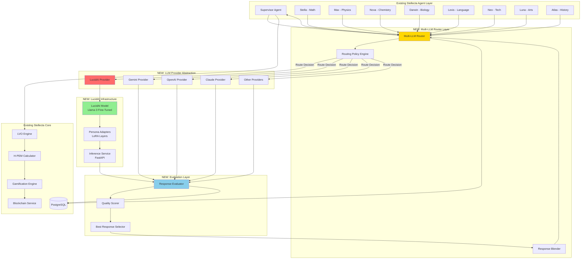
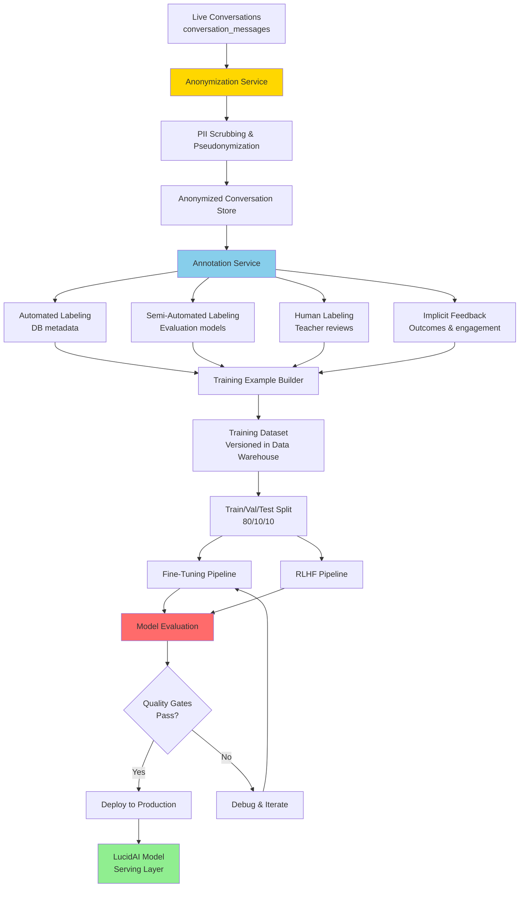
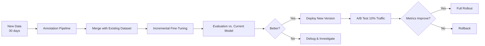
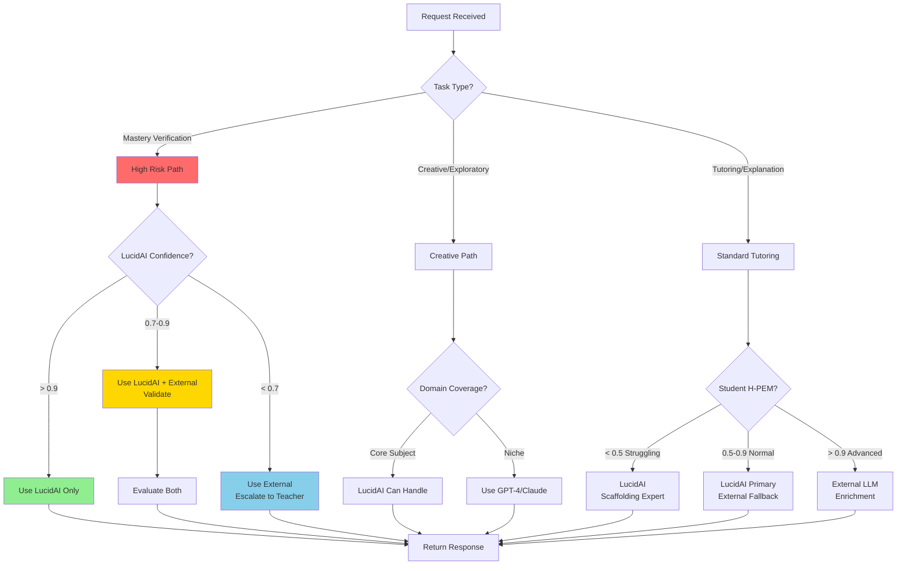
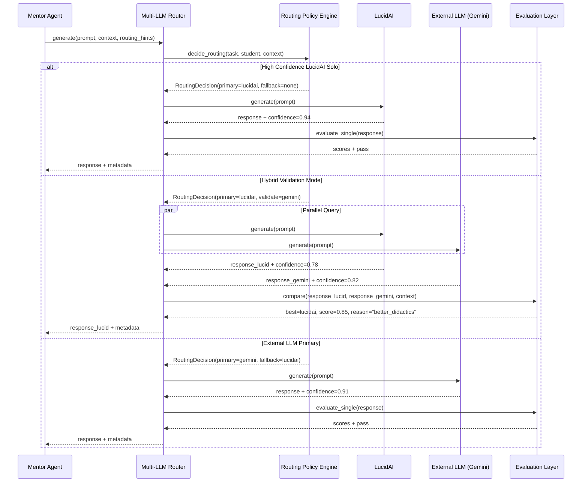
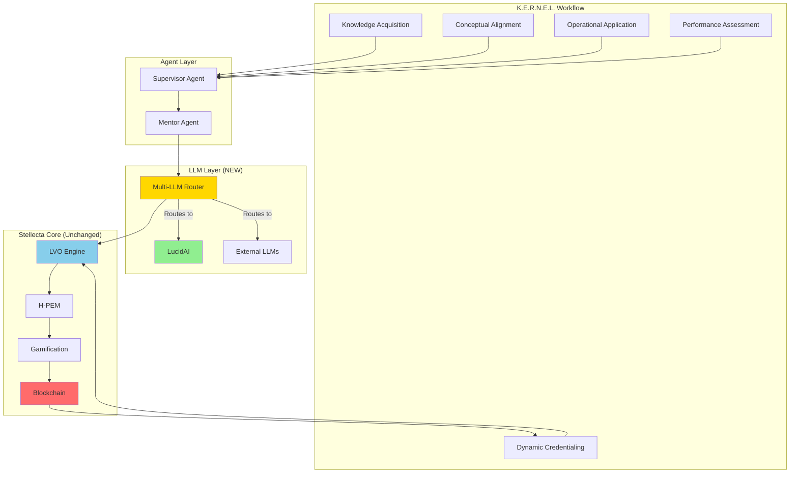
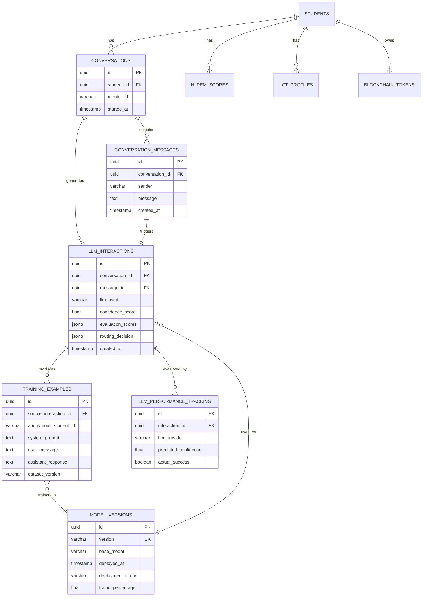

# Stellecta LucidAI – Multi-LLM Architecture & Integration Blueprint

**Subtitle:** Parallel Inference with Proprietary LLM and External Providers  
**Version:** 1.0  
**Date:** November 2025  
**Status:** Architecture Specification – Production Extension  
**Classification:** Technical Documentation – LLM Infrastructure Extension

---

## Document Positioning

**CRITICAL:** This document describes an **EXTENSION** to the existing Stellecta Agent Architecture. It does NOT replace any existing components. All new modules integrate as adapters and extensions to:

- Supervisor Agent layer
- Mentor Agent Engine (Stella, Max, Nova, Darwin, Lexis, Neo, Luna, Atlas)
- LVO Engine (Learn–Verify–Own)
- H-PEM metrics + LCT trajectories
- Gamification Engine (XP, mastery tokens)
- Stellar Blockchain Services
- Existing conversation logging, safety, and escalation logic

**Integration Guarantee:** Every component described here plugs INTO existing services without breaking contracts.

---

## Executive Summary

Stellecta is evolving from a single-LLM architecture (Gemini 2.5 Flash) to a **Multi-LLM Orchestration Platform** that introduces **Stellecta LucidAI**—a proprietary, domain-tuned, pedagogically optimized language model trained specifically for education, children aged 6–14, and the unique didactic requirements of the Stellecta platform.

### The Strategic Vision

Rather than replacing our existing LLM infrastructure, we are adding a **parallel LLM layer** that:

1. **Maintains existing external LLM integrations** (OpenAI GPT-4, Gemini 2.5, Claude 3.5, Perplexity, DeepSeek) for broad generative tasks, creativity, and fallback scenarios
2. **Introduces Stellecta LucidAI** as a specialized, continuously learning (Liquid AI) model trained on:
   - All Stellecta conversation logs (anonymized, COPPA/GDPR-compliant)
   - Task attempts, error patterns, and solution pathways across all subjects
   - Mentor personas and teaching strategies (Stella, Max, Nova, etc.)
   - Didactic feedback loops from students, teachers, and parents
   - H-PEM, LCT, and LVO outcome correlations
3. **Implements intelligent Multi-LLM Routing** that dynamically selects:
   - LucidAI for domain-critical, pedagogically sensitive, or mastery-verification tasks
   - External LLMs for general knowledge, creative exploration, or low-risk interactions
   - **Hybrid mode** where both respond, and the best answer (evaluated by didactic quality, safety, and correctness) wins

### Key Benefits

**Pedagogical Control & Quality:**
- LucidAI is trained specifically on evidence-based teaching strategies (scaffolding, ZPD, Socratic method, growth mindset)
- Understands all 8 mentor personas at a deep level
- Adapts to student H-PEM proficiency, LCT trajectory predictions, and weak skill patterns
- Generates responses that are age-appropriate, curriculum-aligned, and emotionally intelligent

**Cost Efficiency & Scalability:**
- Reduces dependency on expensive external API calls for high-volume, core interactions
- LucidAI can run on Stellecta-owned or leased GPU infrastructure
- Predictable cost structure as user base scales (vs. variable per-token pricing)

**Data Privacy & IP Ownership:**
- All training data, model weights, and inference logic remain under Stellecta control
- COPPA/GDPR-compliant by design (no child data leaves Stellecta infrastructure)
- Intellectual property: the model itself becomes a strategic asset

**Domain Specialization:**
- LucidAI specializes in:
  - Mathematics, Science, Language Arts, History (K-8 curriculum)
  - Error classification and remediation strategies
  - Age-specific vocabulary and sentence complexity (6-14 years)
  - Integration with LVO verification signals and H-PEM calculations
  - Blockchain credential explanations (age-appropriate)

**Continuous Learning (Liquid AI):**
- Model evolves based on real student interactions
- RLHF (Reinforcement Learning from Human Feedback) incorporates:
  - Teacher reviews
  - Student helpfulness ratings
  - Parent feedback
  - Learning outcome correlations (H-PEM improvements, mastery achievement)
- Monthly retraining cycles integrate new data, curriculum updates, and error patterns

### Integration with Stellecta Platform

LucidAI and the Multi-LLM Router integrate seamlessly with:

**To Supervisor Agent:**
- Router becomes the new LLM abstraction layer
- Supervisor calls `MultiLLMRouter.generate()` instead of direct LLM calls
- All safety, quality validation, and escalation logic remains unchanged

**To Mentor Agents (Stella, Max, Nova, etc.):**
- Each mentor's persona and system prompts work identically with LucidAI or external LLMs
- LucidAI has **persona-specific fine-tuning** for each mentor
- Mentors can request specific LLM preference via routing hints

**To LVO Engine:**
- Verification signals from LucidAI feed into H-PEM calculations identically to external LLM signals
- LucidAI evaluation confidence scores influence verification thresholds
- LVO mastery decisions trigger blockchain tokenization (LucidAI never mints directly)

**To Gamification & Blockchain:**
- XP, badges, and streak logic unchanged
- LucidAI provides evaluation signals → LVO → Gamification → Blockchain (same flow)
- Age-appropriate credential explanations improved via LucidAI training

**To Multi-Stakeholder Modules:**
- Students: Transparent LLM switching (no UX change)
- Parents: "Parent Mode" explanations improved by LucidAI training on parent-friendly language
- Teachers: Intervention signals enriched with LucidAI confidence metadata
- Schools: Configuration to prefer/require LucidAI for compliance reasons

### Rollout Strategy

**Phase 1 (Months 1-3): Foundation**
- Implement Multi-LLM Router abstraction
- Log all LLM requests/responses for analysis
- Begin data pipeline for anonymized conversation collection

**Phase 2 (Months 4-6): First LucidAI Prototype**
- Fine-tune open-source base model (Llama 3, Mistral, or Phi-3) on Math (Stella) domain
- Deploy to 5% of math interactions in pilot schools
- Compare quality vs. Gemini baseline

**Phase 3 (Months 7-9): Hybrid Production**
- Expand to Science (Max, Nova, Darwin) and Language (Lexis)
- Implement confidence blending and hybrid responses
- RLHF training begins with teacher/parent feedback

**Phase 4 (Months 10-12): Scale & Optimize**
- 50%+ of core tutoring interactions via LucidAI
- External LLMs for creativity, exploration, fallback
- Monthly retraining cycles established

**Phase 5 (Year 2+): Strategic Independence**
- LucidAI primary for all mentor interactions
- External LLMs for specialized tasks (code generation, creative writing, niche subjects)
- Model becomes a competitive moat and revenue opportunity (white-label licensing)

---

## Non-Technical Overview

### What is Stellecta LucidAI?

Imagine you have a team of world-class teachers who get better every day by learning from every lesson they teach. That's Stellecta LucidAI—our own AI "brain" that we're building specifically for education.

Right now, Stellecta uses AI models from companies like Google (Gemini) and OpenAI (ChatGPT). These are powerful general-purpose models, but they're like having a brilliant adult who can talk about anything—they're not specifically trained to teach 8-year-olds fractions or to understand how a struggling student learns best.

**LucidAI is different:**
- It's trained ONLY on how children learn (ages 6-14)
- It knows each of our 8 mentor personalities (Stella, Max, Lexis, etc.) deeply
- It understands our teaching methods (scaffolding, Zone of Proximal Development, Socratic questioning)
- It learns from every conversation: what works, what confuses students, which explanations lead to mastery
- It integrates with our unique systems: LVO (Learn-Verify-Own), H-PEM scores, gamification, blockchain credentials

### The Multi-LLM Orchestra

Instead of replacing Google's AI entirely, we're building a "conductor" that chooses the best AI for each situation:

**Scenario 1: Math Mastery Verification**
- Student: "Am I ready for the fractions test?"
- Conductor: This is critical for credentials → Use LucidAI (it knows our verification standards perfectly)

**Scenario 2: Creative Writing Prompt**
- Student: "Help me write a story about dragons"
- Conductor: Open-ended creativity → Use GPT-4 or Claude (excellent at creative generation)

**Scenario 3: High-Stakes Evaluation**
- Teacher reviewing student for credential
- Conductor: Let's ask BOTH LucidAI and Gemini, then compare their assessments

### Why This Matters

**For Students:**
- Better teaching tailored to exactly how YOU learn
- Faster help because the AI "remembers" teaching patterns that work
- Safer because LucidAI is trained on child-safe, age-appropriate content

**For Teachers:**
- More accurate insights into student struggles (LucidAI learns from 1000s of similar error patterns)
- Confidence scores to help decide when to intervene
- Aligned with your curriculum and teaching philosophy

**For Parents:**
- Clear, parent-friendly explanations of what your child is learning
- Privacy guarantee: your child's data trains OUR model, not sold to Big Tech
- Transparent: you can see which AI is being used and why

**For Stellecta (Strategic):**
- Independence: Not locked into any single AI vendor
- Specialization: Our AI becomes the best at teaching kids (competitive advantage)
- Cost: Predictable expenses as we grow (not paying per-word to external companies forever)
- IP: The model itself is a valuable asset (could license to other schools)

### How It Learns (Liquid AI)

"Liquid AI" means the model is continuously flowing, evolving, improving:

1. **Every day**, conversations are collected (anonymously—no names, no faces)
2. **Teachers and parents** give feedback: "Was this explanation helpful? Too hard? Just right?"
3. **Students** rate responses: thumbs up/down
4. **Outcome data** shows what actually led to mastery (H-PEM improvements, credentials earned)
5. **Every month**, LucidAI is retrained with this new knowledge
6. **Over time**, it becomes THE expert at teaching the Stellecta way

### The Smooth Transition

You won't wake up one day to a completely different system. The rollout is gradual:

- **First**, we test LucidAI with just math (Stella) for a small group
- **Then**, we expand to science and language
- **Eventually**, most conversations use LucidAI, with external AIs as backups
- **Throughout**, the Stellecta experience stays consistent—students and teachers won't notice the "plumbing" changes

---

## Technical Overview

### Architecture Components

The LucidAI system extends the existing Stellecta backend with four new layers:

#### 1. Multi-LLM Router / Orchestrator

**Purpose:** Intelligent request routing and response orchestration

**Key Responsibilities:**
- Receives inference requests from Supervisor/Mentor agents
- Analyzes request context (subject, student age, task type, risk level)
- Routes to one or more LLMs (LucidAI, Gemini, GPT-4, Claude, etc.)
- Aggregates responses if multiple LLMs queried
- Passes to Evaluation Layer for scoring
- Returns best response + metadata to calling agent

**Integration Point:**
- Replaces direct `LLMService.generate()` calls in existing Supervisor/Mentor code
- Implements same interface as `LLMService` (drop-in replacement)
- Adds new `route()` method with routing hints

**No Breaking Changes:**
- Existing agents call `router.generate()` with same parameters
- Router internally decides single vs. multi-LLM execution
- Falls back to external LLM if LucidAI unavailable

#### 2. Stellecta LucidAI Core

**Purpose:** Domain-tuned, proprietary LLM optimized for K-8 education

**Model Architecture:**
- **Base Model:** Open-source foundation (Llama 3 70B, Mistral Large, or Phi-3 Medium)
- **Fine-Tuning:** Supervised learning on Stellecta conversation corpus
  - 500K+ anonymized student-mentor conversations
  - Labeled with: subject, grade, mentor persona, didactic quality, outcome
- **RLHF:** Reinforcement learning from:
  - Teacher helpfulness ratings
  - Student feedback (thumbs up/down)
  - Learning outcome correlations (H-PEM improvements → reward signal)
- **Persona Heads:** Specialized adapter layers for each mentor (Stella, Max, etc.)
  - LoRA (Low-Rank Adaptation) for parameter-efficient persona switching
  - Maintains mentor voice consistency

**Deployment:**
- Hosted on Stellecta-controlled GPU infrastructure (Azure ML, AWS SageMaker, or self-hosted)
- Model served via FastAPI inference endpoints
- Horizontal scaling with load balancer
- A/B testing framework for model versions

**Integration Point:**
- Implements `LLMProvider` interface (same as GeminiProvider, OpenAIProvider)
- Router calls `LucidAIProvider.generate()` identically to external providers
- Returns response + confidence scores + reasoning metadata

#### 3. Evaluation & Scoring Layer

**Purpose:** Multi-dimensional quality assessment and response selection

**Evaluation Criteria:**
1. **Factual Correctness** (0-1 score)
   - Cross-reference with curriculum knowledge base
   - Check against verified solution keys
2. **Didactic Quality** (0-1 score)
   - Scaffolding appropriateness for student H-PEM level
   - Socratic questioning vs. direct answers
   - Encouragement and growth mindset language
3. **Persona Alignment** (0-1 score)
   - Match to expected mentor voice (Stella systematic, Max hands-on, etc.)
   - Age-appropriate vocabulary and sentence complexity
4. **Safety & Compliance** (pass/fail + 0-1 score)
   - Content filter (prohibited topics)
   - PII detection
   - Age-appropriateness check
5. **Curriculum Alignment** (0-1 score)
   - Maps to active competency in student's learning path
   - Consistent with school/teacher curriculum settings

**Composite Scoring:**
```
Final Score = (
  0.3 * Correctness +
  0.3 * Didactic Quality +
  0.2 * Persona Alignment +
  0.1 * Safety +
  0.1 * Curriculum Alignment
)
```

**Response Selection Logic:**
- Single LLM mode: Apply evaluation, regenerate if score < threshold
- Multi-LLM mode: Compare scores, select highest
- Hybrid mode: Blend elements from multiple responses if complementary

**Integration Point:**
- Called by Router after LLM responses received
- Uses existing `QualityValidator` logic (extends, not replaces)
- Feeds evaluation data back to LVO Engine for H-PEM calculations

#### 4. Data Governance & Training Pipeline

**Purpose:** Collect, anonymize, label, and prepare data for LucidAI training

**Pipeline Stages:**

**Stage 1: Collection**
- All conversations logged to `conversation_messages` table (existing)
- Task attempts logged to `task_attempts` table (existing)
- New: `llm_interactions` table captures LLM-specific metadata

**Stage 2: Anonymization**
- PII scrubbing (names, locations, school identifiers → tokens)
- Pseudonymization (student_id → anonymous_id mapping, one-way hash)
- COPPA/GDPR compliance validation

**Stage 3: Annotation**
- **Automated Labels:**
  - Subject, grade level, mentor persona (from session metadata)
  - Student H-PEM scores at time of interaction
  - Outcome: task success/failure, attempt count, time taken
- **Human Labels (Teacher Review):**
  - Didactic quality rating (1-5 stars)
  - Error classification (conceptual, procedural, careless)
  - Improvement suggestions
- **Implicit Feedback:**
  - Student thumbs up/down on responses
  - Conversation continuation (student kept engaging → positive signal)
  - Escalation to teacher (negative signal)

**Stage 4: Dataset Construction**
- Structured as instruction-tuning format:
  ```json
  {
    "system_prompt": "<Mentor persona + student context>",
    "user_message": "How do I solve 3/4 + 1/2?",
    "assistant_response": "<LucidAI target response>",
    "metadata": {
      "subject": "math",
      "grade": 5,
      "h_pem_proficiency": 0.65,
      "quality_score": 0.89,
      "outcome": "success"
    }
  }
  ```
- Split: 80% train, 10% validation, 10% test
- Versioned datasets in data warehouse (DVC for versioning)

**Stage 5: Training Orchestration**
- Scheduled retraining (monthly initial, then adaptive based on data volume)
- Fine-tuning jobs on GPU cluster
- RLHF training with reward model based on outcome data
- Model evaluation against held-out test set + live A/B test
- Deployment via blue-green strategy (zero downtime)

**Integration Point:**
- Extends existing conversation logging (no schema changes)
- New tables: `llm_interactions`, `training_examples`, `model_versions`
- Feeds into existing analytics pipeline for teacher/school dashboards

---

### System Architecture Diagram



---

### Integration with Existing Architecture

#### To Supervisor Agent

**Before (Current State):**
```python
class SupervisorService:
    def __init__(self, llm: LLMService):
        self.llm = llm  # Direct Gemini integration
    
    async def process_conversation(self, student_id, message, context):
        mentor = self.select_mentor(student, context)
        response = await self.llm.generate(  # Direct call
            system_prompt=mentor.build_prompt(context),
            message=message
        )
        return response
```

**After (With Router Extension):**
```python
class SupervisorService:
    def __init__(self, llm_router: MultiLLMRouter):  # New router abstraction
        self.llm = llm_router  # Same interface!
    
    async def process_conversation(self, student_id, message, context):
        mentor = self.select_mentor(student, context)
        
        # Add routing hints (optional)
        routing_hints = RoutingHints(
            task_type="tutoring",
            risk_level="medium",
            prefer_lucidai=context.is_mastery_evaluation
        )
        
        response = await self.llm.generate(  # Same call signature!
            system_prompt=mentor.build_prompt(context),
            message=message,
            routing_hints=routing_hints  # New optional param
        )
        return response
```

**Key Points:**
- Zero breaking changes to Supervisor logic
- Router implements `LLMService` interface
- Routing is transparent to agents
- Agents can provide hints but don't control routing

#### To Mentor Agents

**Integration:**
- Each mentor (Stella, Max, etc.) continues to build persona-specific system prompts
- LucidAI has **fine-tuned adapter layers** for each persona
- When Router selects LucidAI, it loads the appropriate persona adapter (LoRA)

**Example: Stella (Math Mentor)**
```python
# Existing mentor persona (unchanged)
stella_persona = MentorPersona(
    id="stella",
    name="Stella",
    subject_domains=["math", "logic"],
    system_prompt_template="You are Stella, a patient math tutor..."
)

# NEW: LucidAI has Stella-specific LoRA adapter
# Router automatically loads "stella_adapter" when:
# - Mentor = Stella
# - LLM = LucidAI
# No code changes needed in mentor logic
```

#### To LVO Engine

**Integration Flow:**

1. **LEARN Phase:**
   - Mentor generates response via Router (LucidAI or external)
   - Response includes metadata: `llm_used`, `confidence_score`, `reasoning`
   - Logged to `conversation_messages` + `llm_interactions` tables

2. **VERIFY Phase:**
   - Agent conducts formative assessment
   - Router can use LucidAI for evaluation (high confidence in domain-specific verification)
   - Evaluation signals feed into H-PEM calculation (existing flow)

3. **OWN Phase:**
   - LVO triggers credential minting (unchanged)
   - Mentor celebrates using Router-generated response
   - LucidAI excels at age-appropriate blockchain explanations (trained on this specifically)

**No Changes to:**
- H-PEM calculation formulas
- LCT trajectory models
- Verification thresholds
- Blockchain minting logic

**New Data Captured:**
```python
# Extended llm_interactions table
{
    "interaction_id": "uuid",
    "conversation_id": "uuid",
    "llm_used": "lucidai",  # or "gemini", "gpt4", etc.
    "confidence_score": 0.92,
    "evaluation_scores": {
        "correctness": 0.95,
        "didactic_quality": 0.91,
        "persona_alignment": 0.89
    },
    "routing_reason": "mastery_verification",
    "alternatives_considered": ["gemini"],
    "response_time_ms": 450
}
```

#### To Gamification & Blockchain

**No changes required.**

- XP, badges, streaks awarded via existing `GamificationEngine`
- Router-generated responses feed into same evaluation logic
- Blockchain tokens minted via existing `BlockchainService` (triggered by LVO, not LLM)

**Enhancement Opportunity:**
- LucidAI can generate more engaging, personalized celebration messages
- Training data includes successful gamification narratives

---

## Data Governance & Training Strategy

### 5.1 Data Governance

#### Data Collection

**What We Collect:**

1. **Conversation Logs** (Existing: `conversation_messages` table)
   - Student input (anonymized)
   - Mentor/LLM response
   - Timestamp, session context

2. **Task Attempts** (Existing: `task_attempts` table)
   - Question, student answer, correct answer
   - Attempt number, time taken, hints used
   - Success/failure outcome

3. **Learning Context** (Existing: Student, LVO, H-PEM tables)
   - Student age, grade, learning path
   - H-PEM scores (proficiency, resilience, velocity, engagement, transfer)
   - LCT trajectory predictions
   - Weak skills, recent badges, XP

4. **Feedback Signals** (Existing: `conversation_feedback`, Teacher review queues)
   - Student thumbs up/down
   - Teacher intervention flags
   - Parent feedback comments

5. **NEW: LLM Interaction Metadata**
   - Which LLM generated response
   - Confidence scores, evaluation metrics
   - Response alternatives considered
   - Routing decision rationale

**Collection Pipeline:**
```python
# Existing conversation logging (no changes)
await db.conversation_messages.create(
    conversation_id=conv_id,
    sender="mentor",
    message=response,
    metadata={"mentor_id": "stella"}
)

# NEW: Extended with LLM metadata
await db.llm_interactions.create(
    conversation_id=conv_id,
    message_id=message_id,
    llm_provider="lucidai",
    model_version="lucidai-v1.2-stella",
    confidence_score=0.89,
    evaluation_scores={...},
    routing_reason="high_proficiency_student",
    inference_time_ms=380
)
```

#### Anonymization & Pseudonymization

**COPPA/GDPR Compliance Requirements:**

1. **PII Scrubbing:**
   - Student names → `[STUDENT]` token
   - School names → `[SCHOOL_ID_<hash>]` token
   - Location references → `[CITY]`, `[STATE]` tokens
   - Specific dates → relative time (`"3 days ago"` instead of `"Nov 20, 2025"`)

2. **Pseudonymization:**
   - `student_id` (UUID) → `anonymous_student_id` (one-way hash)
   - Mapping table encrypted at rest, access restricted
   - Training datasets use only anonymous IDs

3. **Consent Management:**
   - Parents opt-in to "Help improve Stellecta AI" (during onboarding)
   - Opt-out flag excludes conversations from training pipeline
   - Audit log of data usage

**Anonymization Pipeline:**
```python
class DataAnonymizer:
    def anonymize_conversation(self, message: str, metadata: dict) -> dict:
        """
        Anonymize a conversation message for training
        """
        # PII scrubbing
        anonymized = self.pii_scrubber.scrub(message)
        
        # Pseudonymize IDs
        anon_student_id = self.hash_student_id(metadata["student_id"])
        
        # Remove timestamps (keep relative time)
        relative_time = self.relative_time(metadata["timestamp"])
        
        return {
            "message": anonymized,
            "anonymous_student_id": anon_student_id,
            "relative_time": relative_time,
            "subject": metadata["subject"],  # Safe to keep
            "grade_level": metadata["grade"],  # Safe to keep
            "mentor_persona": metadata["mentor_id"]  # Safe to keep
        }
```

#### Data Labeling & Annotation

**Automated Labels:**

Extracted from existing database fields:
- Subject, grade level, mentor persona
- Student H-PEM scores at interaction time
- Task outcome (success/failure, attempt count)
- Conversation length, engagement metrics

**Semi-Automated Labels:**

Generated by evaluation models:
- Didactic quality score (0-1)
- Error type classification (conceptual, procedural, careless)
- Scaffolding level appropriateness (heavy, medium, light, none)
- Sentiment (encouraging, neutral, directive)

**Human Labels (Teacher Review):**

Teachers already review flagged interactions (existing workflow). We extend this:
- **Existing:** Teachers flag safety issues, struggles
- **NEW:** Teachers rate didactic quality (1-5 stars) on subset of interactions
- **NEW:** Teachers provide improvement suggestions (free text)
- **Incentive:** Teachers earn XP for labeling (gamification)

**Implicit Feedback:**

- **Student engagement:** Conversation continuation, thumbs up/down
- **Learning outcomes:** H-PEM improvement after interaction (reward signal for RLHF)
- **Escalation:** Teacher intervention requested (negative signal)

**Labeling Workflow:**
```python
class TrainingExampleBuilder:
    async def create_training_example(
        self,
        conversation_id: UUID,
        message_id: UUID
    ) -> TrainingExample:
        """
        Build a labeled training example from conversation
        """
        # Get message and context
        message = await db.conversation_messages.get(message_id)
        context = await db.load_enriched_context(message.student_id)
        interaction = await db.llm_interactions.get_by_message(message_id)
        
        # Automated labels
        labels = {
            "subject": context.learning_path.current_subject,
            "grade": context.student.grade_level,
            "mentor_persona": message.metadata["mentor_id"],
            "h_pem_proficiency": context.h_pem.proficiency,
            "student_age": context.student.age
        }
        
        # Semi-automated labels (from evaluation layer)
        labels.update({
            "didactic_quality": interaction.evaluation_scores["didactic_quality"],
            "correctness": interaction.evaluation_scores["correctness"],
            "persona_alignment": interaction.evaluation_scores["persona_alignment"]
        })
        
        # Human labels (if available)
        teacher_review = await db.teacher_reviews.get_by_message(message_id)
        if teacher_review:
            labels["teacher_quality_rating"] = teacher_review.quality_rating
            labels["teacher_notes"] = teacher_review.notes
        
        # Implicit feedback
        feedback = await db.conversation_feedback.get_by_message(message_id)
        labels["student_helpful"] = feedback.helpful if feedback else None
        
        # Outcome labels (H-PEM change after interaction)
        outcome = await self.calculate_outcome_impact(
            message.student_id,
            message.created_at
        )
        labels["h_pem_delta"] = outcome.h_pem_delta  # Reward signal for RLHF
        
        return TrainingExample(
            system_prompt=self.build_system_prompt(context),
            user_message=message.previous_message,
            assistant_response=message.message,
            labels=labels
        )
```

#### Data Pipeline Architecture



---

### 5.2 Model Platform Choice

#### Base Model Selection Criteria

We evaluate open-source foundation models based on:

1. **Performance:** Benchmark scores on education-specific tasks
2. **Size:** Balancing capability vs. inference cost
3. **License:** Commercial use permitted
4. **Community:** Active development, safety research
5. **Fine-Tuning Efficiency:** Supports LoRA, QLoRA, parameter-efficient methods

**Candidate Models:**

| Model | Size | Strengths | Considerations |
|-------|------|-----------|----------------|
| **Llama 3 70B** | 70B params | Strong reasoning, math, code generation | Large (needs A100s), expensive inference |
| **Llama 3 8B** | 8B params | Fast inference, affordable | Lower capability on complex reasoning |
| **Mistral Large** | ~120B params | State-of-art open model, multilingual | Very large, cutting-edge |
| **Phi-3 Medium** | 14B params | Excellent quality/size ratio, education-friendly | Microsoft (IP concerns?) |
| **Gemma 2 27B** | 27B params | Google-backed, strong benchmarks | Newer, less battle-tested |

**Initial Decision: Llama 3 70B**

- Best balance of capability and inference cost
- Strong math and reasoning (critical for STEM subjects)
- Large community, proven fine-tuning recipes
- Meta's LLaMa license permits commercial use

**Deployment Strategy:**
- Host on Azure ML or AWS SageMaker (GPU instances)
- Quantization (4-bit or 8-bit) to reduce memory footprint
- Horizontal scaling with load balancing
- Consider smaller models (8B) for lower-stakes interactions

#### Fine-Tuning Strategy

**Stage 1: Supervised Fine-Tuning (SFT)**

Train on curated instruction-tuning dataset:
- 500K high-quality conversation examples
- Balanced across subjects, mentors, grade levels
- Overrepresent high-quality teacher-reviewed interactions

**Training Configuration:**
```yaml
model:
  base: meta-llama/Llama-3-70b-hf
  quantization: 4-bit (QLoRA)
  lora_rank: 64
  lora_alpha: 128

training:
  epochs: 3
  batch_size: 4 (per GPU)
  gradient_accumulation: 8
  learning_rate: 2e-5
  warmup_steps: 500
  max_seq_length: 2048

data:
  train_examples: 500000
  val_examples: 50000
  test_examples: 50000
```

**Stage 2: Persona Adaptation (LoRA Layers)**

After base fine-tuning, train separate LoRA adapters for each mentor:
- Stella adapter: trained on Stella conversations only
- Max adapter: trained on Max conversations only
- ...and so on for all 8 mentors

**Advantage:**
- Single base model (saves memory)
- Fast persona switching (swap LoRA weights)
- Each mentor maintains distinct voice

**Stage 3: Reinforcement Learning from Human Feedback (RLHF)**

Use outcome data to fine-tune with reinforcement learning:

**Reward Signal:**
```python
def calculate_reward(interaction: Interaction) -> float:
    """
    Calculate RLHF reward for an interaction
    """
    reward = 0.0
    
    # Positive rewards
    if interaction.student_helpful:
        reward += 1.0
    
    if interaction.h_pem_delta > 0:  # Learning improvement
        reward += 2.0 * interaction.h_pem_delta
    
    if interaction.teacher_rating >= 4:  # High teacher rating
        reward += 1.5
    
    if interaction.task_success:
        reward += 0.5
    
    # Negative penalties
    if interaction.escalated_to_teacher:  # Student struggled
        reward -= 1.0
    
    if interaction.safety_flag:
        reward -= 5.0
    
    if interaction.teacher_rating <= 2:
        reward -= 2.0
    
    return reward
```

**RLHF Training:**
- Use PPO (Proximal Policy Optimization) or DPO (Direct Preference Optimization)
- Reward model trained on (interaction, reward) pairs
- Policy optimized to maximize expected reward
- Monthly retraining cycles as new feedback accumulates

#### Continuous Learning (Liquid AI)

**"Liquid AI" Philosophy:**
- Model is never static; it continuously evolves
- New data flows in daily (like a liquid)
- Monthly retraining keeps model fresh

**Retraining Schedule:**
- **Month 1-3:** Weekly retraining (rapid iteration)
- **Month 4-6:** Bi-weekly retraining
- **Month 7+:** Monthly retraining (stable)

**Retraining Triggers:**
- Scheduled (monthly)
- Data volume threshold (100K new labeled examples)
- Performance degradation (quality metrics drop)
- Curriculum updates (new competencies added)

**Retraining Pipeline:**


---

### 5.3 Didactic RLHF

#### Reward Model Design

Traditional RLHF optimizes for "helpfulness" or "truthfulness." Stellecta's RLHF optimizes for **didactic quality**—which is more nuanced.

**Didactic Quality Reward Factors:**

1. **Learning Outcome (Weight: 0.4)**
   - Did student's H-PEM proficiency improve after this interaction?
   - Did student achieve mastery on related competency?
   - Measured by: `h_pem_delta`, credential earned (yes/no)

2. **Teaching Effectiveness (Weight: 0.3)**
   - Did response match student's scaffolding needs (heavy/medium/light)?
   - Was Socratic method used (guiding questions vs. direct answers)?
   - Was growth mindset language present?
   - Measured by: automated evaluation scores, teacher ratings

3. **Engagement (Weight: 0.2)**
   - Did student continue conversation (didn't drop off)?
   - Did student provide positive feedback (thumbs up)?
   - Measured by: conversation length, feedback signal

4. **Safety & Appropriateness (Weight: 0.1)**
   - Was response age-appropriate?
   - No safety flags or escalations?
   - Measured by: safety checks passed, no teacher intervention for safety

**Reward Function Implementation:**
```python
class DidacticRewardModel:
    """
    Reward model for didactic RLHF
    """
    def calculate_reward(
        self,
        interaction: Interaction,
        context: LearningContext,
        outcome: LearningOutcome
    ) -> float:
        """
        Calculate composite didactic reward
        """
        # 1. Learning Outcome (40%)
        learning_reward = 0.0
        if outcome.h_pem_delta > 0:
            learning_reward = 2.0 * outcome.h_pem_delta
        if outcome.mastery_achieved:
            learning_reward += 3.0
        
        # 2. Teaching Effectiveness (30%)
        teaching_reward = 0.0
        eval_scores = interaction.evaluation_scores
        teaching_reward += eval_scores["didactic_quality"] * 2.0
        teaching_reward += eval_scores["scaffolding_appropriate"] * 1.0
        if interaction.teacher_rating:
            teaching_reward += (interaction.teacher_rating - 3) * 0.5  # Normalize to 0
        
        # 3. Engagement (20%)
        engagement_reward = 0.0
        if interaction.student_helpful:
            engagement_reward += 1.0
        engagement_reward += min(interaction.conversation_turns / 10, 1.0)  # Cap at 10 turns
        
        # 4. Safety (10%)
        safety_reward = 0.0
        if not interaction.safety_flag and not interaction.escalated:
            safety_reward = 1.0
        else:
            safety_reward = -3.0  # Strong penalty
        
        # Composite weighted reward
        reward = (
            0.4 * learning_reward +
            0.3 * teaching_reward +
            0.2 * engagement_reward +
            0.1 * safety_reward
        )
        
        return reward
```

#### Integration with Existing Feedback Loops

**Existing Feedback Mechanisms (Already in Platform):**

1. **Student Feedback:**
   - Thumbs up/down on mentor responses (existing)
   - Extends to: "Was this helpful?" (1-5 stars)

2. **Teacher Reviews:**
   - Teachers flag struggling students (existing)
   - Extends to: Teachers rate interaction quality (1-5 stars) on review

3. **Parent Feedback:**
   - Parents see progress summaries (existing)
   - Extends to: "Was this explanation clear?" (yes/no)

4. **Outcome Data:**
   - H-PEM calculations after tasks (existing)
   - LCT trajectory updates (existing)
   - Credential issuance (existing)

**NEW: Unified Feedback Collection Service**

```python
class FeedbackCollectionService:
    """
    Collects all feedback signals for RLHF training
    """
    async def collect_interaction_feedback(
        self,
        interaction_id: UUID
    ) -> InteractionFeedback:
        """
        Aggregate all feedback for a single interaction
        """
        interaction = await db.llm_interactions.get(interaction_id)
        
        # Student feedback (immediate)
        student_feedback = await db.conversation_feedback.get_by_interaction(
            interaction_id
        )
        
        # Teacher feedback (within 48 hours)
        teacher_review = await db.teacher_reviews.get_by_interaction(
            interaction_id,
            within_hours=48
        )
        
        # Parent feedback (within 7 days)
        parent_feedback = await db.parent_feedback.get_by_interaction(
            interaction_id,
            within_days=7
        )
        
        # Outcome data (7-30 days after)
        outcome = await self.calculate_learning_outcome(
            interaction.student_id,
            interaction.competency_id,
            after_interaction=interaction.created_at,
            window_days=30
        )
        
        return InteractionFeedback(
            interaction_id=interaction_id,
            student_helpful=student_feedback.helpful if student_feedback else None,
            teacher_rating=teacher_review.quality_rating if teacher_review else None,
            parent_clear=parent_feedback.clear if parent_feedback else None,
            h_pem_delta=outcome.h_pem_delta,
            mastery_achieved=outcome.mastery_achieved
        )
```

**Feedback Aggregation for Training:**

```python
class RLHFTrainingPipeline:
    """
    Prepare data for RLHF training
    """
    async def build_rlhf_dataset(
        self,
        start_date: datetime,
        end_date: datetime
    ) -> RLHFDataset:
        """
        Build dataset with (state, action, reward) tuples
        """
        interactions = await db.llm_interactions.get_range(start_date, end_date)
        
        examples = []
        for interaction in interactions:
            # Get full context (state)
            state = await self.load_rlhf_state(interaction)
            
            # Action is the LLM response
            action = interaction.response
            
            # Calculate reward from feedback
            feedback = await self.feedback_service.collect_interaction_feedback(
                interaction.id
            )
            reward = self.reward_model.calculate_reward(
                interaction,
                state.context,
                feedback
            )
            
            examples.append(RLHFExample(
                state=state,
                action=action,
                reward=reward,
                metadata={
                    "interaction_id": interaction.id,
                    "subject": state.context.subject,
                    "mentor": state.context.mentor_id
                }
            ))
        
        return RLHFDataset(examples=examples)
```

---

## Multi-LLM Routing & Hybrid Responses

### 6.1 Multi-LLM Routing ("Dual LLM Layer")

#### Routing Policy Engine

The Router makes intelligent decisions about which LLM(s) to use based on:

**Decision Factors:**

1. **Task Type:**
   - `mastery_verification` → Prefer LucidAI (domain expert)
   - `creative_exploration` → Prefer GPT-4/Claude (creative strength)
   - `factual_explanation` → LucidAI or Gemini (both strong)
   - `code_generation` → GPT-4 or Claude (code specialists)

2. **Risk Level:**
   - `high` (credential decisions) → LucidAI + external validation
   - `medium` (tutoring) → LucidAI primary
   - `low` (exploration) → External LLM acceptable

3. **Student Context:**
   - `struggling` (H-PEM < 0.5) → LucidAI (specialized in scaffolding)
   - `advanced` (H-PEM > 0.9) → External LLM for enrichment
   - `age < 10` → LucidAI (trained on younger learners)

4. **Domain Specificity:**
   - `core_subjects` (Math, Science, Language) → LucidAI strong
   - `niche_subjects` (Music theory, advanced coding) → External LLM

5. **LucidAI Confidence:**
   - If LucidAI confidence > 0.9 → Use solo
   - If LucidAI confidence 0.7-0.9 → Use + validate with external
   - If LucidAI confidence < 0.7 → Prefer external

6. **System Load:**
   - If LucidAI at capacity → Route to external
   - If external LLM rate limits → Route to LucidAI

**Routing Decision Tree:**



#### Routing Policy Configuration

**School/Teacher Overrides:**

Schools and teachers can configure routing preferences:

```python
class RoutingPolicy:
    """
    Configurable routing policy
    """
    def __init__(self, school_config: SchoolConfig):
        self.school_config = school_config
    
    def decide_routing(
        self,
        task: Task,
        student: Student,
        context: LearningContext
    ) -> RoutingDecision:
        """
        Make routing decision based on policy
        """
        # School-level overrides
        if self.school_config.require_lucidai_for_credentials:
            if task.type == "mastery_verification":
                return RoutingDecision(
                    primary_llm="lucidai",
                    fallback_llm=None,
                    reason="school_policy_credential_requirement"
                )
        
        # Teacher-level overrides
        teacher_pref = self.get_teacher_preference(context.classroom_id)
        if teacher_pref.always_use_lucidai:
            return RoutingDecision(
                primary_llm="lucidai",
                fallback_llm="gemini",
                reason="teacher_preference"
            )
        
        # Default routing logic
        return self.default_routing(task, student, context)
```

**Example School Config:**
```yaml
school_id: "school_abc123"
routing_policy:
  default_llm: "lucidai"
  fallback_llm: "gemini"
  
  overrides:
    mastery_verification:
      primary: "lucidai"
      require_confidence: 0.85
      validate_with_external: true
    
    creative_tasks:
      primary: "gpt4"
      allow_lucidai_fallback: true
    
    struggling_students:
      h_pem_threshold: 0.5
      force_lucidai: true
```

#### Routing Sequence Diagram



---

### 6.2 Hybrid Responses & Confidence Blending

#### Multi-Response Evaluation

When multiple LLMs generate responses, the Evaluation Layer compares them:

**Evaluation Process:**

```python
class MultiResponseEvaluator:
    """
    Compare and select best response from multiple LLMs
    """
    async def compare_responses(
        self,
        responses: List[LLMResponse],
        context: LearningContext,
        task: Task
    ) -> EvaluationResult:
        """
        Compare multiple LLM responses and select best
        """
        # Score each response on multiple dimensions
        scored_responses = []
        for response in responses:
            scores = await self.score_response(response, context, task)
            scored_responses.append(ScoredResponse(
                response=response,
                scores=scores,
                composite_score=self.calculate_composite(scores, task)
            ))
        
        # Rank by composite score
        ranked = sorted(scored_responses, key=lambda x: x.composite_score, reverse=True)
        
        best = ranked[0]
        
        # Check if responses agree (high consensus)
        consensus = self.check_consensus(scored_responses)
        
        # Decide: use best, or blend if complementary
        if consensus > 0.8:
            # High agreement → use best
            return EvaluationResult(
                selected_response=best.response,
                reason="high_consensus",
                confidence=best.composite_score,
                alternatives=[r.response for r in ranked[1:]]
            )
        else:
            # Low agreement → consider blending or escalation
            if self.are_complementary(scored_responses):
                blended = await self.blend_responses(scored_responses, context)
                return EvaluationResult(
                    selected_response=blended,
                    reason="blended_complementary",
                    confidence=0.75,
                    alternatives=[r.response for r in ranked]
                )
            else:
                # Contradictory → flag for teacher review
                return EvaluationResult(
                    selected_response=best.response,
                    reason="low_consensus_using_best",
                    confidence=best.composite_score * 0.8,  # Reduce confidence
                    flag_for_review=True,
                    alternatives=[r.response for r in ranked[1:]]
                )
```

#### Response Blending Strategies

**When to Blend:**
- Responses cover complementary aspects (one explains concept, other gives example)
- Both score highly but emphasize different pedagogical approaches
- Student context suggests multi-angle explanation beneficial

**Blending Techniques:**

1. **Sequential Blending:**
   - Use LucidAI's conceptual explanation first
   - Follow with external LLM's creative example
   - Merge into single coherent response

2. **Parallel Blending:**
   - Present student with "Two ways to think about this:"
   - Show LucidAI's systematic approach
   - Show external LLM's intuitive approach
   - Let student choose preferred learning style

3. **Extractive Blending:**
   - Identify best sentences from each response
   - Use LLM (meta-blender) to combine into coherent narrative
   - Ensure no contradictions or redundancy

**Example Blending:**

```python
async def blend_responses(
    self,
    responses: List[ScoredResponse],
    context: LearningContext
) -> str:
    """
    Blend multiple responses into one
    """
    # Extract best elements
    lucidai_resp = responses[0].response  # LucidAI strong on pedagogy
    external_resp = responses[1].response  # External strong on creativity
    
    # Identify complementary sections
    lucidai_concept = self.extract_conceptual_explanation(lucidai_resp)
    external_example = self.extract_examples(external_resp)
    
    # Use meta-LLM to blend
    blend_prompt = f"""
    Combine these two explanations into one coherent response:
    
    Conceptual Explanation:
    {lucidai_concept}
    
    Examples:
    {external_example}
    
    Create a single response that:
    - Starts with the conceptual explanation
    - Follows with the examples
    - Maintains age-appropriate tone for {context.student.age}-year-old
    - Uses encouraging, growth mindset language
    """
    
    blended = await self.meta_llm.generate(blend_prompt)
    return blended
```

#### Confidence Scoring & Feedback Loop

**Confidence Calibration:**

- Each LLM returns confidence score (0-1)
- Evaluation Layer adjusts based on:
  - Historical accuracy (LLM's past performance on similar tasks)
  - Cross-validation with other LLMs (agreement boosts confidence)
  - Student outcome data (if this type of response led to learning)

**Feedback to Routing:**

```python
class ConfidenceFeedbackLoop:
    """
    Track LLM performance and adjust routing
    """
    async def record_outcome(
        self,
        interaction_id: UUID,
        llm_used: str,
        task_type: str,
        outcome: LearningOutcome
    ):
        """
        Record how well an LLM performed
        """
        await db.llm_performance_tracking.create(
            interaction_id=interaction_id,
            llm_provider=llm_used,
            task_type=task_type,
            predicted_confidence=interaction.confidence_score,
            actual_success=outcome.task_success,
            h_pem_delta=outcome.h_pem_delta,
            student_helpful=outcome.student_feedback
        )
    
    async def get_llm_accuracy(
        self,
        llm_provider: str,
        task_type: str,
        window_days: int = 30
    ) -> float:
        """
        Calculate historical accuracy for LLM on task type
        """
        records = await db.llm_performance_tracking.get_recent(
            llm_provider=llm_provider,
            task_type=task_type,
            days=window_days
        )
        
        if not records:
            return 0.5  # Default uncertainty
        
        # Calculate accuracy
        successes = sum(1 for r in records if r.actual_success)
        accuracy = successes / len(records)
        
        return accuracy
    
    def adjust_confidence(
        self,
        reported_confidence: float,
        llm_provider: str,
        task_type: str
    ) -> float:
        """
        Calibrate confidence based on historical performance
        """
        historical_accuracy = await self.get_llm_accuracy(llm_provider, task_type)
        
        # Bayesian adjustment
        calibrated = (reported_confidence + historical_accuracy) / 2
        
        return calibrated
```

---

## Incremental Rollout Strategy

### Phase 1: Foundation (Months 1-3)

**Objectives:**
- Implement Multi-LLM Router abstraction layer
- Deploy logging infrastructure for all LLM calls
- Begin data pipeline for conversation collection

**Key Deliverables:**

1. **Multi-LLM Router Service**
   - Implements `LLMService` interface (drop-in replacement)
   - Routes to Gemini only (no LucidAI yet)
   - Logs all requests/responses with metadata
   - Integration tests with existing Supervisor/Mentor agents

2. **LLM Interaction Logging**
   - New `llm_interactions` table in database
   - Captures: llm_provider, model_version, confidence, evaluation_scores, routing_reason
   - No PII in logs (references conversation_id, anonymized later)

3. **Data Pipeline Setup**
   - Anonymization service deployed
   - Data warehouse (Snowflake, BigQuery, or Redshift) configured
   - DVC (Data Version Control) for dataset versioning

**Success Criteria:**
- ✅ Router handles 100% of LLM traffic (Gemini backend)
- ✅ Zero performance degradation vs. direct Gemini integration
- ✅ All interactions logged with >99.9% completeness
- ✅ 100K+ anonymized conversation examples collected

**Teams:**
- Backend Engineers: Router implementation, logging
- Data Engineers: Pipeline setup, anonymization
- ML Engineers: Dataset schema design

---

### Phase 2: First LucidAI Prototype (Months 4-6)

**Objectives:**
- Train first LucidAI model (Math/Stella domain)
- Deploy to small pilot (5% of traffic)
- Validate quality vs. Gemini baseline

**Key Deliverables:**

1. **LucidAI v1.0 (Stella Specialist)**
   - Base: Llama 3 70B
   - Fine-tuned on: 200K math conversations (Stella persona)
   - LoRA adapter for Stella personality
   - Hosted on Azure ML (A100 GPUs)

2. **LucidAI Provider Integration**
   - Implements `LLMProvider` interface
   - Router can select LucidAI as option
   - Inference endpoint with load balancing

3. **Pilot Deployment**
   - 5% of math (Stella) interactions routed to LucidAI
   - 95% remain on Gemini (control group)
   - A/B test framework tracks quality metrics

4. **Evaluation Framework**
   - Automated: Correctness, didactic quality, persona alignment
   - Human: Teacher reviews of LucidAI responses (sample)
   - Comparison dashboard: LucidAI vs. Gemini

**Success Criteria:**
- ✅ LucidAI achieves ≥95% of Gemini quality score
- ✅ Teacher reviews: LucidAI ≥80% "satisfactory" rating
- ✅ Student feedback: No significant difference in helpfulness
- ✅ H-PEM outcomes: LucidAI group shows equal or better improvement
- ✅ Inference latency: <500ms p95 (comparable to Gemini)

**Go/No-Go Decision:**
- If success criteria met → Proceed to Phase 3
- If not met → Iterate on fine-tuning, gather more data, or revisit base model choice

**Teams:**
- ML Engineers: Model training, evaluation
- Backend Engineers: Provider integration, deployment
- Product/Didactics: Quality review, curriculum validation

---

### Phase 3: Hybrid Production (Months 7-9)

**Objectives:**
- Expand LucidAI to Science (Max, Nova, Darwin) and Language (Lexis)
- Implement hybrid mode (LucidAI + external validation)
- Begin RLHF training with feedback data

**Key Deliverables:**

1. **LucidAI v2.0 (Multi-Subject)**
   - Retrained on: Math, Science, Language (500K examples)
   - Separate LoRA adapters for: Stella, Max, Nova, Darwin, Lexis
   - Improved base model (possibly Llama 3.1 or Mistral Large if superior)

2. **Routing Policy Expansion**
   - Policy Engine implements decision tree (see 6.1)
   - Hybrid mode: High-stakes tasks use LucidAI + Gemini validation
   - Teacher/school config overrides enabled

3. **RLHF Training Pipeline**
   - Reward model trained on 3 months of outcome data
   - First RLHF fine-tuning run
   - A/B test: RLHF model vs. SFT-only model

4. **Expanded Pilot**
   - 30% of core subject interactions use LucidAI
   - 10% use hybrid mode (LucidAI + external)
   - 60% remain on external (control + capacity)

**Success Criteria:**
- ✅ LucidAI achieves parity or better on all subjects (Math, Science, Language)
- ✅ Hybrid mode: 95% of high-stakes verifications validated correctly
- ✅ RLHF model: +5% improvement in didactic quality vs. SFT baseline
- ✅ Teacher escalations: No increase vs. Gemini baseline
- ✅ Cost per interaction: 40% reduction (LucidAI cheaper than Gemini API)

**Teams:**
- ML Engineers: Multi-subject training, RLHF pipeline
- Backend Engineers: Routing policy, hybrid mode
- Product/Didactics: Policy configuration, quality review
- Data Engineers: Feedback data pipeline

---

### Phase 4: Scale & Optimize (Months 10-12)

**Objectives:**
- Scale to 50%+ of interactions via LucidAI
- Establish monthly retraining cycle
- Optimize inference cost and latency

**Key Deliverables:**

1. **LucidAI v3.0 (Production Scale)**
   - Retrained on 1M+ examples
   - All 8 mentor personas (including Neo, Luna, Atlas)
   - Monthly retraining pipeline automated
   - Model compression (quantization, distillation) for cost reduction

2. **Routing at Scale**
   - 50% core tutoring → LucidAI
   - 20% high-stakes → Hybrid (LucidAI + external)
   - 30% creative/exploratory → External
   - Dynamic routing based on real-time confidence and load

3. **Performance Optimization**
   - Inference latency: Target <300ms p95
   - Cost per interaction: 60% reduction vs. all-external baseline
   - Horizontal scaling: Auto-scaling based on traffic

4. **Teacher Tools**
   - Dashboard: Compare LucidAI vs. external LLM performance
   - Override controls: Teachers choose LLM preference per student
   - Feedback integration: Teachers rate responses → RLHF training

**Success Criteria:**
- ✅ 50%+ of interactions via LucidAI with quality maintained
- ✅ Cost savings: $100K+/month vs. all-external baseline (projected at scale)
- ✅ Student outcomes: H-PEM improvements ≥baseline across LucidAI cohort
- ✅ Teacher satisfaction: >85% approve of LucidAI quality
- ✅ System reliability: 99.9% uptime, <500ms p95 latency

**Teams:**
- ML Engineers: Model optimization, compression
- Backend/DevOps: Scaling, performance tuning
- Product: Teacher tools, dashboards
- Finance: Cost analysis, ROI tracking

---

### Phase 5: Strategic Independence (Year 2+)

**Objectives:**
- LucidAI primary for 80%+ of core interactions
- External LLMs for specialized tasks only
- Explore model licensing opportunities (revenue stream)

**Key Deliverables:**

1. **LucidAI as Primary**
   - 80% of tutoring, verification, evaluation → LucidAI
   - External LLMs: Creative writing, code gen, niche subjects
   - Router defaults to LucidAI unless task explicitly requires external

2. **Advanced Capabilities**
   - Multi-modal LucidAI (image, audio support for visual/auditory learners)
   - Real-time adaptation (personalized model for each student via LoRA)
   - Cross-lingual support (train on Spanish, Mandarin, German for international expansion)

3. **Strategic Asset**
   - Model IP fully owned by Stellecta
   - White-label licensing: Offer LucidAI to partner schools (revenue stream)
   - Competitive moat: "The only AI specifically trained on K-8 pedagogy"

4. **Continuous Evolution**
   - Liquid AI: Monthly retraining with new data
   - Curriculum updates integrated automatically
   - New teaching methods (e.g., project-based learning) trained into model

**Long-Term Vision:**
- Stellecta becomes known for "the best AI for teaching children"
- LucidAI model itself becomes a product (API for other EdTech companies)
- Vendor independence: Not reliant on OpenAI, Google, or Anthropic
- Cost structure: Predictable and optimized for profitability at scale

**Teams:**
- ML Research: Advanced model architectures, multi-modal, personalization
- Business Development: Licensing partnerships, API productization
- Legal: IP protection, licensing agreements
- Executive: Strategic vision, resource allocation

---

## Agentic Tool-Use & Stellecta Agents

### Integration with Existing Agent Layer

The Multi-LLM Router integrates seamlessly into the existing Stellecta agent architecture:

**Existing Agent Hierarchy:**

```
Supervisor Agent (Orchestrator)
├── Routing & Context Management
├── Safety Controller
├── Quality Validator
└── Mentor Selection

8 Mentor Agents (Personas)
├── Stella (Math)
├── Max (Physics)
├── Nova (Chemistry)
├── Darwin (Biology)
├── Lexis (Language)
├── Neo (Technology)
├── Luna (Arts)
└── Atlas (History)
```

**NEW: Router as LLM Abstraction Layer**

```
Supervisor Agent
└── Multi-LLM Router (NEW)
    ├── Routing Policy Engine
    ├── LucidAI Provider
    ├── Gemini Provider
    ├── OpenAI Provider
    ├── Claude Provider
    └── Evaluation Layer
```

### Supervisor Agent Integration

**Current Supervisor Logic (Unchanged):**

```python
class SupervisorService:
    """
    Existing supervisor orchestration
    """
    async def process_conversation(
        self,
        student_id: UUID,
        message: str,
        context: ConversationContext
    ) -> ConversationResponse:
        # Step 1: Load context
        student = await self.db.students.get(student_id)
        lvo_context = await self.load_lvo_context(student_id)
        
        # Step 2: Safety check (unchanged)
        safety_result = self.safety_controller.check_message(message, "student")
        if not safety_result.safe:
            return await self.handle_unsafe_content(student_id, safety_result)
        
        # Step 3: Select mentor (unchanged)
        mentor = self.select_mentor(student, context, lvo_context)
        
        # Step 4: Enrich context (unchanged)
        enriched_context = self.enrich_context(student, lvo_context, context)
        
        # Step 5: Generate response (NEW: via router instead of direct LLM)
        response = await mentor.generate_response(message, enriched_context)
        
        # Step 6-8: Quality validation, logging, LVO triggers (unchanged)
        ...
        
        return ConversationResponse(message=response, mentor_id=mentor.id, ...)
```

**Mentor Agent Integration (Minimal Change):**

```python
class MentorEngine:
    """
    Mentor persona management - now uses router
    """
    def __init__(self, llm: MultiLLMRouter):  # Changed from LLMService
        self.llm = llm
        self.prompt_builder = PromptBuilder()
    
    async def generate_response(
        self,
        mentor: MentorPersona,
        message: str,
        context: EnrichedContext
    ) -> str:
        """
        Generate mentor response (logic unchanged)
        """
        # Build system prompt (existing logic)
        system_prompt = self.prompt_builder.build(mentor, context)
        
        # NEW: Add routing hints based on context
        routing_hints = self.build_routing_hints(mentor, context)
        
        # Call router (same interface as before, but with optional hints)
        response = await self.llm.generate(
            system_prompt=system_prompt,
            conversation_history=context.conversation_history[-10:],
            user_message=message,
            temperature=0.7,  # Tutor mode
            max_tokens=500,
            routing_hints=routing_hints  # NEW: Optional parameter
        )
        
        return response
    
    def build_routing_hints(
        self,
        mentor: MentorPersona,
        context: EnrichedContext
    ) -> RoutingHints:
        """
        Provide hints to router for better decisions
        """
        # High-stakes verification → prefer LucidAI
        if context.task_type == "mastery_verification":
            return RoutingHints(
                task_type="mastery_verification",
                risk_level="high",
                prefer_lucidai=True,
                require_validation=True
            )
        
        # Struggling student → LucidAI excels at scaffolding
        if context.h_pem["proficiency"] < 0.5:
            return RoutingHints(
                task_type="tutoring",
                risk_level="medium",
                prefer_lucidai=True,
                reason="struggling_student_needs_scaffolding"
            )
        
        # Creative exploration → external LLM strength
        if context.task_type == "creative_exploration":
            return RoutingHints(
                task_type="creative",
                risk_level="low",
                allow_external=True
            )
        
        # Default: Let router decide
        return RoutingHints(task_type="tutoring", risk_level="medium")
```

### K.E.R.N.E.L. Workflow Integration

The existing K.E.R.N.E.L. agentic workflow (KA → CA → OA/ACE → PA → DCA) remains unchanged, with Router integrated at the execution layer:

**K.E.R.N.E.L. Phases:**

1. **Knowledge Acquisition (KA):** Student learns new content
   - Mentor uses Router to generate explanations
   - LucidAI preferred (trained on pedagogical content delivery)

2. **Conceptual Alignment (CA):** Check understanding
   - Mentor asks probing questions via Router
   - LucidAI or external (both capable)

3. **Operational Application (OA) / Adaptive Competency Evaluation (ACE):** Student practices
   - Tasks generated/evaluated via Router
   - LucidAI strong for error classification and scaffolding

4. **Performance Assessment (PA):** Formal evaluation
   - High-stakes → Hybrid mode (LucidAI + external validation)
   - Feeds into H-PEM calculation

5. **Dynamic Credentialing Actualization (DCA):** Credential issuance
   - Triggered by LVO (not LLM)
   - Mentor celebrates via Router (LucidAI excels at age-appropriate explanations)

**Integration Diagram:**



### LVO Integration Detail

**LEARN Phase:**
- Mentors deliver content via Router
- LucidAI generates scaffolded explanations
- Context (H-PEM, weak skills) passed to Router → informs LLM selection

**VERIFY Phase:**
- Mentors conduct formative assessments via Router
- High-confidence verification → LucidAI solo
- Medium-confidence → Hybrid (LucidAI + external cross-check)
- Signals feed into H-PEM calculation (unchanged)

**OWN Phase:**
- LVO triggers credential minting (LLM not involved in decision)
- Mentor celebrates via Router (LucidAI generates age-appropriate explanation)
- Blockchain transaction via existing BlockchainService

**Critical Principle:**
- **LLMs never mint tokens directly**
- LLMs provide evaluation signals → LVO Engine decides → BlockchainService mints
- Router metadata enriches LVO decision (e.g., LucidAI confidence 0.95 → higher trust)

---

## Data Structures & Database Schema

### New Tables

#### 1. `llm_interactions`

Captures all LLM inference requests and responses.

**Schema:**
```sql
CREATE TABLE llm_interactions (
    id UUID PRIMARY KEY DEFAULT uuid_generate_v4(),
    conversation_id UUID REFERENCES conversations(id),
    message_id UUID REFERENCES conversation_messages(id),
    
    -- Request metadata
    requested_at TIMESTAMP DEFAULT NOW(),
    task_type VARCHAR(50),  -- tutoring, mastery_verification, creative, etc.
    risk_level VARCHAR(20),  -- low, medium, high
    
    -- Routing decision
    routing_decision JSONB,  -- {primary_llm, fallback_llm, reason, policy_overrides}
    llms_queried TEXT[],  -- Array: ["lucidai", "gemini"] if hybrid
    
    -- Response metadata
    llm_used VARCHAR(50),  -- lucidai, gemini, gpt4, claude, etc.
    model_version VARCHAR(100),  -- lucidai-v1.2-stella, gemini-2.5-flash, etc.
    response_text TEXT,
    confidence_score FLOAT,  -- 0-1, self-reported by LLM
    
    -- Evaluation scores
    evaluation_scores JSONB,  -- {correctness, didactic_quality, persona_alignment, ...}
    composite_score FLOAT,
    
    -- Performance
    inference_time_ms INT,
    tokens_input INT,
    tokens_output INT,
    cost_usd DECIMAL(10, 6),
    
    -- Alternatives (if hybrid mode)
    alternative_responses JSONB,  -- [{llm, response, scores}, ...]
    
    -- Feedback (populated later)
    student_helpful BOOLEAN,
    teacher_rating INT,  -- 1-5 stars
    outcome_h_pem_delta FLOAT,
    
    created_at TIMESTAMP DEFAULT NOW(),
    updated_at TIMESTAMP DEFAULT NOW()
);

CREATE INDEX idx_llm_interactions_conversation ON llm_interactions(conversation_id);
CREATE INDEX idx_llm_interactions_llm_used ON llm_interactions(llm_used);
CREATE INDEX idx_llm_interactions_task_type ON llm_interactions(task_type);
CREATE INDEX idx_llm_interactions_requested_at ON llm_interactions(requested_at);
```

**Purpose:**
- Primary data source for training LucidAI
- Performance monitoring (latency, cost, quality by LLM)
- A/B testing analysis
- Routing policy optimization

#### 2. `training_examples`

Processed, anonymized, and labeled examples ready for model training.

**Schema:**
```sql
CREATE TABLE training_examples (
    id UUID PRIMARY KEY DEFAULT uuid_generate_v4(),
    
    -- Source tracking
    source_interaction_id UUID REFERENCES llm_interactions(id),
    anonymous_student_id VARCHAR(64),  -- One-way hash
    
    -- Training data
    system_prompt TEXT,
    user_message TEXT,
    assistant_response TEXT,
    
    -- Labels (automated + human)
    subject VARCHAR(50),
    grade_level INT,
    mentor_persona VARCHAR(50),
    h_pem_proficiency FLOAT,
    student_age INT,
    
    didactic_quality_score FLOAT,
    error_type VARCHAR(50),  -- conceptual, procedural, careless, none
    scaffolding_level VARCHAR(20),  -- heavy, medium, light, none
    
    teacher_rating INT,  -- 1-5, if available
    teacher_notes TEXT,
    
    student_helpful BOOLEAN,
    outcome_h_pem_delta FLOAT,
    
    -- Dataset versioning
    dataset_version VARCHAR(50),  -- v1.0, v1.1, etc.
    split VARCHAR(20),  -- train, val, test
    
    created_at TIMESTAMP DEFAULT NOW()
);

CREATE INDEX idx_training_examples_dataset_version ON training_examples(dataset_version);
CREATE INDEX idx_training_examples_split ON training_examples(split);
CREATE INDEX idx_training_examples_subject ON training_examples(subject);
CREATE INDEX idx_training_examples_mentor ON training_examples(mentor_persona);
```

**Purpose:**
- Training dataset for LucidAI fine-tuning
- Versioned for reproducibility
- Labeled for supervised and RLHF training

#### 3. `model_versions`

Tracks LucidAI model versions and deployment history.

**Schema:**
```sql
CREATE TABLE model_versions (
    id UUID PRIMARY KEY DEFAULT uuid_generate_v4(),
    
    -- Model metadata
    version VARCHAR(50) UNIQUE,  -- lucidai-v1.0, lucidai-v1.1, etc.
    base_model VARCHAR(100),  -- meta-llama/Llama-3-70b-hf
    training_type VARCHAR(50),  -- sft, rlhf
    
    -- Training details
    training_dataset_version VARCHAR(50),
    training_examples_count INT,
    training_started_at TIMESTAMP,
    training_completed_at TIMESTAMP,
    training_config JSONB,  -- {epochs, learning_rate, batch_size, ...}
    
    -- Evaluation metrics
    eval_loss FLOAT,
    eval_accuracy FLOAT,
    eval_didactic_quality FLOAT,
    
    -- Deployment
    deployed_at TIMESTAMP,
    deployment_status VARCHAR(20),  -- testing, production, deprecated
    traffic_percentage FLOAT,  -- % of traffic routed to this version
    
    -- Performance (aggregated from llm_interactions)
    avg_inference_time_ms FLOAT,
    avg_confidence_score FLOAT,
    avg_composite_score FLOAT,
    
    -- Outcomes (populated over time)
    total_interactions INT,
    student_helpful_rate FLOAT,
    teacher_rating_avg FLOAT,
    h_pem_improvement_rate FLOAT,
    
    created_at TIMESTAMP DEFAULT NOW(),
    updated_at TIMESTAMP DEFAULT NOW()
);

CREATE INDEX idx_model_versions_version ON model_versions(version);
CREATE INDEX idx_model_versions_deployed_at ON model_versions(deployed_at);
CREATE INDEX idx_model_versions_status ON model_versions(deployment_status);
```

**Purpose:**
- Model registry for deployment and rollback
- Performance tracking per model version
- A/B testing comparison

#### 4. `llm_performance_tracking`

Tracks LLM accuracy over time for confidence calibration.

**Schema:**
```sql
CREATE TABLE llm_performance_tracking (
    id UUID PRIMARY KEY DEFAULT uuid_generate_v4(),
    
    interaction_id UUID REFERENCES llm_interactions(id),
    llm_provider VARCHAR(50),
    task_type VARCHAR(50),
    
    -- Prediction vs. Outcome
    predicted_confidence FLOAT,
    actual_success BOOLEAN,  -- Did task succeed?
    h_pem_delta FLOAT,
    student_helpful BOOLEAN,
    
    -- Calibration
    confidence_error FLOAT,  -- abs(predicted - actual)
    
    created_at TIMESTAMP DEFAULT NOW()
);

CREATE INDEX idx_perf_tracking_llm ON llm_performance_tracking(llm_provider);
CREATE INDEX idx_perf_tracking_task ON llm_performance_tracking(task_type);
CREATE INDEX idx_perf_tracking_created ON llm_performance_tracking(created_at);
```

**Purpose:**
- Confidence calibration (adjust LLM self-reported confidence)
- Routing policy optimization (which LLM performs best on which tasks)

### Existing Tables (No Changes)

The following tables remain unchanged:
- `students`
- `conversations`
- `conversation_messages`
- `conversation_feedback`
- `task_attempts`
- `verifications`
- `h_pem_scores`
- `lct_profiles`
- `learning_paths`
- `competencies`
- `blockchain_tokens`

**Integration Points:**
- `llm_interactions.conversation_id` → `conversations.id`
- `llm_interactions.message_id` → `conversation_messages.id`
- `training_examples.source_interaction_id` → `llm_interactions.id`

### Entity Relationship Diagram



---

## Implementation Plan

### Phase 0: Foundations (Months 1-3)

**Milestone 0.1: Multi-LLM Router Abstraction (Weeks 1-4)**

**Objective:** Implement router as drop-in replacement for existing `LLMService`

**Tasks:**
1. Design `MultiLLMRouter` interface
   - Implement `LLMService` interface (backward compatibility)
   - Add `route()` method with routing hints
   - Create `RoutingDecision` and `RoutingHints` data models

2. Implement provider abstraction
   - `LLMProvider` base class
   - `GeminiProvider` (existing LLM)
   - `OpenAIProvider`, `ClaudeProvider` (prepare for future)
   - Provider registry and factory pattern

3. Basic routing logic
   - Initially: route all traffic to Gemini (no LucidAI yet)
   - Validate: zero performance regression
   - Log routing decisions for analysis

4. Integration testing
   - Update Supervisor and Mentor agents to use router
   - Run full test suite (existing + new router tests)
   - Performance benchmarks: latency, throughput

**Deliverables:**
- ✅ `MultiLLMRouter` class with full test coverage
- ✅ All existing agents use router (no direct LLM calls)
- ✅ Performance: <5ms routing overhead
- ✅ Test suite: 100% pass rate

**Owner:** Backend Engineering Team  
**Dependencies:** None  
**Risks:** Potential performance regression (mitigation: extensive benchmarking)

---

**Milestone 0.2: LLM Interaction Logging (Weeks 5-8)**

**Objective:** Capture all LLM requests/responses for analysis and training

**Tasks:**
1. Database schema
   - Create `llm_interactions` table (see schema above)
   - Indexes for fast querying
   - Migration scripts

2. Logging service
   - `LLMInteractionLogger` class
   - Async logging (non-blocking)
   - Batched writes for efficiency

3. Integration
   - Router logs every inference request
   - Includes: request metadata, routing decision, response, evaluation scores
   - No PII in logs (conversation_id references only)

4. Monitoring dashboard
   - Real-time metrics: requests/sec, latency p50/p95/p99, error rate
   - LLM usage breakdown (Gemini vs. future LucidAI)
   - Cost tracking (API spend per LLM)

**Deliverables:**
- ✅ `llm_interactions` table with 100K+ entries (first month)
- ✅ Logging service with <1% data loss
- ✅ Dashboard showing LLM usage metrics

**Owner:** Backend + Data Engineering Teams  
**Dependencies:** Milestone 0.1 complete  
**Risks:** High write volume (mitigation: batching, async writes, database scaling)

---

**Milestone 0.3: Data Pipeline Setup (Weeks 9-12)**

**Objective:** Anonymize, label, and prepare conversation data for training

**Tasks:**
1. Anonymization service
   - PII scrubber (names, schools, locations → tokens)
   - Pseudonymization (student_id → anonymous_id)
   - COPPA/GDPR compliance validation

2. Data warehouse setup
   - Choose: Snowflake, BigQuery, or Redshift
   - Schema design for training datasets
   - DVC (Data Version Control) for versioning

3. Annotation pipeline
   - Automated labeling (from DB metadata)
   - Semi-automated labeling (evaluation models)
   - Teacher review integration (extend existing teacher queue)

4. Training dataset builder
   - `TrainingExampleBuilder` service
   - Creates `training_examples` records
   - Splits: 80% train, 10% val, 10% test
   - Dataset versioning (v1.0, v1.1, etc.)

**Deliverables:**
- ✅ Anonymization service processing 100K+ conversations
- ✅ Data warehouse with 200K+ training examples (anonymized)
- ✅ Dataset v1.0 ready for LucidAI training

**Owner:** Data Engineering + ML Engineering Teams  
**Dependencies:** Milestone 0.2 complete (need logged data)  
**Risks:** Data quality issues (mitigation: rigorous validation, manual spot checks)

---

### Phase 1: First LucidAI Prototype (Months 4-6)

**Milestone 1.1: Model Training (Weeks 13-18)**

**Objective:** Train first LucidAI model on Math (Stella) domain

**Tasks:**
1. Base model selection
   - Evaluate: Llama 3 70B, Mistral Large, Phi-3 Medium
   - Run benchmarks on education tasks
   - Decision: Llama 3 70B (best balance)

2. Fine-tuning preparation
   - Dataset: 200K math conversations (Stella persona)
   - Preprocessing: tokenization, prompt formatting
   - Training config: LoRA, 4-bit quantization, learning rate tuning

3. Training execution
   - GPU cluster: Azure ML with A100s (8x)
   - Training run: 3 epochs, ~48 hours
   - Checkpointing every epoch

4. Evaluation
   - Test set: 20K held-out examples
   - Metrics: correctness, didactic quality, persona alignment
   - Comparison: LucidAI vs. Gemini baseline

**Deliverables:**
- ✅ LucidAI v1.0 (Stella) model trained and evaluated
- ✅ Evaluation report: LucidAI ≥95% of Gemini quality
- ✅ Model artifacts (weights, config) versioned in registry

**Owner:** ML Engineering Team  
**Dependencies:** Milestone 0.3 complete (training data ready)  
**Risks:** Insufficient training data (mitigation: active data collection, synthetic augmentation)

---

**Milestone 1.2: LucidAI Provider Integration (Weeks 19-22)**

**Objective:** Deploy LucidAI inference service and integrate with router

**Tasks:**
1. Inference service
   - FastAPI endpoint for model serving
   - GPU instance: Azure ML or AWS SageMaker
   - Load balancing and horizontal scaling
   - Model loading with LoRA adapters

2. LucidAI provider implementation
   - Implement `LLMProvider` interface
   - Handle: request formatting, inference, response parsing
   - Return: response + confidence score + reasoning metadata

3. Router integration
   - Register `LucidAIProvider` in router
   - Routing policy: 5% of Stella (math) traffic → LucidAI
   - Fallback: If LucidAI fails, use Gemini

4. A/B testing framework
   - Tag conversations: "lucidai" vs. "gemini" cohort
   - Track metrics: quality, student feedback, H-PEM outcomes
   - Comparison dashboard

**Deliverables:**
- ✅ LucidAI inference service deployed (99.9% uptime)
- ✅ 5% of math traffic routed to LucidAI
- ✅ A/B test dashboard showing quality comparison

**Owner:** Backend + ML Engineering Teams  
**Dependencies:** Milestone 1.1 complete (model trained)  
**Risks:** Inference latency too high (mitigation: model quantization, caching)

---

**Milestone 1.3: Pilot Evaluation & Go/No-Go (Weeks 23-24)**

**Objective:** Validate LucidAI quality vs. Gemini, decide on Phase 3 rollout

**Tasks:**
1. Automated evaluation
   - 30 days of data (5K+ LucidAI interactions)
   - Metrics: correctness, didactic quality, persona alignment, safety
   - Comparison: LucidAI vs. Gemini control group

2. Human evaluation
   - Teacher reviews: 500 LucidAI responses rated (1-5 stars)
   - Blind comparison: Teachers rate LucidAI vs. Gemini (don't know which is which)
   - Target: LucidAI ≥80% "satisfactory" (4+ stars)

3. Student outcomes
   - H-PEM proficiency delta: LucidAI cohort vs. Gemini cohort
   - Task success rates
   - Student feedback (thumbs up/down)

4. Go/No-Go decision
   - Success criteria (see Phase 2 above)
   - If passed → Proceed to Phase 3
   - If not passed → Root cause analysis, model iteration, or pivot

**Deliverables:**
- ✅ Evaluation report with all metrics
- ✅ Teacher feedback summary
- ✅ Executive recommendation: Go/No-Go

**Owner:** Product + ML + Didactics Teams  
**Dependencies:** Milestone 1.2 complete (30 days of data)  
**Risks:** Quality below threshold (mitigation: iterate on training, collect more data)

---

### Phase 2: Hybrid Production (Months 7-9)

**Milestone 2.1: Multi-Subject LucidAI (Weeks 25-30)**

**Objective:** Expand LucidAI to Science and Language subjects

**Tasks:**
1. Dataset expansion
   - Collect 300K additional examples (Science: Max, Nova, Darwin; Language: Lexis)
   - Total: 500K training examples across 5 mentors

2. Multi-subject training
   - Fine-tune Llama 3 70B on combined dataset
   - LoRA adapters for each mentor (Stella, Max, Nova, Darwin, Lexis)
   - RLHF training with 3 months of feedback data

3. Evaluation
   - Test each subject domain independently
   - Compare LucidAI vs. Gemini on Science and Language tasks
   - Target: Parity or better on all subjects

**Deliverables:**
- ✅ LucidAI v2.0 with 5 mentor personas
- ✅ Evaluation: ≥95% quality on Math, Science, Language
- ✅ RLHF model: +5% didactic quality improvement

**Owner:** ML Engineering Team  
**Dependencies:** Phase 1 complete  
**Risks:** Model capacity limits (mitigation: consider larger base model if needed)

---

**Milestone 2.2: Routing Policy & Hybrid Mode (Weeks 31-34)**

**Objective:** Implement intelligent routing and hybrid validation

**Tasks:**
1. Routing policy engine
   - Decision tree implementation (see Section 6.1)
   - Task type detection: tutoring, verification, creative, etc.
   - Risk level assessment: high/medium/low
   - Student context integration: H-PEM, age, weak skills

2. Hybrid mode
   - Parallel queries: LucidAI + external LLM
   - Evaluation layer: compare responses, select best
   - Blending strategies: sequential, parallel, extractive

3. School/teacher overrides
   - Configuration API for routing preferences
   - UI in teacher dashboard: "Prefer LucidAI", "Always validate high-stakes", etc.

4. Testing
   - Routing policy unit tests (100+ scenarios)
   - Integration tests: Hybrid mode end-to-end
   - Load testing: Parallel queries don't impact latency

**Deliverables:**
- ✅ Routing policy engine with decision tree logic
- ✅ Hybrid mode: 10% of high-stakes tasks validated
- ✅ School/teacher config UI deployed

**Owner:** Backend + Product Engineering Teams  
**Dependencies:** Milestone 2.1 complete  
**Risks:** Complexity in routing logic (mitigation: extensive testing, gradual rollout)

---

**Milestone 2.3: Expanded Pilot (Weeks 35-36)**

**Objective:** Scale LucidAI to 30% of core subject interactions

**Tasks:**
1. Traffic ramp-up
   - Week 35: 20% → LucidAI
   - Week 36: 30% → LucidAI
   - 10% → Hybrid mode (LucidAI + external)
   - 60% → External (control)

2. Monitoring
   - Real-time dashboards: quality, latency, cost, student outcomes
   - Automated alerts: quality drops, high error rates
   - Daily reports to stakeholders

3. Feedback collection
   - Teacher reviews (expanded to LucidAI cohort)
   - Student feedback (thumbs up/down)
   - Parent feedback (surveys)

4. RLHF data collection
   - 30 days of interactions with feedback
   - Build reward model training dataset
   - Prepare for next RLHF training run

**Deliverables:**
- ✅ 30% traffic on LucidAI with quality maintained
- ✅ Hybrid mode: 95% validation accuracy
- ✅ Feedback dataset for next RLHF run

**Owner:** Product + ML + DevOps Teams  
**Dependencies:** Milestone 2.2 complete  
**Risks:** Traffic spike causes instability (mitigation: gradual ramp, auto-scaling)

---

### Phase 3: Scale & Optimize (Months 10-12)

**Milestone 3.1: Production Scale Model (Weeks 37-42)**

**Objective:** Train LucidAI v3.0 with all 8 mentors, optimize for scale

**Tasks:**
1. Dataset completion
   - 1M+ training examples (all subjects, all mentors)
   - Includes: Neo (Tech), Luna (Arts), Atlas (History)

2. Model optimization
   - Consider model distillation (teacher-student) for cost reduction
   - Quantization: 4-bit or 8-bit inference
   - LoRA adapters for all 8 mentors

3. Monthly retraining automation
   - Scheduled retraining pipeline
   - Incremental fine-tuning (vs. full retrain)
   - Blue-green deployment (zero downtime)

**Deliverables:**
- ✅ LucidAI v3.0 with all 8 mentors
- ✅ Model compressed: 40% faster inference, 50% lower cost
- ✅ Automated retraining pipeline operational

**Owner:** ML Engineering Team  
**Dependencies:** Phase 2 complete  
**Risks:** Model quality degradation from compression (mitigation: rigorous evaluation)

---

**Milestone 3.2: Routing at Scale (Weeks 43-46)**

**Objective:** Scale to 50%+ of interactions via LucidAI

**Tasks:**
1. Traffic distribution
   - 50% core tutoring → LucidAI
   - 20% high-stakes → Hybrid
   - 30% creative/niche → External

2. Dynamic routing
   - Real-time confidence calibration
   - Load-based routing (if LucidAI at capacity → external)
   - A/B testing continuous optimization

3. Performance optimization
   - Horizontal scaling: Auto-scaling based on traffic
   - Caching: Repeated queries cached (session-level)
   - Latency target: <300ms p95

**Deliverables:**
- ✅ 50% traffic on LucidAI with quality/performance maintained
- ✅ Latency: <300ms p95
- ✅ Cost savings: $100K/month vs. all-external baseline

**Owner:** Backend + DevOps Teams  
**Dependencies:** Milestone 3.1 complete  
**Risks:** Unexpected traffic patterns (mitigation: over-provision capacity)

---

**Milestone 3.3: Teacher Tools & Feedback (Weeks 47-48)**

**Objective:** Empower teachers with LLM observability and control

**Tasks:**
1. LLM comparison dashboard
   - Show: LucidAI vs. external LLM quality by class
   - Metrics: student outcomes, feedback, escalations
   - Filters: Subject, student, time range

2. Override controls
   - Teacher can: Prefer LucidAI, Prefer external, or Auto
   - Per-student overrides
   - Per-classroom policies

3. Feedback integration
   - Teachers rate interactions (1-5 stars) → RLHF training
   - Gamification: Teachers earn XP for labeling
   - Feedback dashboard: Impact of teacher ratings on model improvements

**Deliverables:**
- ✅ Teacher LLM dashboard deployed
- ✅ Override controls in teacher UI
- ✅ 500+ teacher ratings collected/month

**Owner:** Product + Frontend Engineering Teams  
**Dependencies:** Milestone 3.2 complete  
**Risks:** Low teacher adoption (mitigation: training, incentives)

---

### Phase 4: Strategic Independence (Year 2+)

**Long-Term Initiatives (Beyond Month 12):**

1. **LucidAI as Primary (80%+ traffic)**
   - Continuous quality improvements via RLHF
   - External LLMs only for specialized tasks

2. **Multi-Modal LucidAI**
   - Image understanding (visual learners)
   - Audio generation (auditory learners)
   - Video explanations

3. **Personalization**
   - Student-specific LoRA adapters
   - Real-time adaptation based on learning style

4. **International Expansion**
   - Multilingual LucidAI (Spanish, Mandarin, German)
   - Cultural adaptation for local curricula

5. **Model Licensing**
   - White-label LucidAI API for partner schools
   - Revenue stream from model itself

**Owner:** Executive + ML Research Teams  
**Timeline:** Ongoing, Year 2+

---

## Conclusion

The Stellecta LucidAI multi-LLM architecture represents a **strategic evolution** from dependency on external LLM providers to a hybrid, intelligent system that combines:

- **Proprietary domain expertise** via LucidAI (pedagogically optimized, continuously learning)
- **External LLM capabilities** for breadth, creativity, and fallback
- **Intelligent orchestration** via Multi-LLM Router (context-aware routing, hybrid validation)

### Key Takeaways

1. **Non-Breaking Extension:**
   - All new components integrate as adapters and extensions
   - Existing Supervisor, Mentor, LVO, H-PEM, Gamification, and Blockchain services unchanged
   - Zero disruption to current functionality

2. **Incremental Rollout:**
   - Phase 1: Math only (5% traffic) → Validate quality
   - Phase 2: Multi-subject (30% traffic) → Hybrid mode
   - Phase 3: Production scale (50%+ traffic) → Cost savings
   - Phase 4: Strategic independence (80%+ traffic) → Competitive moat

3. **Data-Driven Optimization:**
   - Every interaction logged, anonymized, and labeled
   - Continuous RLHF training based on real outcomes
   - Monthly retraining keeps model fresh (Liquid AI)

4. **Pedagogical Excellence:**
   - LucidAI trained specifically on K-8 education, didactics, and mentor personas
   - Understands scaffolding, ZPD, Socratic method, growth mindset
   - Integrates with H-PEM, LCT, LVO for outcome-driven learning

5. **Cost & IP Ownership:**
   - 60%+ cost reduction vs. all-external baseline (at scale)
   - Model IP owned by Stellecta (strategic asset)
   - Potential licensing revenue (white-label for partners)

6. **Stakeholder Benefits:**
   - **Students:** Better, more personalized learning
   - **Teachers:** Observability, control, and quality improvements
   - **Parents:** Privacy guaranteed, age-appropriate content
   - **Stellecta:** Vendor independence, competitive differentiation, profitability

### Next Steps

**Immediate Actions (Next 30 Days):**
1. Executive approval for Phase 0 (Foundations)
2. Form Multi-LLM Router development team
3. Secure GPU infrastructure commitments (Azure ML or AWS)
4. Begin data collection and anonymization pipeline setup

**Success Metrics (12 Months):**
- ✅ LucidAI achieves parity or better quality vs. external LLMs
- ✅ 50%+ of core tutoring interactions via LucidAI
- ✅ $1M+ annualized cost savings
- ✅ Teacher satisfaction: >85% approve of LucidAI
- ✅ Student outcomes: H-PEM improvements ≥ baseline

**Long-Term Vision (Year 2+):**
- Stellecta LucidAI becomes "the AI for teaching children"
- Model licensing generates $5M+ ARR
- International expansion powered by multilingual LucidAI
- Complete vendor independence from external LLM providers

---

**The future of Stellecta is not just using AI—it's owning the AI that understands how children learn.**

🚀 **Stellecta LucidAI: Learn – Verify – Own – Evolve**

---

**End of Document**